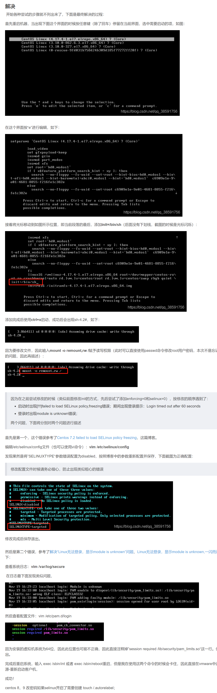

+

## systemctl status network 进行 restart 后，仍旧出现 active(existing)状态

```java
2.1 停止 networkmanager 服务
# 依次执行这两条语句

# 停止 NetworkManager 服务
systemctl stop NetworkManager
# 将 NetworkManager 设置开机不自启动
systemctl disable NetworkManager

2.1 重启 network 服务
systemctl restart network 
1
3.验证已解决
当 使用xshell时发现可以连接了，说明已经解决

也可以通过 systemctl status network.service 再次查看状态 --> 发现为 active(Running)说明已解决
 
```


## SELINUXTYPE=targeted  错误改变这个




## 切换 es 后切回 root 需要密码

root 用户下执行代码

```
passwd root
然后设置密码即可
```


# yum update 导致系统崩溃

```java
yum update 默认更新的时候会自动升级内核:
可以通过下面两种方法避免升级内核：

1、修改yum的配置文件 vim /etc/yum.conf：
	在[main]的最后添加exclude=kernel*

2、直接在yum的命令后面加上如下的参数：
	yum --exclude=kernel* update
    
// ===========================================
yum update 后面没有指定要更新的包名的话会更新【所有已安装】的包，只有指定了包名才更新指定的安装包    
    使用了 -y 参数的话会直接进行更新，而不会询问你是否进行更新
    【更新有风险，操作需谨慎！ 如果要进行 yum update 的话，应该要指定更新那个包】
```


