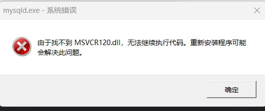
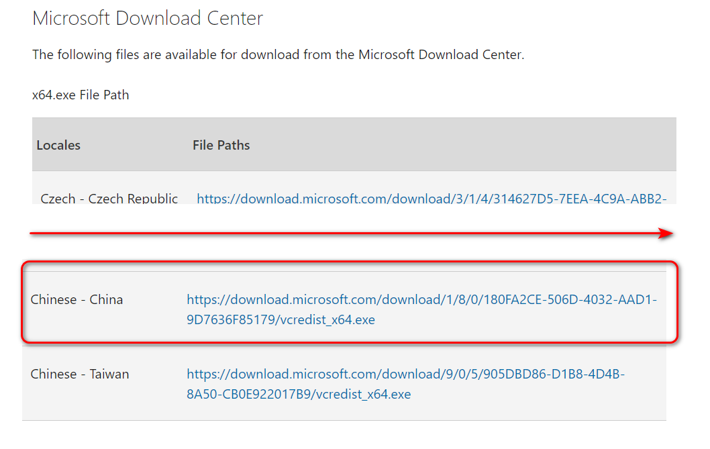
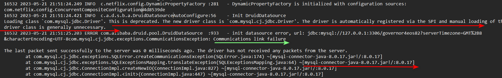

# === linux

# [linux] Starting MySQL.... ERROR! The server quit without updating PID file (/var/run/mysqld/mysqld.pid)

```
第一个文件是mysqld.pid: 是MySQLserver的主进程，是管进程的，这个文件名是本机的域名加pid后缀，
第二个文件是mysql.sock 文件，这个文件是进程间通信，以及mysql与其他程序通信的socker接口文件，
第三个文件是最为重要的mysql配置文件，没有之一，my.cnf、端口的定义，大小写敏感的定义。连接数的定义，等等配置都在这个文件内定义
 
  
  
pid-file文件是在系统中有mysql服务在运行时才会生成,mysql服务没有运行的情况下找不到PID文件也是正常的!!!
#运行临时文件初始化
 
 touch /var/run/mysqld/mysqld.pid
 
```

# [linux] 解决连接远程服务器MySQL“ACCESS DENIED FOR USER‘ROOT‘@‘IP地址‘“问题

```
show grants; 可以查询

// 解决方案
  #配置远程访问
  grant all on *.* to root@"%" identified by "root";
  flush privileges;
```


# [linux]mysql 密码忘记

```
1. vim /etc/my.cnf
	此处的Mysql 8.0和以往版本的mysql不同，my.cnf 文件中没有[mysql] 标识需要手动加入
	文件末尾加上 skip-grant-tables 跳过密码验证
2. 重启MySQL，使配置生效
	使用 mysqld 脚本启动：/etc/inint.d/mysqld start
	使用 mysqld 脚本启动：/etc/inint.d/mysqld stop
	使用 mysqld 脚本启动：/etc/inint.d/mysqld restart
	
3. 进入MySQL，直接输入mysql
	切换数据库: use mysql
	空密码: update user set authentication_string='' where user='root';
	退出: quit
4. 删除免密码登录代码“skip-grant-tables”，并重启MySQL
5. 登入MySQL，修改密码
	ALTER USER 'root'@'localhost' IDENTIFIED BY 'primeton';
6. 重新启动MySQL服务（使配置生效，此步骤不能省略）使用密码登入MySQL	
```


# == window

# 找不到 120.dll



* 解决

  https://support.microsoft.com/en-us/topic/update-for-visual-c-2013-and-visual-c-redistributable-package-5b2ac5ab-4139-8acc-08e2-9578ec9b2cf1

  


# mysql链接超时

## 异常



## 解决

```properties
# governor 的配置文件更改了下   1.更改驱动   2 url后面加上 &useSSL=false
# spring.datasource.driver-class-name=com.mysql.jdbc.Driver
spring.datasource.driver-class-name=com.mysql.cj.jdbc.Driver
spring.datasource.url=jdbc:mysql://127.0.0.1:3306/governor4eos82?serverTimezone=GMT%2B8&characterEncoding=UTF-8&useSSL=false
spring.datasource.username=root
```


