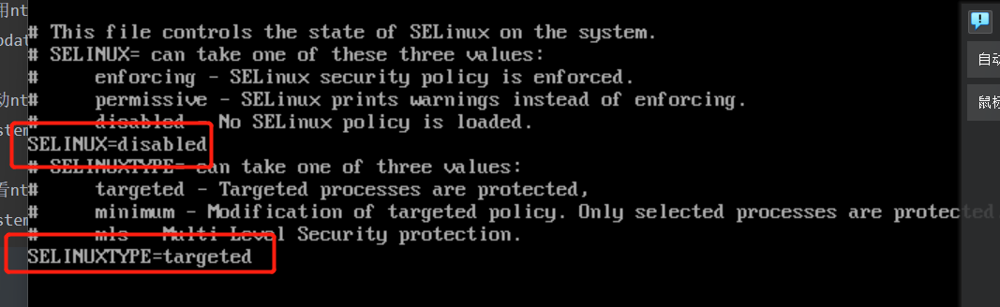
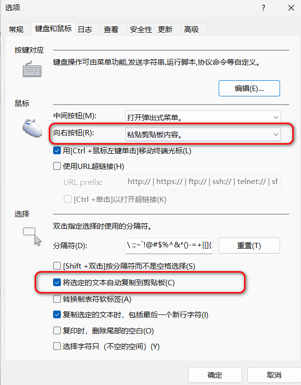

# 配置流程

* 网络配置：网络配置，ssh，rz/sz,

* 关闭

  ```
  1防火墙关闭或者开启对应的端口
  2Selinux关闭，重启
  3.
  ```

  

# 网络配置

## 防火墙开关

```java
检查当前防火墙状态，可以使用以下命令：
systemctl status firewalld

这将显示当前防火墙的状态信息。

如果防火墙正在运行，您可以使用以下命令来停止防火墙服务：

systemctl stop firewalld
这将停止防火墙服务，并且将立即停止对网络流量的过滤和阻止。

若要禁用防火墙服务，以使其在系统重启后不会自动启动，可以执行以下命令：
systemctl disable firewalld
这将禁用防火墙服务，并将其配置为在系统启动时不自动启动。


// 端口开启
如果没有针对端口 8080 的规则，可以使用以下命令添加规则：
firewall-cmd --zone=public --add-port=8/tcp --permanent

重新加载防火墙规则以使更改生效：
firewall-cmd --reload

检查规则是否成功添加：
firewall-cmd --list-all | grep "29898"
```

## 打开网络

```
vi/etc/sysconfig/network-scripts/[ifcfg-ens33根据显示改成你自己的

sudo service network restart
```

# 时间调整

```
使用date-R查看时区是否正确:
date-R

修改时区
timedatect lset-timezone Asia/Shanghai

装NTP
sudo yum-y install ntp

使用ntpdate更新系统时间
ntpdate pool.ntp.org

启动ntpddaemon，持续校准时间
systemctl start ntpd

查看ntpddaemon是否启动
systemctlstatusntpd
```


# Selinux关闭

- 确保Selinux调整为disabled或者permissive。修改/etc/selinux/config文件需要重新启动主机。

  ```
  注意是 selinux. 
  
  自己改的是下面的哪个，自己s
  ```

  

# yum

```
更新yum的本地数据库：yumupdate
列出可用的软件包：yumlist
安装指定的软件包：yuminstallpackage_name（例如，yuminstallnano）
移除指定的软件包：yumremovepackage_name（例如，yumremovenano）
升级所有已安装的软件包：yumupdate
```


# tar

```python
tar -zxvf EOS_Platform_8.2LA2_Private_Medium_Application.tar.gz -C /opt/idc/apps/eos-8.2-app

tar: 是一个用于创建和提取归档文件（通常称为 tarball）的命令。
-zxvf: 是 tar 命令的一些选项和标志的组合，具体含义如下：
-z: 使用 gzip 压缩算法解压缩文件。
-x: 提取（解压缩）文件。
-v: 显示提取的文件列表和详细信息。
-f: 指定要操作的归档文件。
接下来是要解压缩的归档文件的名称：EOS_Platform_8.2LA2_Private_Medium_Application.tar.gz。

最后是 -C 选项，它用于指定提取文件的目标目录。在这个命令中，目标目录是 /opt/idc/apps/eos-8.2-app。提取的文件将被放置在该目录下。

综上所述，执行该命令将会将名为 EOS_Platform_8.2LA2_Private_Medium_Application.tar.gz 的归档文件解压缩，并将其中的文件提取到 /opt/idc/apps/eos-8.2-app 目录下。请确保你具有对目标目录的写权限，并替换命令中的归档文件名和目标目录为实际的文件名和目录路径。 


```


# rz和sz

```
yum install -y lrzsz.x86_64
```

## 参数

```
$sz--help
$rz--help
-+,--append:将文件内容追加到已存在的同名文件
-a,--ascii:以文本方式传输-b,--binary:以二进制方式传输
--delay-startupN:等待N秒
-e,--escape:对字符转义
-E,--rename:已存在同名文件则重命名新上传的文件，以点和数字作为后缀
-p,--protect:对ZMODEM协议有效，如果目标文件已存在则跳过
-q,--quiet:安静执行，不输出提示信息
-v,--verbose:输出传输过程中的提示信息
-y,--overwrite:存在同名文件则替换
-X,--xmodem:使用XMODEM协议
--ymodem:使用YMODEM协议
-Z,--zmodem:使用ZMODEM协议
--version：显示版本信息
--h,--help：显示帮助信息
```

# vim

```
/etc/profile.d中存放的.sh脚本文件会被/etc/profile中的函数调用


1.显示行号
vi/etc/virc[在最后一行添加setnu]
```


# linux 用户组操作

## 查看所有的用户

```
cat /etc/passwd：这个命令会显示系统中的所有用户及其相关信息。每个用户的信息在一行上以冒号分隔，通常包括用户名、加密密码、用户标识号（UID）、用户组标识号（GID）、用户描述信息、主目录和登录 shell 等。

getent passwd：这个命令也可以列出系统中的所有用户及其相关信息。它从系统数据库中获取用户信息，包括 /etc/passwd 文件和其他用户身份验证数据库。

awk -F: '{ print $1 }' /etc/passwd：这个命令使用 AWK 工具来提取 /etc/passwd 文件中的用户名字段，并将其打印出来。
```

## 查看用户组下的用户

```
bash

grep '用户组名' /etc/group
其中，用户组名 是要查看用户列表的目标用户组。

例如，要查看名为 developers 的用户组下的用户列表，可以运行以下命令：
grep 'developers' /etc/group
```

## 用户组删除用户

```

// 删除用户组
因此，删除mysql用户组和mysql用户，简单快捷：
userdel mysql     #删除mysql用户
groupdel mysql    #删除mysql用户组

=====================
使用 gpasswd 命令：

sudo gpasswd -d 用户名 用户组
其中，用户名 是要从用户组中删除的用户名，用户组 是要从中删除用户的用户组名。

例如，要从 developers 用户组中删除用户 john，可以运行以下命令：


sudo gpasswd -d john developers
使用 usermod 命令：

sudo usermod -G 用户组名 用户名
其中，用户组名 是要从中删除用户的用户组名，用户名 是要从用户组中删除的用户名。

例如，要从 developers 用户组中删除用户 john，可以运行以下命令：


sudo usermod -G developers -l john
这将从 developers 用户组中删除用户 john。
```

# 用户权限

```java
要查看Linux系统中用户的权限，可以使用以下命令：

查看用户所属的组： 
groups username
其中，username是要查看权限的用户名。

查看用户对某个文件的权限： 
ls -l filename
其中，filename是要查看权限的文件名。

查看用户对某个目录的权限： 
ls -ld directoryname
其中，directoryname是要查看权限的目录名。

查看用户对某个命令的权限： 
which commandname
其中，commandname是要查看权限的命令名。如果返回结果为空，则说明该用户没有执行该命令的权限


===============
rwx 
	r read 4
	w write 2
	x 执行 1
	
===============
方法1：直接用加减法计算（简单直接，推荐使用）
重点提示：不能单纯直接相减得到结果，要看umask对应位的奇偶性。
例如：
1. umask=022
目录权限：777-022=755
文件权限：666-022=644
2. umask=032，对应位是奇数的，计算文件默认权限时需要相减后再加1
目录权限：777-032=745
文件权限：6-0=6，6-3+1=4，6-2=4，最终结果是644 
	
	这种计算方法只需要在计算文件默认权限时需要考虑umask对应位的奇偶性，如果umask对应位是偶数，则用6直接相减可以得出最后结果，如果umask对应位是奇数，则用6相减后再加1可以得出最后结果；对于目录，直接用777-umask得到结果
============================
方法2：通过字母符号进行计算
假设umask值为551[r-xr-x--x]，
    
目录权限：[rwx-rwx-rwx]-[r-xr-x--x]=[-w--w-rw-]，即226
    
// 系统默认把最高的执行权限收回了
文件权限：[rw-rw-rw-]-[r-xr-x--x]=[-w--w-rw-]，文件的x位上没有x，不用处理，直接取过来即可，即226
=============================
umask设置的是权限“补码”，
chmod设置的是文件权限码
    
    
    
========================
假设默认 umask=022
    -rw-r--r--. 1 root root    0 12月  6 12:07 1.txt
    [-rw-r--r-- 怎么得来的]
    文件最高权限:    rw-rw-rw-   666
	默认掩码：       ----w--w-   022
     相减
    ------------------------------------
     计算结果       rw-r--r--    644
        
=================================        
        
    drwxr-xr-x. 2 root root 4096 12月  6 12:17 1
    文件夹最高权限:    rwx-rwx-rwx-   666
	默认掩码：         ----w--w-   022
     相减
    ------------------------------------
     计算结果          rwxr-xr-x.    755
        
```


# ==xshell


# 配置

```
工具 -- 选项 -- 鼠标和键盘 --
```




