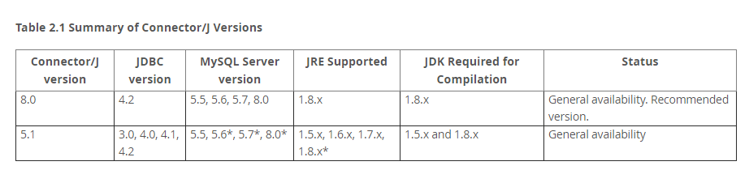
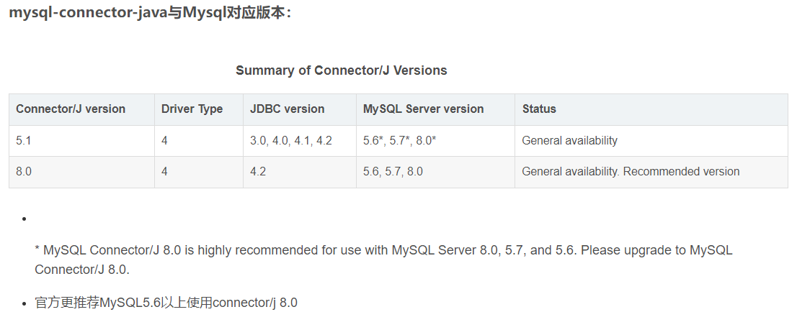
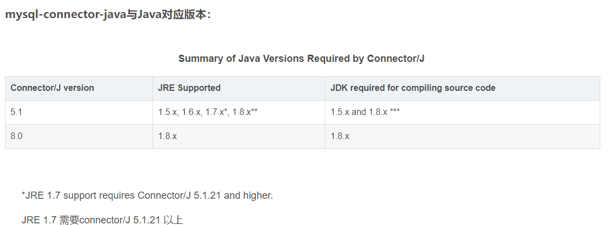

# mysql 安装配置

## 注意

```
重要说明：避免mariadb冲突，可先行卸载mariadb,通过以下命令卸载

yum list installed | grep -i maria
yum remove mariadb.x86_64
yum remove mariadb-libs.x86_64**
```


## tar 包方式

* 上传 jar 包到服务器， 解压到制定目录，一般在 /usr/local 目录中

  ```
  1. tar zxfv 之后进行移动’
  
  2. 创建 data 文件夹，用来放置数据库文件
  ```


* linux 创建用户组，用来操作mysql

  ```java
  // groupadd 是一个用于创建新用户组的命令。在 Linux 系统中，用户组是一组具有相同权限和访问权限的用户的集合。用户组可以用来管理用户的访问权限、文件所有权以及组共享的资源等。
  // 创建一个新的用户组，并指定用户组的名称作为命令的参数。
  // 例如，使用以下命令创建名为 "mysql" 的用户组：
  groupadd mysql
      
   
  /*
  
  useradd [选项] 用户名
  
  
   useradd 是一个用于创建新用户的命令。在 Linux 系统中，用户是系统中的个体，可以登录系统并访问资源。
  -g：指定用户的初始用户组。
  -d：指定用户的主目录。
  -s：指定用户的登录 shell。
  -m：在创建用户时同时创建用户的主目录。
  
  useradd -g users       -d /home/john       -s /bin/bash john   
  上述命令将在系统中创建一个名为 "john" 的用户。
  创建用户后，可以设置用户的密码、添加用户到其他用户组、修改用户的属性等。
  需要注意的是，useradd 命令需要管理员权限或者以 root 用户身份执行才能成功创建用户。
  
  用户的家目录： 可以类比 windows 用户目录
  */
  //  useradd [-g mysql] mysql [-d /usr/local/mysql/]
  useradd -g mysql mysql -d /home/mysql
      
  /*
  chown [选项] 用户:组 文件或目录
  chown（Change Owner）命令用于修改文件或目录的所有者。它允许你更改文件或目录的所有者和所属组，以控制文件的访问权限和管理。
  
  -R：递归地修改指定目录下的所有文件和子目录。
  -H：如果目标是符号链接，则跟踪链接所指向的文件。
  -L：直接修改符号链接本身的所有者，而不跟踪链接所指向的文件。
  -P：修改符号链接所指向的文件的所有者，而不修改链接本身。
  
  chown -R [mysql:mysql] [/usr/local/mysql/]
  修改目录所有者为 mysql:mysql，并递归地修改所有子目录和文件：
  */     
  chown -R mysql:mysql /usr/local/mysql/
  ```


* 编辑

  ```properties
   
  // 编辑配置文件   vim /etc/my.cnf
  
  
    [client]
    port = 3306
    socket = /tmp/mysql.sock
      
    [mysqld]
    character_set_server=utf8mb4
   
   /*
     SET NAMES utf8mb4 是一个MySQL的SQL语句，用于设置客户端和服务器之间的字符集。它将字符集设置为 utf8mb4，
     添加到MySQL配置文件中，你可以确保每个新的客户端连接在建立时都会自动执行这个SQL语句，将字符集设置为 utf8mb4。这样可以确保所有的客户端连接都使用相同的字符集，并且避免手动设置字符集的麻烦。
    
    */
    init_connect='SET NAMES utf8mb4'
        
    basedir=/opt/mysql/mysql-5.7.21-linux-glibc2.12-x86_64/data
    datadir=/opt/mysql/mysql-5.7.21-linux-glibc2.12-x86_64/data
        
    socket=/tmp/mysql.sock
    log-error=/var/log/error.log
    pid-file=/var/run/mysqld/mysqld.pid
    lower_case_table_names = 1
    sql_mode='STRICT_TRANS_TABLES,ERROR_FOR_DIVISION_BY_ZERO,NO_AUTO_CREATE_USER,NO_ENGINE_SUBSTITUTION'
    max_connections=5000
    default-time_zone = '+8:00'
   
  
  
  [mysqld]
  
  
  
  # 设置MySQL的监听地址，允许所有IP连接
  bind-address=0.0.0.0
  
  # 设置MySQL的端口号
  port=3306
   
  
  # 设置MySQL的默认存储引擎
  default-storage-engine=InnoDB
  
  # 设置MySQL的最大连接数
  max_connections=200
  
  # 设置MySQL的查询缓存大小
  query_cache_size=16M
  
  # 设置MySQL的临时表存储路径
  tmp_table_size=32M
  
  # 设置MySQL的最大临时表大小
  max_heap_table_size=32M
  
  # 设置MySQL的最大包大小
  max_allowed_packet=64M
  
  # 设置MySQL的键缓存大小
  key_buffer_size=256M
  
  # 设置MySQL的排序缓存大小
  sort_buffer_size=4M
  
  # 设置MySQL的连接超时时间
  wait_timeout=28800
  
  
  
  
  
  # 设置MySQL的开启日志查询功能
  general_log=0
  
  # 设置MySQL的慢查询日志
  slow_query_log=1
  slow_query_log_file=/var/log/mysql/slow.log
  long_query_time=2
  
  
  
  ```


```properties
[client]
port = 3306
socket = /tmp/mysql.sock
[mysqld]
character_set_server=utf8mb4
init_connect='SET NAMES utf8mb4'
basedir=/opt/primeton/mysql/mysql-5.7.21
datadir=/opt/primeton/mysql/mysql-5.7.21/data
socket=/tmp/mysql.sock
log-error=/opt/primeton/mysql/mysql-5.7.21/logs/mysqld.log
pid-file=/opt/primeton/mysql/mysql-5.7.21/logs/pid/mysqld.pid
lower_case_table_names = 1
sql_mode='STRICT_TRANS_TABLES,ERROR_FOR_DIVISION_BY_ZERO,NO_AUTO_CREATE_USER,NO_ENGINE_SUBSTITUTION'
max_connections=5000
default-time_zone = '+8:00'
```


* 文件创建

  ```java
  /*
  创建 log-err 记录的目录和文件
  	文件： 777 和 -R 权限
  创建 pid-file 的目录和文件
  	目录： 777 和 -R q
  */
  mkdir  -p /var/log/mysql/err
  # 日志初始化异常日志
  
  touch /var/log/mysql/err/err.log
  chmod 777 /var/log/mysql/err/err.log
  chown -R mysql:mysql /var/log/mysql/err/err.log
  
  # 运行临时文件初始化
  mkdir  -p /var/run/mysql
  mkdir -p /var/run/mysqld
  chmod 777 /var/run/mysqld
  chown -R  mysql:mysql /var/run/mysqld
  touch /var/run/mysqld/mysqld.pid
  
  
  chown -R mysql:mysql /var/log/mysql
  chown -R mysql:mysql /var/run/mysql
  ```

​	


* **配置MySQL本地服务**

  ```java
    将/usr/local/mysql-5.6.45_3306/support-files目录下的mysql.server文件拷贝到/etc/init.d/目录下，并命名mysql
    
    basedir: mysql安装的路径，就是 /usr/local
    datadir: mysql数据库放置的位置， 一般为 basedir/data
    
    // cp  -a /usr/local/mysql/support-files/mysql.server /etc/init.d/mysqld
   cp -a mysql-5.7.21-linux-glibc2.12-x86_64/support-files/mysql.server  /etc/init.d/mysqld
  
  ```

* 软连接创建

```
 ln -s  /usr/local/mysql/bin/mysql    /usr/bin
```

* 初始化

```java
// 推荐: 进入 bin 文件夹进行初始化
./mysqld --initialize --console

// 初始化mysql
  /usr/local/mysql/mysql-5.7.21-linux-glibc2.12-x86_64/bin/mysqld 
  	--initialize 
  	--user=mysql
  	--basedir=/usr/local/mysql/mysql-5.7.21-linux-glibc2.12-x86_64
    --datadir=/usr/local/mysql/mysql-5.7.21-linux-glibc2.12-x86_64/data 
    --lc_messages_dir=/usr/local/mysql/share 
    --lc_messages=en_US

      
      
//--- 下面的没有用到
①进入/usr/local/mysql-5.6.45_3306目录：
cd /usr/local/mysql-5.6.45_3306

②执行安装脚本命令：
./scripts/mysql_install_db --user=mysql

需要安装perl-module模块,等待perl-module安装成功之后，再继续执行上述步骤
执行命令：yum -y install perl-Module-Install.noarch；
```


* 启动

```java
# 启动mysql
  /usr/local/mysql/mysql-5.7.21-linux-glibc2.12-x86_64/support-files/mysql.server start
  // Starting MySQL.. SUCCESS! 出现这个字符就是成功的
  
  
  
// 查看初始化密码，后面登录要用，记录下来 
// root@localhost: 6%elvyqhMhhs （root@localhost: xxxxx 。 这里的xxxxx就是初始密码
  grep -i "@" /var/log/mysqld.log   
```

* 开机自启

  ```
  chmod +x /etc/init.d/mysqld
  chkconfig --add mysqld
  chkconfig --list
  chkconfig --level 345 mysqld on
  service mysqld status
  ```


## 授权

```java
 1. 修改密码：
    set password for root@localhost=password("primeton");

2. 增加远程登录权限
// 第一行指令的%代表所有主机来源，password可以设置和本地mysql不同的密码，当然一般情况下相同即可，执行完上面的指令后mysql就可以从外网立即连接了，到这里mysql基本的安装配置就完成了。（前提是防火墙开放了3306端口访问权限）
// 别人可以通过这个 grant 的密码链接你的数据库，这个密码可以跟你的数据库登录密码不一致
// 相当于你数据库有两个密码： 1. 本地登录密码， 2. 远程连接密码    
grant all privileges on *.* to root@'%' identified by 'primeton' WITH GRANT OPTION;

// 刷新权限
flush privileges;

GRANT ALL: 授予所有权限。
ON *.*: 指定权限适用于所有数据库（所有的库和表）。
TO root@"%": 授予权限给用户名为"root"，并且可以从任何主机（通配符"%"表示所有主机）连接。
IDENTIFIED BY "root": 设置"root"作为连接密码。
综合起来，这个命令的含义是将所有权限授予用户"root"，使其能够从任何主机连接到MySQL服务器，并使用密码"root"进行身份验证。授予的权限包括对所有数据库和表的操作权限。
```


# 驱动关系




# == DBeaver

## 驱动对应关系






