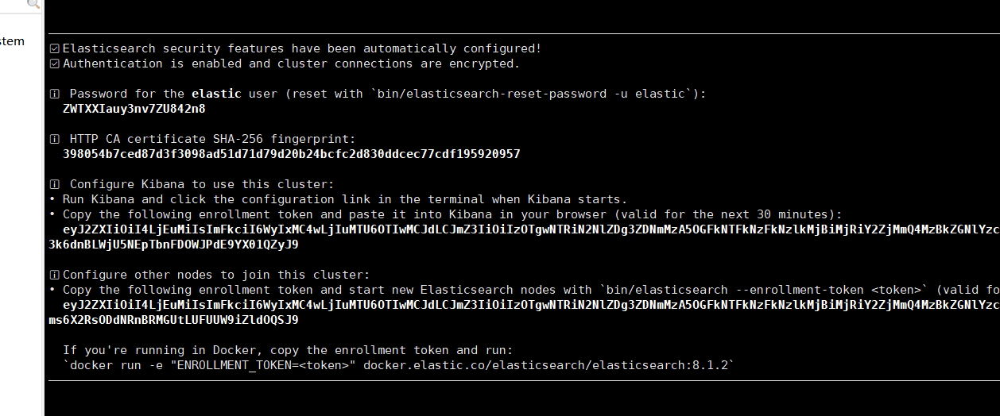
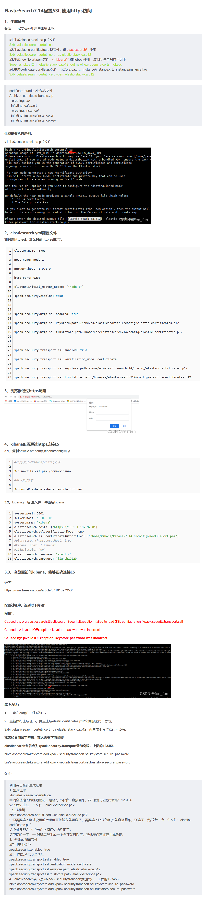

# 安装

## 注意

### jdk 对照

* https://www.elastic.co/cn/support/matrix#matrix_jvm

  ```java
  es8 只支持 17 以上的，不支持 jdk8 的
  如果你是 es8 的版本， 注意使用 es 自带的 jdk
  
  
  
  // warning: ignoring JAVA_HOME=/usr/local/java/jdk1.8.0_371; using bundled JDK
  出现这个说明你服务器上的 java 版本和 es 所需要的版本不对照，所以出现这个问题
  这个不是异常，是使用 es 自带的 jdk , 没有其他的就不要管了
  ```

## 版本特性

```
ElasticSearch 8.0，和其他低版本最大的区别就是，默认开启安全防护。kibana访问时需要token访问。

首次启动Elasticsearch时，默认情况下会启用并配置安全功能。以下安全配置将自动进行：
	启用身份验证和授权，并为弹性内置超级用户生成密码。
	为传输层和HTTP层生成TLS的证书和密钥，并使用这些密钥和证书启用和配置TLS。
	为Kibana生成一个注册令牌，有效期为30分钟。 
```

# 安装

## linux-centos

### 用户创建

* 创建用户： es 禁止使用 root 启动

```
# groupadd es
# useradd es -g es

# chown -R es:es /usr/local/elasticsearch/elasticsearch-8.1.2

# su es
// 配置文件啥的，最好都在 es 
```

### 配置更该

* config -- jvm.options

  ```
  默认配置如下：
  -Xms10g
  -Xmx10g
  默认的配置占用内存太多了，调小一些：
  -Xms256m
  -Xmx256m
  
  ```

* config - elasticsearch.yml

  ```yml
  bootstrap.memory_lock: true # 生产环境建议设置，锁定物理内存地址，防止 es 内存被交换出去，避免使用 swap 交换分区
  network.host: 0.0.0.0 # 四个0， 可以让任意ip访问
  # node.name: node-1
  # cluster.initial_master_nodes: ["node-1"]
  # http.port: 9200 # es 的默认启动端口，9200
  
  
  
  # 这个是启动一次 es 后才会出现的，就是到最后的最后了，
  # ========================================
  # 前端的 network 出现错误; no resources with identifier found
  # 关闭xpack认证, 不用输入账号密码就可以范文
  # true 改成 false
  xpack.security.enabled: false
  # 与客户端http链接是否加密，先选择不加密
  #  true 改成 false
  xpack.security.http.ssl:
    enable: false
    verification_mode: certificate
  保存退出
  ```

* 其他

  ```java
  vi /etc/security/limits.conf 
  #在文件最后，增加如下配置：
   
  * soft nofile 65536
  * hard nofile 65536
  * soft nproc 2048
  * hard nproc 4096    
      
  # 执行以下命令加载配置文件
  sysctl --system
  
      
  /在/etc/sysctl.conf文件最后添加一行 vm.max_map_count=655360 添加完毕之后，执行命令： sysctl -p
  vi /etc/sysctl.conf
  vm.max_map_count=655360
  sysctl -p
  ```

  

* 启动

  ```yaml
  # 官方启动： 最好先不要带 -d, 你尝试通过了，再启用 -d
  $ ./elasticsearch -d
  # 推荐 elasticsearch -E xpack.security.enabled=false
  
  
  =========================================
  # primeton 自己搭建的平台
  # 进入bin目录
  cd  {安装位置}/elk/elasticsearch/bin
  # 启动Elasticsearch
  ./startup.sh
  ```

### 成功标志



* 改密码

  ```
  下执行.//elasticsearch-reset-password -u elastic -i命令，其中elastic为用户名，设置密码为primeton
  ```

  


## 启动关闭

```
前台运行，Ctrl + C 则程序终止
/usr/local/elasticsearch-7.13.2/bin/elasticsearch

后台运行
/usr/local/elasticsearch-7.13.2/bin/elasticsearch -d
出现started时启动完成

// es 没有重启的命令， 只能kill 进程去重启
kill pid 
```


# 其他

```
#ES日志需要有模板，通过命令可以加载，模板文件在elasticsearch/template 文件夹中
cd  {安装位置}/elk/elasticsearch/template
curl -H "Content-Type:application/json" -XPUT 'http://{安装机器IP}:9200/_template/eos-classic-log' -d @eos-classic-log-template.json
curl -H "Content-Type:application/json" -XPUT 'http://{安装机器IP}:9200/_template/eos-dap-app-log' -d @eos-dap-app-log-template.json
curl -H "Content-Type:application/json" -XPUT 'http://{安装机器IP}:9200/_template/eos-dap-trace-log' -d @eos-dap-trace-log-template.json
curl -H "Content-Type:application/json" -XPUT 'http://{安装机器IP}:9200/_template/eos-wf-log' -d @eos-wf-log-template.json
# ES删除已经建立的数据和索引
curl -H "Content-Type:application/json" -XDELETE 
'http://{安装机器IP}:9200/eos*'


验证安装 访问ES es常用命令 http://{安装机器IP}:9200/_cat/health 检查ES数据库的索引状态（百分比） http://{安装机器IP}:9200/_cat/indices 查看ES数据库的索引列表（green可用，yellow正在创建，red不可用）。
```


# es

* jvm 大小，别设置的太大了，你给虚拟机5G， 然后给 es 10G 启动的时候就会被 killed
* 使用 .start 启动不了，就用当前文件夹的 ./elasticsearch
* 不能使用 root 进行启动，使用其他用户


# 证书生成

```java
1. 进入安装目录
2. 生成证书
    // 用于生成一个自签名证书颁发机构 (CA) 的证书，用于在 Elasticsearch 集群中建立信任关系。
    $ ./bin/elasticsearch-certutil ca --pem --out ca.zip --days 36500 -s  ## 会生成ca.zip文件
    $ unzip ca.zip 
    $ openssl x509 -in ca/ca.crt -noout -dates    ## 查看证书有效期
    
    //  用于生成一个证书签名请求 (CSR)，该请求需要发送给 CA 以获取签名证书。在 Elasticsearch 中，节点需要使用签名证书来与其他节点建立信任关系。
    $ ./bin/elasticsearch-certutil cert --ca-cert ca/ca.crt --ca-key ca/ca.key --pem --name za-test  --out za-test.zip --days 36500 -s            ## 会生成za-test.zip文件
    $ unzip za-test.zip
    $ openssl x509 -in za-test/za-test.crt -noout -dates   ## 查看证书有效期
    
    
##(2)将证书拷贝到对应目录
$ mkdir config/certs
$ cp ca/* za-test/* config/certs
##(3)将新证书拷贝到集群所有机器 
$ scp config/certs/* xxxx

##(3)修改配置
...
## ssl
xpack.security.transport.ssl.enabled: true
xpack.security.enabled: true
xpack.security.transport.ssl.verification_mode: certificate
xpack.security.transport.ssl.key: certs/za-test.key
xpack.security.transport.ssl.certificate: certs/za-test.crt
xpack.security.transport.ssl.certificate_authorities: certs/ca.crt
...

##(4)生成账户密码
$ ./bin/elasticsearch-setup-passwords interactive    ## 依次输入密码    
```


# 生成证书




