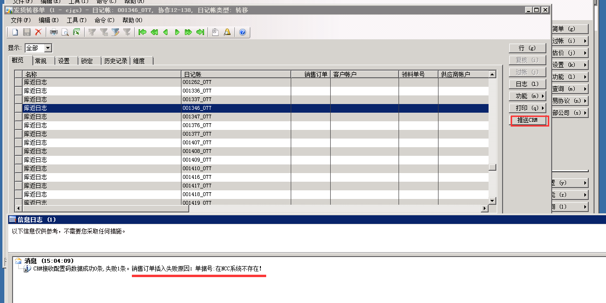

# 安装过程

1、JMeter下载和安装
下载地址：https://jmeter.apache.org/apache-jmeter-5.2.1.zip
下载版本：apache-jmeter-5.2.1.zip，解压任意目录即可

2、配置
/bin/jmeter.properties 37行，改为简体中文
language=zh_CN

3、启动JMeter
下载解压后直接在 bin 目录里双击 jmeter.bat 即可启动（Lunix系统通过 jmeter.sh 启动）

- Windows
  启动：双击bin/jmeter.bat运行文件
  访问：http://localhost:8848/nacos
  用户名密码：nacos/nacos


```
1、安装JDK，必须JDK1.7以上的版本，推荐1.8的版本

2、进入官网：http://jmeter.apache.org/download_jmeter.cgi 下载最新的Jmeter版本,下载后解压到非中文目录，如：D:\

3、配置Jmeter的环境变量。

(1) 新增变量：JMETER_HOME：D:\apache-jmeter-5.2.1

(2) 在CLASSPATH变量的最前面加入如下变量： %JMETER_HOME%\lib\ext\ApacheJMeter_core.jar;%JMETER_HOME%\lib\jorphan.jar;

(3)在PATH变量的最前面加入如下变量：%JMETER_HOME%\bin;

4、进入D:\apache-jmeter-5.2.1\bin，双击jmeter.bat，或在dos窗口输入jmeter命令打开jmeter界面，安装成功。
```


============

# window 配置

修改中文
Options-->Choose Language-->Chinese(Simplified)

字符编码

```
进入jmeter/bin目录下，
打开文件jmeter.properties 搜索default.encoding
#sampleresult.default.encoding=ISO-8859-1 去掉注释#、把ISO-8859-1修改成UTF-8
保存后重启jmeter，重新发送请求查看response


```


```
在 erp 中进行发货订单转移， 就会出现下面的异常
```

