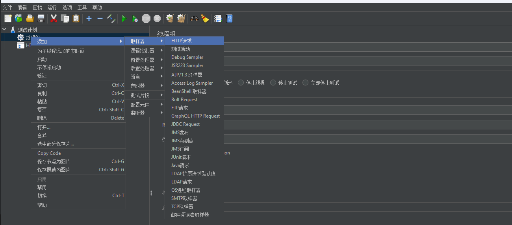
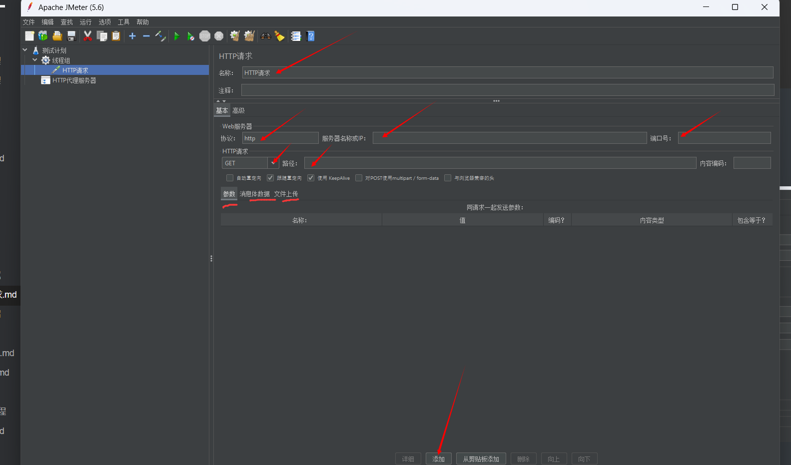
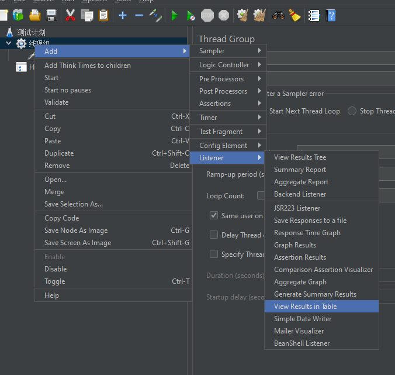

# 步骤

```
1.测试计划

2.线程组

3.HTTP Cookie管理器

4.Http请求默认值

5.Sampler(HTTP请求)

6.断言

7.监听器(查看结果树、图形结果、聚合报告等)
```


## get 请求

* 创建请求

  

* 参数添加

  ```
  1. parameters 和 body data 只能用一个，不能两个都用，如果有异常就清空一个
  2. 
  ```

  

  

* 查看请求的结果

  

  