## 执行顺序

### 顺序

```java
/*
测试计划： 线程组（并发多少的测试）
一个配置原件 sapler 就是一个请求，其中有 http 等请求 


配置元件 
-> 前置处理器       【原件前执行】
-> 定时器           【】
-> 取样器          【】 
-> 后置处理器      【原件后执行】
-> 断言 		    【结果校验】
-> 监听器		   【结果收集汇总】
 	

*/
1、测试计划：是使用 JMeter 进行测试的起点，它是其它 JMeter测试元件的容器【一个测试任务】

2、线程组：代表一定数量的用户，它可以用来模拟用户并发发送请求。实际的请求内容在Sampler中定义，它被线程组包含。【有多少个并发】

3、配置元件：维护Sampler需要的配置信息，并根据实际的需要修改请求的内容。

4、前置处理器：负责在请求之前工作，常用来修改请求的设置【线程请求之前需要做的】

5、定时器：负责定义请求之间的延迟间隔。

6、取样器(Sampler)：是性能测试中向服务器发送请求，记录响应信息、响应时间的最小单元，如：HTTP Request Sampler、FTP Request Sample、TCP Request Sample、JDBC Request Sampler等，每一种不同类型的sampler 可以根据设置的参数向服务器发出不同类型的请求。

7、后置处理器：负责在请求之后工作，常用获取返回的值。【线程请求之后需要做的】

8、断言：用来判断请求响应的结果是否如用户所期望的。

9、监听器：负责收集测试结果，同时确定结果显示的方式。

10、逻辑控制器：可以自定义JMeter发送请求的行为逻辑，它与Sampler结合使用可以模拟复杂的请求序列
```


### 注意

```
1.前置处理器、后置处理器和断言等组件只能对取样器起作用，因此，如果在它们的作用域内没有任何取样器，则不会被执行。

2.如果在同一作用域内有多个同一类型的元件，则这些元件按照它们在测试计划中的上下顺序依次执行
```

### 快速使用

```
1.测试计划

2.线程组

3.HTTP Cookie管理器

4.Http请求默认值

5.Sampler(HTTP请求)

6.断言

7.监听器(查看结果树、图形结果、聚合报告等)
```

# 界面

# 测试计划 -- project

* 【开启一个测试项目。 就是一个 project】

* 可以理解为新建要给空白项目，在这个项目总可以添加一系列的接口

  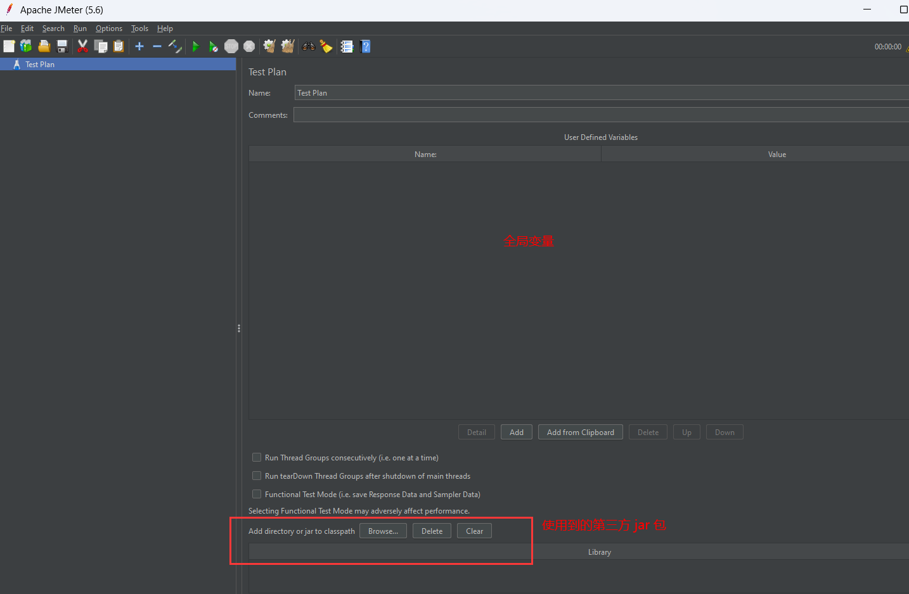

## 线程组设置 - 并发量设置

```
add -- thread
```


### 设置

```
个人理解： 你要做一个3000的并发测试，这个线程组就是专门做并发量为3000的测试


原件描述： 一个线程组可以看做一个虚拟用户组，线程组中的每个线程都可以理解为一个虚拟用户。

(1)线程数：即虚拟用户数。设置多少个线程数也就是设置多少虚拟用户数

(2)Ramp-Up时间(秒)：设置虚拟用户数全部启动的时长。如果线程数为20,准备时长为10秒,那么需要10秒钟启动20个线程。也就是平均每秒启动2个线程。

(3)循环次数：每个线程发送请求的个数。如果线程数为20,循环次数为10,那么每个线程发送10次请求。总请求数为20*10=200。如果勾选了“永远”, 那么所有线程会一直发送请求,直到手动点击工具栏上的停止按钮,或者设置的线程时间结束。
```

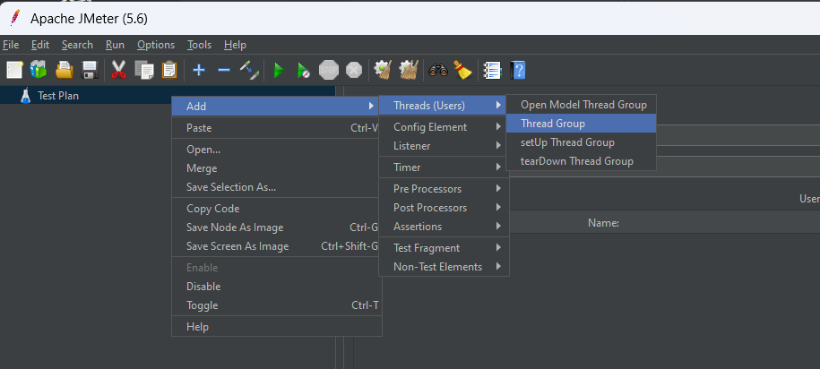

### 界面介绍 - add

```
logic controller  {
	逻辑控制器 -- 脚本的流程语句， 怎么执行脚本
	
}

config element {
	预先的配置信息
}

sampler  {
	取样器： 就是发送的具体的请求类型	
}

pre processors {
	发送请求前， 对请求进行处理
}

post processors {
	发送请求后， 对请求进行处理
}

timer {
	定时发送请求
}

assertions {
	断言： 就是对返回的结果进行自动判断是包含提前预设的值
}

listener {
	对响应结果进行分析处理
}
```


### 逻辑控制器

* 脚本的控制语句、怎么执行

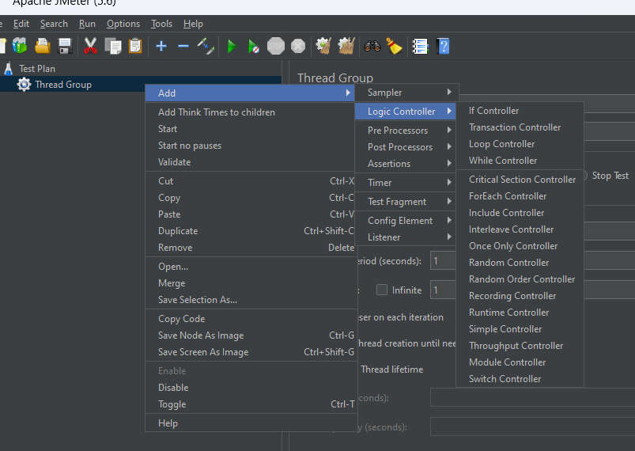

### 配置

* 就是一些配置好的东西，能够直接用的

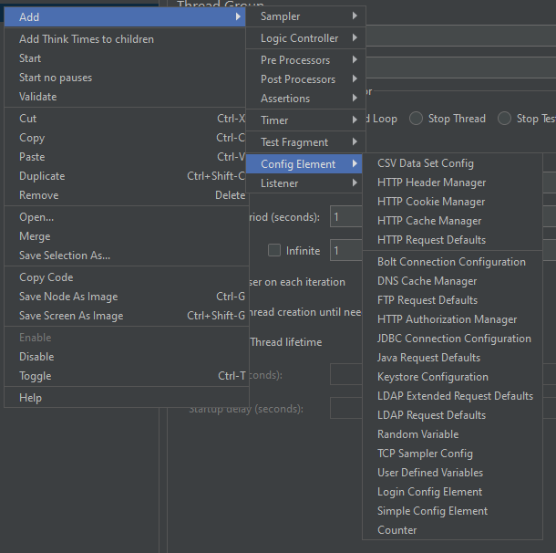

### 取样器

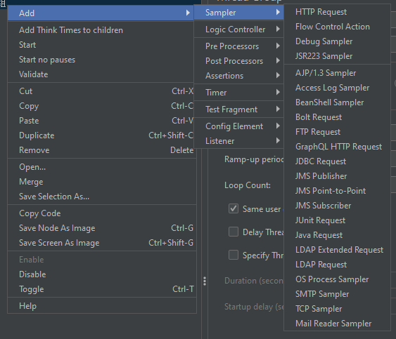

### 定时器


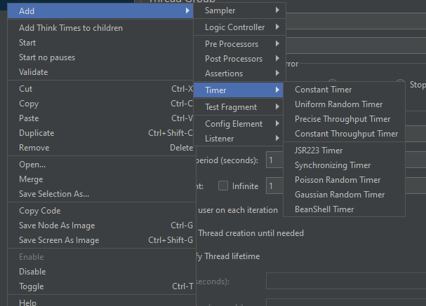


#### HTTP Cookie管理器 

```
添加方法：右键线程组->添加->配置元件->HTTP Cookie管理器。

元件描述：HTTP Cookie管理器可以像浏览器一样存储和发送cookie，如果你要发送一个带cookie的http请求，cookie manager会自动存储该请求的cookies，并且后面如果发送同源站点的http请求时，都可以用这个cookies。
```

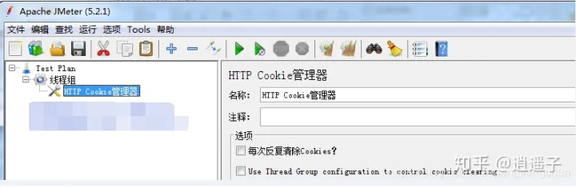

#### HTTP请求默认值

```
个人理解： 你一个并发量为3000的测试任务，可能有好几个http都需要这样子侧，所以每个线程组下可以设置好几个http请求

添加方法：右键线程组->添加->配置元件->HTTP请求默认值。

元件描述：HTTP请求默认值是为了方便填写后续内容而设置。主要填写[服务器名称或IP]和[端口号]，后续的HTTP请求中就不用每次都填写IP地址和端口号了。
```

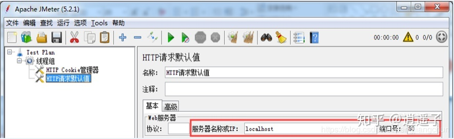

#### http请求 -- 访问的请求

```
添加方法：右键线程组->添加->Sampler->HTTP请求。

元件描述：HTTP请求包括接口请求方法、请求路径和请求参数等

(1)名称：本属性用于标识一个取样器，建议使用一个有意义的名称。

(2)注释：对于测试没有任何作用，仅用户记录用户可读的注释信息。

(3)服务器名称或IP ：HTTP请求发送的目标服务器名称或IP地址。

(4)端口号：目标服务器的端口号，默认值为80 。

(5)协议：向目标服务器发送HTTP请求时的协议，可以是HTTP或者是HTTPS ，默认值为http

(6)方法：发送HTTP请求的方法，可用方法包括GET、POST、HEAD、PUT、TRACE、OPTIONS、DELETE等。

(7)路径：目标URL路径（不包括服务器地址和端口）

(8)内容编码：内容的编码方式，默认值为iso8859

(9)自动重定向：如果选中该选项，当发送HTTP请求后得到的响应是302/301时，JMeter 自动重定向到新的页面。

(10)使用keep Alive ：保持jmeter 和目标服务器之间的活跃状态，默认选中

(11)对Post使用multipart/from-data：当发送POST 请求时，使用multipart/from-data方法发送，默认不选中。

(12)同请求一起发送参数 ： 在请求中发送URL参数，对于带参数的URL ，jmeter提供了一个简单的对参数化的方法。用户可以将URL中所有参数设置在本表中，表中的每一行是一个参数值对（对应RUL中的 名称1=值1）。
```

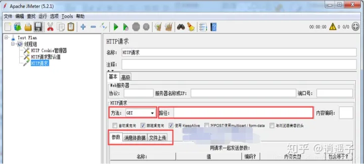


#### 响应断言 -- 结果判断

```
添加方法：右键HTTP请求->添加->取样器->HTTP请求->响应断言。

元件描述：检查接口是否访问成功。如果检查失败的话会提示找不到断言的内容，没提示的话就代表成功了。

Apply to
    指断言作用范围，通常发出一个请求只触发一个请求，所以勾选“main sample only”就可以；
    若发一个请求可以触发多个服务器请求，就有main sample 和sub-sample之分了。

    (1)Main sample and sub-samples：作用于主请求和子请求

    (2)Main sample only：仅仅只作用于主请求

    (3)Sub-samples only：仅仅只作用于子请求

    (4)Jmeter Variable：作用于jmeter变量(输入框内输入jmeter变量名称)
    
测试字段
	响应文本(匹配返回的json数据)、
	响应代码(匹配返回码:如200, 404,500等)、
	响应信息(匹配响应信息如“OK”字样)、
	响应头(匹配响应头)、
	请求头(匹配请求头)、
	URL样本(匹配请求的url链接,如果有重定向则包含请求url 和 重定向url)、
	[文档(文本)](匹配响应数据的文本形式)、
	忽略状态(一个请求有多个响应断言，第一个响应断言选中此项，当第一个响应断言失败时可以忽略此响应结果，继续进行下一个断言。如果下一个断言成功则还是判定事务是成功的)、
	请求数据(匹配请求数据)

模式匹配规则
    包括：响应内容包含需要匹配的内容即代表响应成功，支持正则表达式。

    匹配：响应内容要完全匹配需要匹配的内容即代表响应成功，大小写不敏感，支持正则表达式。

    字符串：响应内容包含需要匹配的内容才代表响应成功，大小写敏感，不支持正则表达式

    相等：响应内容要完全等于需要匹配的内容才代表响应成功，大小写敏感，不支持正则表达式

    否：相当于取反，如果结果为true，勾上否就是false

    或者：如果不想用AND连接（所有的模式都必须匹配，断言才算成功），用OR选项可以用于将多个断言模式进行OR连接(只要一个模式匹配，断言就是成功的)

测试模式
	其实就是断言的数据。点击“添加”按钮，输入要断言的数据。    
```

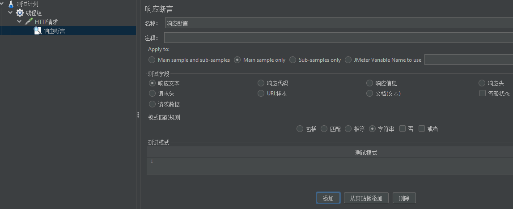


#### 增加监听器 - 结果汇总

```
个人理解： 就是对线程组的运行结果的分析汇总，也可以对每个 http 请求添加监听器，

添加方法：线程组 ->右键添加 ->监听器 ->察看结果树。一般还会一并添加图形结果、聚合报告。
添加方法：线程组 ->右键添加 ->监听器 ->聚合报告。  一般还会一并添加图形结果、。

元件描述：树状形式显示接口的访问结果，包括请求结果、请求内容、服务器的响应内容。
```

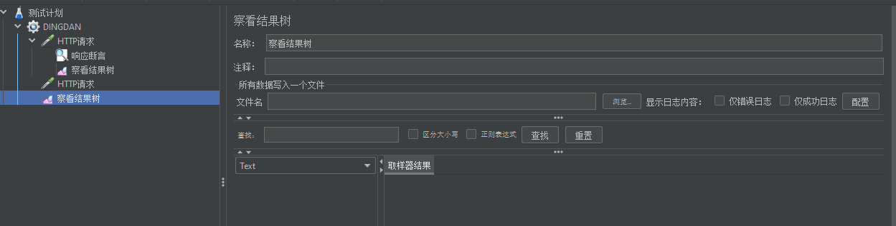


#### 测试报告

```java
90% Line：90％ 用户的响应时间
    
1.Label ：请求对应的name值。每个 JMeter 的 element（例如 HTTP Request）都有一个 Name 属性，这里显示的就是 			Name 属性的值
2.Samples ：总的发出请求数。（线程数乘以循环次数：如果模拟10个用户，每个用户迭代10次，那么这里显示100）
3.Average ：请求的平均响应时间。默认情况下是单个 Request 的平均响应时间，当使用了 Transaction Controller 时，			以Transaction 为单位显示平均响应时间
4.Median ：样本请求的中数。也就是 50％ 用户的响应时间
6.90% Line ：90%的样本都没有超过这个时间。意思就是把所有请求的请求时间按从小到大将其排列，排列在第90%的值。
7.95% Line：95%的样本都没有超过这个时间。意思就是把所有请求的请求时间按从小到大将其排列，排列在第95%的值。
8.99% Line：99%的样本都没有超过这个时间。这个值是指把所有数据按由小到大将其排列，就是排列在第99%的值。
9.Min：所有请求中最小的响应时间。
10.Max：所有请求中最大的响应时间。
11.Error %：本次测试中，报错请求所占百分比, 错误请求数/请求总数。
12.Throughput：吞吐量是以每秒/分钟/小时的请求量来度量的，这里表示每秒完成的请求数。当使用了 Transaction Controller 时，也可以表示类似 LoadRunner 的 Transaction per Second 数
13.Received KB/sec：收到的千字节每秒的吞吐量测试。
14.Sent KB/sec：发送的千字节每秒的吞吐量测试。 

KB/Sec：每秒从服务器端接收到的数据量，相当于LoadRunner中的Throughput/Sec

一般而言，性能测试中我们需要重点关注的数据有：#Samples 请求数，Average 平均响应时间，Min 最小响应时间，Max 最大响应时间，Error% 错误率及Throughput 吞吐量。推荐：100道Java中高级面试题汇总+详细拆解
 
    
    
    
```


# 工作台

## 注意

* **最新版的jmeter去掉了工作台**
* Test Plan --->右键选添加->非测试元件->HTTP代理服务器

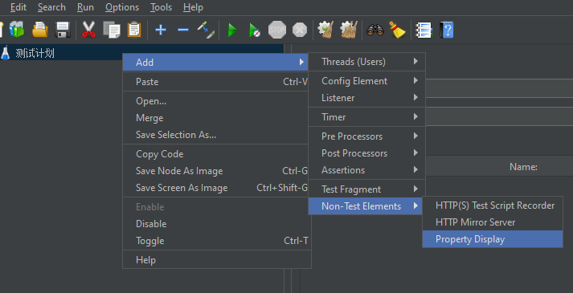


## 介绍

* 用来录制脚本使用


