# 创建方式一： 重新创建

## 项目创建

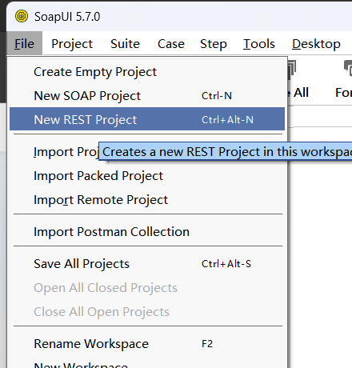‘

## 输入 url

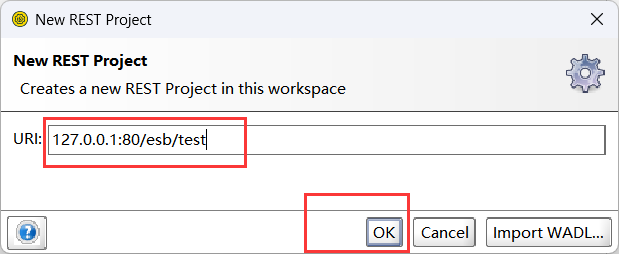

## 查看

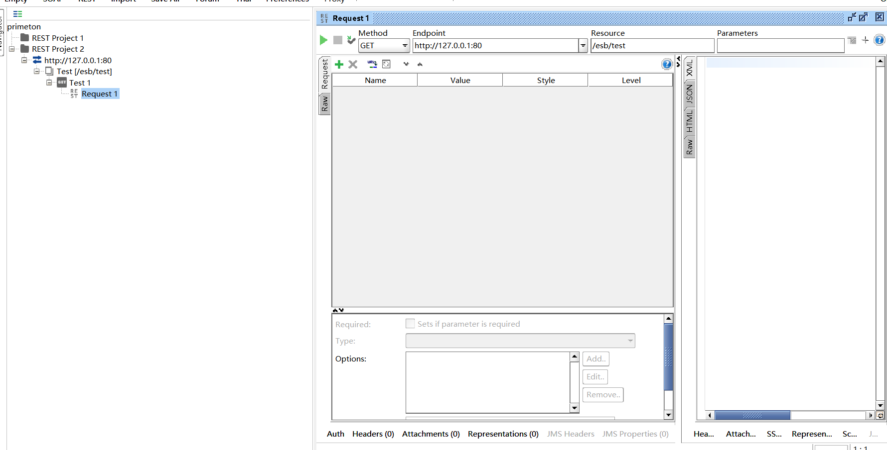

## 请求设置

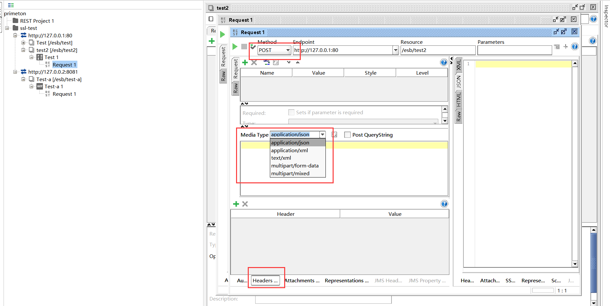

## ===

## 修改 -- project name 

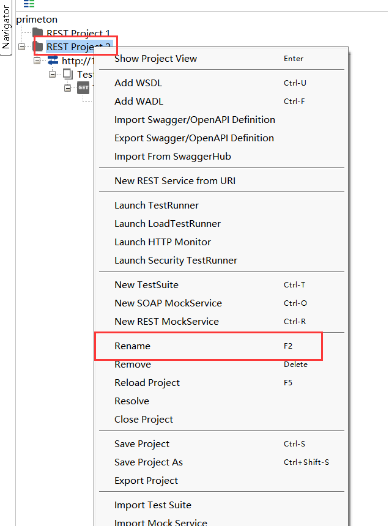

## 修改 - 添加不同的 url-path

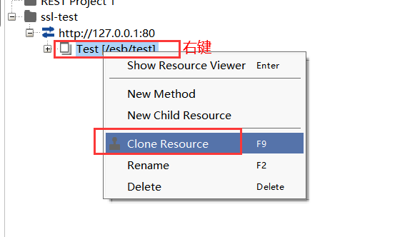

* 重命名

  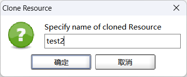

  * 修改 path , 【ctrl + s】 进行保存

    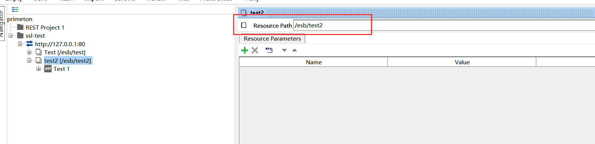

    

## 修改 - 添加新 ip 请求

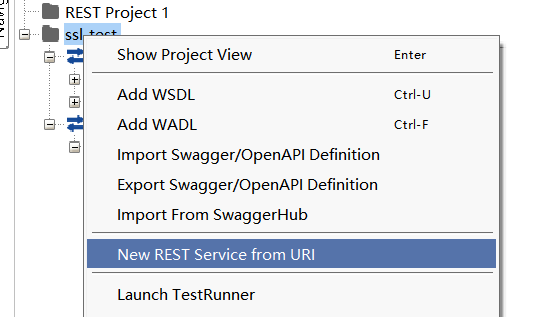

* 添加 ip 和请求

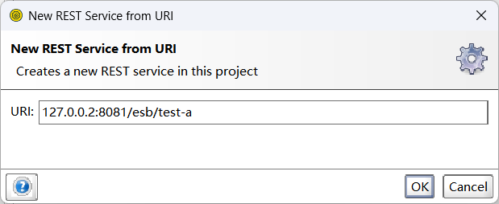

* 结果

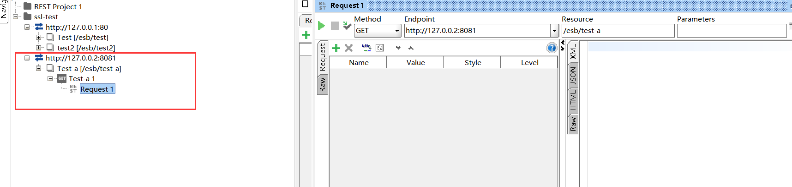

