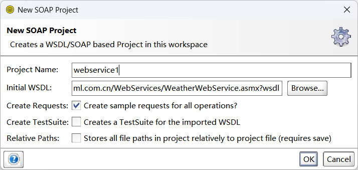
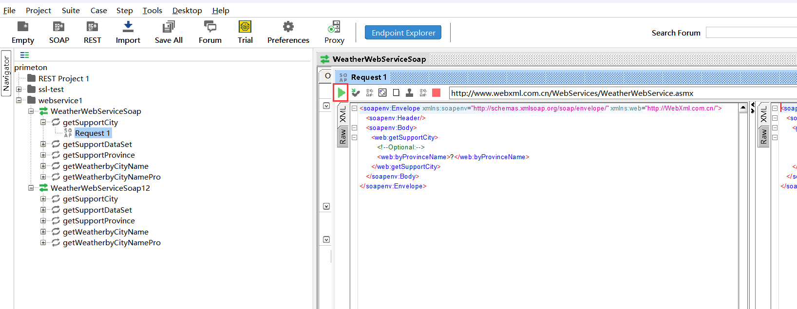
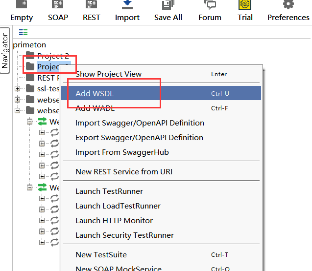

# webservice 分类

* soap 形式： 基于soap协议的（**wsdl 结尾的接口 ** ）

* 基于restful思想的，由于restful api接口

  ```
  注意： 请求报文为xml/json
  
  
  
  这个没有碰到过哎，好像用友的  esb 是这个情况
  ```


# soap -- 方式一

## 创建项目

* 注意： 在线的 wsdl 网址需要添加一个 wsdl 后缀



## 选择运行




# soap -- 方式二

* 使用 empty 创建一个空项目

* 右键 project 进行导入 wsdl

  

  

# rest -- 方式的


