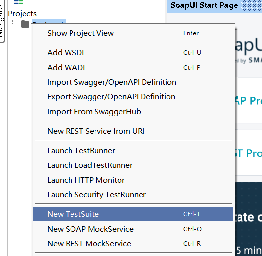
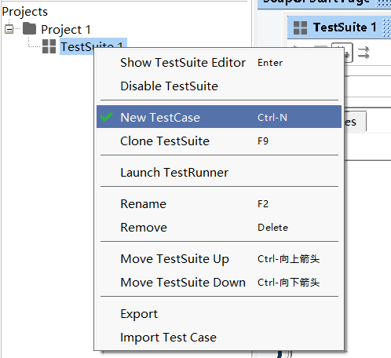
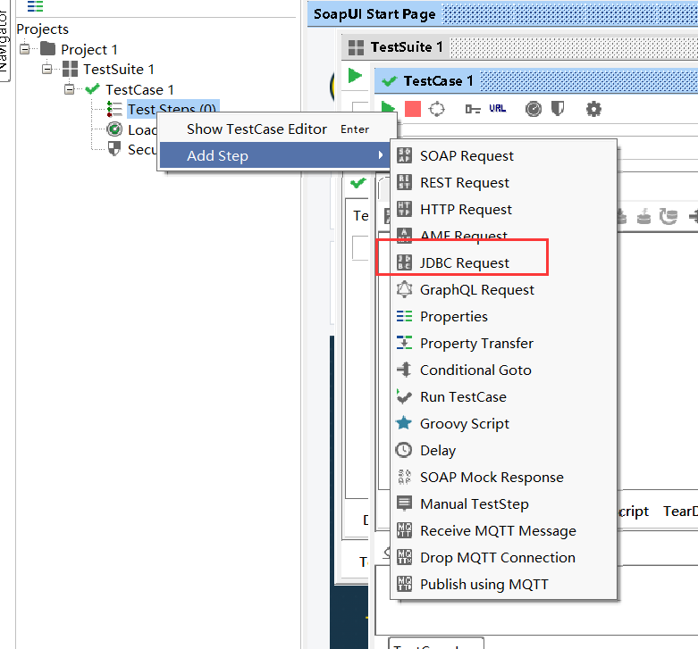
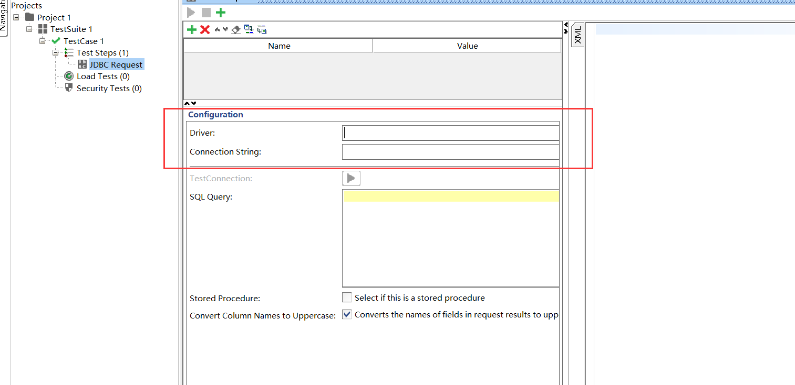

# jdbc请求

* 创建 project

* 创建测试集合

  

* 新建测试用例

  

  

  * 创建 jdbc 请求

    

  * 数据库驱动安装

    下载一个 mysql 的 java 链接驱动，放到 soap 的 lib 文件夹

  * 参数设置

    * 注意： connecting string 就是 url, 是需要拼接上账号密码的

  

  