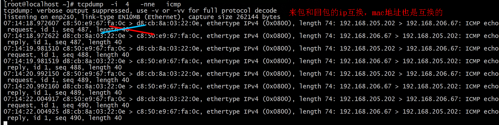

# 抓包工具 

# == tcpdump

# 介绍

```
tcpdump [option] expression  抓包数据处理

expression ： protocol direction type
【协议 -- 方向 -- 抓取的类型】
协议： 
	tcp, udp, icmp, ip, ip6, arp, rarp,ether,wlan, fddi, tr, decnet

方向：
	src[源主机] --> 服务器 -->dst[目的主机]（源主机和目的主机是相对于服务器来说的）

抓取的类型
	host 主机， net 网段【host范围】
    port  端口， portrange 端口范围
 
 expression 连接符
 	

```

# 过滤规则

## host

```shell
# 抓取通过接口 eth2 接收 src 发送过来的数据
$ tcpdump -i eth2 src 192.168.10.100

# 根据目标ip进行过滤
# 抓取发送通过接口 eth2 给 dst 的数据
$ tcpdump -i eth2 dst 192.168.10.200

# 简写： 所有与主机 192.168.10.100 相关的包都会抓取
$ tcpdump host 192.168.10.100

// ============================
# 根据源网段进行过滤
$ tcpdump src net 192.168

# 根据目标网段进行过滤
$ tcpdump dst net 192.168

# 简写
$ tcpdump net 192.168.10.0/24


```


## port

```shell
# 根据源端口进行过滤
$ tcpdump src port 8088

# 根据目标端口进行过滤
$ tcpdump dst port 8088

# 简写：与该端口相关的数据都会抓取，部分 src 和 dst
$ tcpdump port 8088
# ===============================

# 范围
$ tcpdump src portrange 8000-8080
$ tcpdump dst portrange 8000-8080
$ tcpdump portrange 8000-8080

#=================================
默认端口
http == 80，
https == 443
```

## 命令

### n 关闭域名解析

```shell
 -n 用于关闭对ip包的dns反向查询功能，不使用-n，收到包后，系统会执行根据ip反向查询url地址的过程。有时执行tcpdump后，等十几秒才会有显示，使用-n后抓包后立即显示。

/

-a 选项强制将网络地址显示为名称。
-n 阻止将地址显示为名字。
-N 阻止将域名转换。

/


- `-n`：不把ip转化成域名，直接显示 ip，避免执行 DNS lookups 的过程，速度会快很多

# 了及时打印显示抓包，一般都用选项-nn来快速显示。
-nn：不把协议和端口号转化成名字，速度也会快很多。
	取消反向dns的过程，立即打印抓包，并用数字显示ip端口之类

- `-N`：不打印出host 的域名部分.。比如,，如果设置了此选现，tcpdump 将会打印'nic' 而不是 'nic.ddn.mil'.


```


### -i 网卡接口

```
跟踪接口的数据流量，首先得指定跟踪接口，不指定默认是编号最小的接口。
 -i  <interface>  
 含义： 是指定抓取网卡的名称或者数字编号； 
 1. 直接使用 IP address 查看使用的哪个网口
 2. 如果要查看所有网卡，可以 -i any
 3. 当没有指定网卡时，程序会从找一个编号最小的网口进行跟踪

tcpdump -i ens192 dst host 192.168.188.32 and dst port 53258 -w /opt/Primeton_ESB_8.6_GA_Server/aaa.log

<interface> 是你要监听的网络接口，例如eth0或wlan0。[使用 ip address 查看]
```

### -w 数据写入文件

```
使用 -w 参数后接一个以 .pcap 后缀命令的文件名，就可以将 tcpdump 抓到的数据保存到文件中。
最后再使用 wireshark 打开它即可

参数是路径和文件名，不写路径默认是系统默认路径, 【默认路径是/root】
1. 注意使用 ctrl+c 终止，否则不会生成文件
$ tcpdump icmp -w icmp.pcap
```

### t 时间显示

```shell
-t：在每行的输出中不输出时间
-tt：在每行的输出中会输出时间戳
-ttt：输出每两行打印的时间间隔(以毫秒为单位)   # 显示每两包间的时间差，在一些超时分析，重发分析中常用
-tttt：在每行打印的时间戳之前添加日期的打印（此种选项，输出的时间最直观) # 这个最直观
```

### x 报文头信息

```shell
-x：以16进制的形式打印每个包的头部数据（但不包括数据链路层的头部）
-xx：以16进制的形式打印每个包的头部数据（包括数据链路层的头部）
-X：以16进制和 ASCII码形式打印出每个包的数据(但不包括连接层的头部)，这在分析一些新协议的数据包很方便。
-XX：以16进制和 ASCII码形式打印出每个包的数据(包括连接层的头部)，这在分析一些新协议的数据包很方便
```

### -c 抓包量

```
-s  指定抓包大小 
-c   指定抓包数量


用于指定抓包的包数，到达指定包数后自动停止抓包，不用ctrl+c来停止。

-c 用于指定抓取包的包字节数；
-C 用于指定抓取保存文件的大小，单位是兆；
	tcpdump 在把原始数据包直接保存到文件中之前, 检查此文件大小是否超过file-size. 如果超过了, 将关闭此文件,另创一个文件继续用于原始数据包的记录. 新创建的文件名与-w 选项指定的文件名一致, 但文件名后多了一个数字.该数字会从1开始随着新创建文件的增多而增加. file-size的单位是百万字节(nt: 这里指1,000,000个字节,并非1,048,576个字节, 后者是以1024字节为1k, 1024k字节为1M计算所得, 即1M=1024 ＊ 1024 ＝ 1,048,576)


```

### e 用来显示源，目标ip的mac地址

```
在有ip冲突，ping不通之类与入出mac相关的问题时，最好使用这个选项。如正常的ping消息，request和reply的源和目的地址是相互互换的，若不是，ping的发起方有可能显示time out，这是用-e选项，很容易看出问题。
```




### --- 其他

### 4.3 从文件中读取包数据[#](https://www.cnblogs.com/wongbingming/p/13212306.html#idx_13)

使用 `-w` 是写入数据到文件，而使用 `-r` 是从文件中读取数据。

读取后，我们照样可以使用上述的过滤器语法进行过滤分析。

```shell
Copy
Copy$ tcpdump icmp -r all.pcap
```

### 4.4 控制详细内容的输出[#](https://www.cnblogs.com/wongbingming/p/13212306.html#idx_14)

- `-v`：产生详细的输出. 比如包的TTL，id标识，数据包长度，以及IP包的一些选项。同时它还会打开一些附加的包完整性检测，比如对IP或ICMP包头部的校验和。
- `-vv`：产生比-v更详细的输出. 比如NFS回应包中的附加域将会被打印, SMB数据包也会被完全解码。（摘自网络，目前我还未使用过）
- `-vvv`：产生比-vv更详细的输出。比如 telent 时所使用的SB, SE 选项将会被打印, 如果telnet同时使用的是图形界面，其相应的图形选项将会以16进制的方式打印出来（摘自网络，目前我还未使用过）


### 4.8 过滤特定流向的数据包[#](https://www.cnblogs.com/wongbingming/p/13212306.html#idx_18)

- `-Q`： 选择是入方向还是出方向的数据包，可选项有：in, out, inout，也可以使用 --direction=[direction] 这种写法

### 4.9 其他常用的一些参数[#](https://www.cnblogs.com/wongbingming/p/13212306.html#idx_19)

- `-A`：以ASCII码方式显示每一个数据包(不显示链路层头部信息). 在抓取包含网页数据的数据包时, 可方便查看数据
- `-l` : 基于行的输出，便于你保存查看，或者交给其它工具分析
- `-q` : 简洁地打印输出。即打印很少的协议相关信息, 从而输出行都比较简短.
- `-c` : 捕获 count 个包 tcpdump 就退出
- `-s` : tcpdump 默认只会截取前 `96` 字节的内容，要想截取所有的报文内容，可以使用 `-s number`， `number` 就是你要截取的报文字节数，如果是 0 的话，表示截取报文全部内容。
- `-S` : 使用绝对序列号，而不是相对序列号
- 
- `-F`：使用file 文件作为过滤条件表达式的输入, 此时命令行上的输入将被忽略.

### 4.10 对输出内容进行控制的参数[#](https://www.cnblogs.com/wongbingming/p/13212306.html#idx_20)

- `-D` : 显示所有可用网络接口的列表
- `-e` : 每行的打印输出中将包括数据包的数据链路层头部信息
- `-E` : 揭秘IPSEC数据
- `-L` ：列出指定网络接口所支持的数据链路层的类型后退出
- `-Z`：后接用户名，在抓包时会受到权限的限制。如果以root用户启动tcpdump，tcpdump将会有超级用户权限。
- `-d`：打印出易读的包匹配码
- `-dd`：以C语言的形式打印出包匹配码.
- `-ddd`：以十进制数的形式打印出包匹配码


```
-D  是显示所有的可跟踪的接口，可以和ip addr配合使用来确定要抓取的网口数字编号或名称；


-n 来关闭dns反向解析功能，-nn是关闭反向查询功能并以数字格式显示ip地址端口号，和url地址。不带这个选项回显会很慢。


-e用于显示对应的源，目的的mac地址

-w 文件路径和文件名  用于指定保存文件的路径和名称，没有指定路径默认在系统默认路径下；

-t是不显示时间戳，-tt显示时间戳，-ttt显示请求和响应的时间的时间差；

-v是显示一些协议的详细资料，-vv，-vvv来显示更详细的资料；

-X是用16进制和asc码显示ip层以上各协议包头；

-x  小写x是用16进制打印从ip层开始的帧内容

-xx 小写的xx是用16进制打印从数据链路层开始的帧内容

-X  大写的X是用16进制打印从ip层开始的帧内容

-XX 大写的XX是用16进制打印从数据链路层开始的

-G 后面跟秒数，多少秒后重写另一个文件；

-Z 后面跟用户名，表示要用该用户名来执行；

-r 后面跟抓包文件，读取抓包文件
————————————————
版权声明：本文为CSDN博主「wj31932」的原创文章，遵循CC 4.0 BY-SA版权协议，转载请附上原文出处链接及本声明。
原文链接：https://blog.csdn.net/wj31932/article/details/106570542
```


## 运算符

* 逻辑运算符

```shell
and：所有的条件都需要满足，也可以表示为 &&
or：只要有一个条件满足就可以，也可以表示为 ||
not：取反，也可以使用 !

# 抓一个来自10.5.2.3，发往任意主机的3389端口的包
$ tcpdump src 10.5.2.3 and dst port 3389
```


* 判断运算符

```shell
=：判断二者相等
==：判断二者相等
!=：判断二者不相等

>  : greater 大于
<  : lower 小于
>= : greater or equal 大于或者等于
<= : lower or equal 小于或者等于
=  : equal  等于
!= : different  不等于


#  配套关键字
if：表示网卡接口名、
proc：表示进程名
pid：表示进程 id
svc：表示 service class
dir：表示方向，in 和 out
eproc：表示 effective process name
epid：表示 effective process ID
# end


# 我现在要过滤来自进程名为 nc 发出的流经 en0 网卡的数据包
$ tcpdump "( if=en0 and proc =nc )"
```

* 报文截取

```
proto[位置:个数] = 0x十六进制数，proto指协议，位置是指协议字段开始的偏移量，个数指从偏移位置开始的字节数，[]里都是十进制数字。

proto[x:y]          : 过滤从x字节开始的y字节数。比如ip[2:2]过滤出2、3字节（第三、第四字节）（第一字节从0开始排）
proto[x:y] & z = 0  : proto[x:y]和z的与操作为0
proto[x:y] & z !=0  : proto[x:y]和z的与操作不为0
proto[x:y] & z = z  : proto[x:y]和z的与操作为z
proto[x:y] = z      : proto[x:y]等于z


语句：arp[14:4]=0x12fa0019  or  arp[24:4]=0x12fa0019  or  icmp
Arp请求消息中偏移量为14开始的4个字节是arp请求消息的源ip，arp应答消息偏移量为24开始的4个字节是arp响应reply的目的ip，这条语句就是抓arp查询过程和icmp消息，ip地址是18.250.0.25的消息过程。
```


# 实践

### 抓取 服务器发送的 ws 报文

```shell

```

### http 请求

```
sudo tcpdump -i <interface> -s0 -w <filename.pcap> port <http_port> and (((ip[2:2] - ((ip[0]&0xf)<<2)) - ((tcp[12]&0xf0)>>2)) != 0)

---
-s0参数表示抓取的数据包长度不超过64字节

---


这个命令将抓取指定接口上HTTP流量并将结果写入一个名为filename.pcap的Pcap文件中。其中，interface是您要抓取的网络接口，http_port是HTTP流量使用的端口号（默认为80）。
表达式通过计算TCP报文中的SYN标志位置来判断是否为HTTP请求。如果结果为0，则表示该报文是一个HTTP请求。


```

# 自己实现

## 抓取 ws 服务

```shell
场景：
	有一个 http-2-ws 的服务， 需要查看经过 esb 转后发出去的 ws 到底长什么样子
实现：	
# 发往 192.168.188.32:53258 的数据
sudo tcpdump -i ens192 dst host 192.168.188.32 and dst port 53258 -w /opt/Primeton_ESB_8.6_GA_Server/aaa.log
参数
<interface> 是你要监听的网络接口，例如eth0或wlan0。[使用 ip address 查看]
dst host 1.1.1.1 是过滤器的一部分，用于仅捕获目的地址为1.1.1.1的请求。
dst port 990 是过滤器的另一部分，用于仅捕获目的端口为990的请求。
<output_file.pcap> 是保存抓包数据的文件名和路径。

含义
tcpdump将开始捕获符合指定过滤器条件的数据包，并将它们写入指定的输出文件。
当你想停止抓包时，按下Ctrl+C来终止tcpdump进程。
完成后，你可以使用Wireshark或其他抓包分析工具加载生成的.pcap文件，以查看捕获的特定目的地址和端口的请求
```


# -- 报文解析

# tcp

```
21:26:49.013621 IP 172.20.20.1.15605 > 172.20.20.2.5920: Flags [P.], seq 49:97, ack 106048, win 4723, length 48


从上面的输出来看，可以总结出：

第一列：时分秒毫秒 21:26:49.013621
第二列：网络协议 IP
第三列：发送方的ip地址+端口号，其中172.20.20.1是 ip，而15605 是端口号
第四列：箭头 >， 表示数据流向
第五列：接收方的ip地址+端口号，其中 172.20.20.2 是 ip，而5920 是端口号
第六列：冒号
第七列：数据包内容，包括Flags 标识符，seq 号，ack 号，win 窗口，数据长度 length，其中 [P.] 表示 PUSH 标志位为 1，更多标识符见下面
2.2 Flags 标识符#
使用 tcpdump 抓包后，会遇到的 TCP 报文 Flags，有以下几种：

[S] : SYN（开始连接）
[P] : PSH（推送数据）
[F] : FIN （结束连接）
[R] : RST（重置连接）
[.] : 没有 Flag （意思是除上面四种类型外的其他情况，有可能是 ACK 也有可能是 UR
```

# IP

当你想查看 tcp 的包，你也许会这样子写

```shell
Copy
Copy$ tcpdump tcp
```

这样子写也没问题，就是不够精准，为什么这么说呢？

ip 根据版本的不同，可以再细分为 IPv4 和 IPv6 两种，如果你只指定了 tcp，这两种其实都会包含在内。

那有什么办法，能够将 IPv4 和 IPv6 区分开来呢？

很简单，如果是 IPv4 的 tcp 包 ，就这样写（友情提示：数字 6 表示的是 tcp 在ip报文中的编号。）

```shell
CopyCopy$ tcpdump 'ip proto tcp'

# or

$ tcpdump ip proto 6

# or

$ tcpdump 'ip protochain tcp'

# or 

$ tcpdump ip protochain 6
```

而如果是 IPv6 的 tcp 包 ，就这样写

```shell
CopyCopy$ tcpdump 'ip6 proto tcp'

# or

$ tcpdump ip6 proto 6

# or

$ tcpdump 'ip6 protochain tcp'

# or 

$ tcpdump ip6 protochain 6
```

关于上面这几个命令示例，有两点需要注意：

1. 跟在 proto 和 protochain 后面的如果是 tcp, udp, icmp ，那么过滤器需要用引号包含，这是因为 tcp,udp, icmp 是 tcpdump 的关键字。
2. 跟在ip 和 ip6 关键字后面的 proto 和 protochain 是两个新面孔，看起来用法类似，它们是否等价，又有什么区别呢？

关于第二点，网络上没有找到很具体的答案，我只能通过 `man tcpdump` 的提示， 给出自己的个人猜测，但不保证正确。

proto 后面跟的 `<protocol>` 的关键词是固定的，只能是 ip, ip6, arp, rarp, atalk, aarp, decnet, sca, lat, mopdl, moprc, iso, stp, ipx, or netbeui 这里面的其中一个。

而 protochain 后面跟的 protocol 要求就没有那么严格，它可以是任意词，只要 tcpdump 的 IP 报文头部里的 protocol 字段为 `<protocol>` 就能匹配上。

理论上来讲，下面两种写法效果是一样的

```shell
CopyCopy$ tcpdump 'ip && tcp'
$ tcpdump 'ip proto tcp'
```

同样的，这两种写法也是一样的

```shell
CopyCopy$ tcpdump 'ip6 && tcp'
$ tcpdump 'ip6 proto tcp'
```


## 