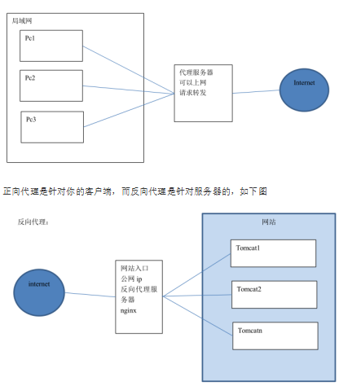
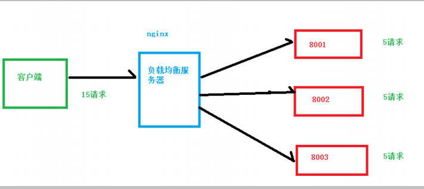
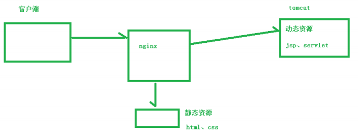

# 知识普及

## 正反向代理

```java
个人理解
    正反向代理就是站在不同立场的产物， 
    a 通过 B 去反问 c
    // 我们一般思考逻辑就是： 客户端发送请求过来， 后端接收处理
    // 简单理解为： 在客户端考虑问题是正向，在服务端考虑是反向
    // 其实你依照服务端有多少个去判断是正反向代理， 其实也是不由自主自己代入了自己是客户端还是服务端
    站在 a 的立场： B 就是代指服务器  // 正向代理： 通常服务端只有一个
    站在 c 的立场： B 就是代指客户端  // 反向代理： 通常服务端有多个
```



## 负载均衡

```java
个人理解
    就是好多请求去请求同一个服务器， 会造成服务器运行压力太大(内存占用过高、线程被占用完了等等)，无法及时处理所有的请求， 负载均衡就是通过一定的规则把过多的请求，分散到不同的服务器上， 减轻服务器的运行压力
```



## 动静分离

```java
其实就是把静态页面、动态代码放在
```




# 配置介绍

## 配置文件

```
默认位置在 config 下，改过后记得重启Nginx服务

配置文件 = 注释行 + 指令(配置项) + 指令块{配置项} 

指令特点：
	1. 配置的继承。在一个区段中嵌套其他区段，那么被嵌套的区段会继承其父区段的配置。在嵌套模块中重新声明指令会覆盖该继承。
	2. 配置块能相互嵌套。在某些情况下不同配置块能够相互嵌套
	3. 指令都有作用域
```


### 指令值

* 单位

  ```
      k或K:千字节
      m或M:兆字节
      ms:Milliseconds(毫秒)
      s:Seconds(秒)
      m:Minutes(分钟)
      h:Hours(小时)
      d:Days(天)
      w:Weeks(星期)
      M:Months(月)
      y:Years(年)
  ```

* 值

  ```
  1. 如果指令值中包含空格、分号或者是大括号等特殊字符，需要使用单引号或双引号将其括起。
  ```

  


## 配置文件结构

```


①、http 全局块
http 全局块配置的指令包括：文件引入、MIME-TYPE 定义、日志自定义、连接超时时间、单链接请求数上限等。

②、server 块
这块和虚拟主机有密切关系，虚拟主机从用户角度看，和一台独立的硬件主机是完全一样的，该技术的产生是为了节省互联网服务器硬件成本。

每个 http 块可以包括多个 server 块，而每个 server 块就相当于一个虚拟主机。而每个 server 块也分为全局 server 块，以及可以同时包含多个 locaton 块。（☆☆☆☆☆）

1、全局 server 块
最常见的配置是本虚拟机主机的监听配置和本虚拟主机的名称或 IP 配置。

2、location 块
一个 server 块可以配置多个 location 块。

这块的主要作用是基于 Nginx 服务器接收到的请求字符串（例如 server_name/uri-string），对虚拟主机名称（也可以是 IP 别名）之外的字符串（例如 前面的 /uri-string）进行匹配，对特定的请求进行处理。地址定向、数据缓存和应答控制等功能，还有许多第三方模块的配置也在这里进行。
```

## 注释

```
字符"#"表示该行是注释行，nginx在读取配置文件时将忽略的文本。
```


## main 模块

```python
 #启用或禁用守护进程模式。
daemon on;

#worker进程运行的用户和组，如果没有提供则使用nginx的master进程的用户和用户组。
user  nobody;   

#定义worker进程数量一般和cpu核数一致。
worker_processes  4;

#错误日志，这里的级别由debug,info,notice,warn,error和crit(debug记录了全部日志，crit仅报告关键错误)
#作用域：main, http, mail, stream, server, location
error_log  logs/error.log error; 

#存放nginx守护进程的pid文件路径。
pid        logs/nginx.pid;

#开启或禁用记录404错误。
log_not_found on; 
...
#除上面指令外还有worker_rlimit_core、worker_rlimit_nofile、worker_cpu_affinity、worker_priority等。
```


## events模块

* 用来配置网络机制。

```python
#默认值on，启用或禁用使用一个接受互斥锁来打开套接字监听。   
accept_mutex:on; 

#指定nginx所使用的网络事件模型，可选值有/dev/poll,epoll,kqueue等，通常不需要显式指定它，默认情况下nginx将使用最有效方法。    
use epoll; 

#定义一个worker进程能够同时连接的数量。
worker_connections 1024; 
```

## configuration模块

* 能够将其他文件包含在nginx配置文件中。在配置文件的任何地方均可插入该指令。
* 注意如果没有指定绝对路径，那么文件路径将和配置文件的目录相关。

```python
include /file/path.conf;
include sites/*.conf;
```

## HTTP 核心

* HTTP 核心模块是Nginx中最大的一个模块，它包含了所有的基本的区段、指令和变量

  ```python
  http {
      # 在http区段中启用gzip压缩
      gzip on;
      server {
          location /downloads/ {
               #在此location区段禁用gzip压缩
              gzip off;
          }
      }
  }
  
  
      http 区段位于配置文件的根部，在这个区段中允许定义HTTP模块的指令和HTTP模块的相关区段。
      server区段用于声明一个站点，该区段只能用在http区段中。
      loation 区段应用于网站特定的URI位置，该区段能够用于server区段中，也能嵌套在其他location中。
  ```

### 属性

```
include       mime.types;
default_type  application/octet-stream;
sendfile        on;
keepalive_timeout  65;


=====
keepalive相关指令：keepalive_requests、keepalive_timeout、send_timeout。

缓冲区相关指令：client_body_buffer_size、client_header_buffer_size、large_client_header_buffers等。

其他客户端指令：client_body_timeout、client_header_timeout、client_max_body_size、lingering_time、ligering_timeout、ignore_invalid_header等

log_not_found:
	开启或禁用404没有找到的HTTP错误，如果日志中由于找不到favicon.ico或robots.txt而充满404错误日志，则可以通过这个选项关闭掉。
    作用域：http,server,location。
    默认值：on
log_subrequest:
	启用或禁用记录子请求（被内部请求指令（如rewrite）或SSI请求触发的请求）。
    作用域：http,server,location。
    默认值：off
```


### error_page

```java
范围： http,server,location,if
含义：用于定义处理特定 HTTP 错误代码时的错误页面或重定向
语法： error_page <error_code> [=replacement code] [=@block|URI]
<error_code> 
    是要处理的 HTTP 错误代码。
    可以是单个错误代码，也可以是用逗号分隔的多个错误代码，或者使用通配符来匹配一类错误代码。
    
<response> 
    是要返回的 HTTP 响应码，
    可以是数字形式的 HTTP 响应码，也可以是一个内置的 Nginx 响应码，如 400 或 404，
    或者使用 = 前缀精确匹配一个自定义的错误页面。
    
<url> 是要重定向到的 URL 地址，可以是相对路径或绝对路径。  
    
案例
 
#跳转到命名的location区段。
error_page 404 @notfound; 


返回自定义的错误页面：
// 当发生 404 错误时，将返回 /errors/not-found.html 页面
error_page 404 /errors/not-found.html;
// 重定向到外部 URL：当发生 503 错误时，将重定向到 http://example.com/maintenance.html。
error_page 503 http://example.com/maintenance.html;


使用内置的 Nginx 响应码：
// 当发生 500 错误时，将返回 /errors/server-error.html 页面，并确保只匹配精确的 500 错误。
error_page 500 = /errors/server-error.html;
// 在出现404错误时 ，内部重定向到index.html,并且返回200 OK响应码。
error_page 404 =200/index/html;
 
处理多个错误码： 
// 当发生 404 或 500 错误时，将返回 /errors/error.html 页面。    
error_page 404, 500 /errors/error.html;
 
使用通配符匹配错误码：
// 当发生以 50 开头的任何错误码时，都将返回 /errors/server-error.html 页面。
error_page 50* /errors/server-error.html;


注意：
1. 使用相对路径时，路径是相对于服务器配置文件或 root 指令所指定的根目录。
2. 在某些情况下，需要确保错误页面或重定向的 URL 是有效的，并且具有正确的权限设置。    
3. 生效路径：就近原则    
```

### index

```java
作用域: http、server 或 location
含义：用于定义默认的索引文件.如果请求中没有指定文件名，nginx则使用默认页面提供服务。默认值index.html。
语法： index file1 [file2...] 
	<file1>, <file2>, ... 是按照优先级顺序列出的索引文件名称。
	Nginx 将按照从左到右的顺序查找这些文件，直到找到存在的文件为止。
案例：
// 当用户请求一个目录时，Nginx 将首先查找 index.html 文件，如果不存在，则查找 index.htm 文件，并将找到的第一个索引文件返回给客户端
// 如果目录下没有匹配的索引文件，则 Nginx 将返回目录的文件列表（如果目录浏览功能启用）或返回 403 Forbidden 错误（如果目录浏览功能禁用）。    
location / {
	index index.html index.htm;
}

```


### types

```java
作用域:  
含义：指定了服务器在返回文件时使用的 MIME 类型，以便客户端能够正确解析和处理这些文件
语法：  

案例
/*
text/html MIME 类型关联了 .html 和 .htm 扩展名。
application/json MIME 类型关联了 .json 扩展名。
image/jpeg MIME 类型关联了 .jpg 和 .jpeg 扩展名。
	Nginx 使用这些映射关系来确定返回文件时的正确 MIME 类型。当服务器返回一个文件时，它会根据请求的文件扩展名查找相应的 MIME 类型，并将其包含在响应头中的 Content-Type 字段中。
	可以确保服务器返回正确的 MIME 类型，以便客户端能够正确地解析和处理文件。这对于确保 Web 应用程序的正常运行和安全性非常重要，因为不正确的 MIME 类型可能导致浏览器或其他客户端错误地处理文件内容。
*/
types {
    text/html html htm;
    application/json json;
    image/jpeg jpg jpeg;
}

```

### default_type

```

用于设置默认的 MIME 类型。当服务器返回一个文件时，如果无法通过文件扩展名或其他方式确定其 MIME 类型，则将使用默认类型。
http {
    default_type application/octet-stream;
    ...
}

```

### proxy_pass

```java
含义： 指定转发给后端服务器的协议和地址。
语法：proxy_pass 协议://地址[/URI]; 
	协议可以是http或https。地址可以是TCP套接字（域名或者ip地址+port）、UNIX域套接字，还可以指向upstream区段。URI是可选部分，如果指定了URI，location 后面指定的路径将被替换。

/*
proxy_pass 将请求代理到不同的后端服务器或上游服务器：
/api/ 请求会被代理到名为 backend-server 的后端服务器。
/app/ 请求会被代理到名为 backend-server、端口号为 8080 的后端服务器
*/
location /api/ {
    proxy_pass http://backend-server;
}

location /app/ {
    proxy_pass http://backend-server:8080/;
}

proxy_pass http://localhost:8080;
proxy_pass http://127.0.0.1:8080;
proxy_pass http://unix:/tmp/backend.sock;
proxy_pass https://192.168.0.1;
proxy_pass http://localhost:8080/uri/;
proxy_pass http://unix:/tmp/backend.sock:/uri/:
# URL中还可以使用变量
proxy_pass http://$server_name:8080;

#指向upstream区段
#格式：proxy_pass http://myblock;
upstream backend {
    server 127.0.0.1:8080;
    server 127.0.0.1:8081;
}
location ~ \.php($|/) {
    fastcgi_pass http://backend;
}


注意：如果proxy_pass指定了URI，那么location匹配不能使用正则表达式。如果代理的URI需要使用正则表达式，则可以使用rewrite和proxy_pass结合的方式来定义转发路径。此时proxy_pass 后面定义的URL不再生效。

location /static_js/ {
    rewrite /static_js/(._)$ /$1 break;
    proxy_pass http://js.test.com;
}

```

### proxy_next_upstream

```
```


## http-server

* 案例

### listen  

```
 listen [address][:port][其他选项]
 
address：
	指定监听的 IP 地址或域名。
	可以是具体的 IP 地址，例如 192.168.0.1，也可以是域名，例如 example.com。
	如果省略 address，则表示监听所有可用的 IP 地址。
port：
	指定监听的端口号。
	可以是具体的端口号，例如 80，也可以是一个范围，例如 8000-8080。
	如果省略 port，则表示使用默认的 HTTP 端口 80。
	
options：
	可选的附加选项，用于进一步配置监听行为
	ssl 
		选项来启用 SSL/TLS 加密
 	default: 
 	  1. 后续改为  default_server
 	  2. 当客户端请求的域名没有与其他服务器块的server_name指令匹配时，将使用设置为默认服务器的那个服务器块来处理请求。[就是就是匹配不到对应的服务器，就使用 default 修饰的]
 	  
例子
listen 80;  
	表示监听默认的 HTTP 端口 80，对所有可用的 IP 地址生效。
listen 192.168.0.1:8080;
	监听 IP 地址 192.168.0.1 的端口 8080
listen [::]:80;
	表示监听所有 IPv6 地址的端口 80
	
listen example.com:443 ssl;
	表示监听域名 example.com 的端口 443，并启用 SSL/TLS 加密。
listen example.com:443 default_server;
	表示监听域名 example.com 的端口 443。当客户端请求的域名找不到对应的 server 的时候，就是用当前 listen 所在的 server 处理请求
```

### server-name

```
 nginx收到http请求时，根据请求header中Host值与所有server区段比较，第一个与主机名匹配的server块将被选中，否则如果没有server区段与客户端请求的主机名匹配，nginx会选择第一个server区段，匹配监听参数(listen命令),另外具有default选项的listen会被优先选择。注意该指令接受通配符。
 
 
注意：
    1. nginx 根据 server_name 匹配 server, 随后在进行 listen 匹配的
    
案例
单个域名或主机名：
server_name example.com;

多个域名或主机名，使用空格分隔：
server_name example.com www.example.com;

使用通配符（以 * 开头）匹配多个域名或主机名：
server_name *.example.com;

使用正则表达式进行模式匹配：
server_name ~^(www\.)?example\.com$;
在这个示例中，使用了 ~ 符号表示正则表达式匹配，并指定了一个匹配域名的正则模式。


默认服务器配置，使用 _ 作为 server_name 的值：
server_name _;
这表示该 server 块将作为默认服务器处理没有匹配到其他具体 server_name 的请求。


注意：
	1. 当存在多个 server 块时，Nginx 将根据请求中的域名或主机名与 server_name 的配置进行匹配。匹配成功的 server 块将处理请求。如果没有匹配到具体的 server_name，将会使用默认服务器或第一个 server 块来处理请求。
```

### 其他不重要的

```
tcp_nodelay：
	开启或关闭使用TCP_NODELAY套接字选项，仅用于keep-alive连接。它禁用了Nagle 缓冲算法。
tcp_nopush
    开启或禁用TCP_NOPUSH(FreeBSD)或TCP_CORK(Linux)的scoket选项。如果tcp_nopush开启，则nginx将尝试在整个tcp数据包中发送整个http响应头。
sendfile
    指定nginx是否调用sendfile系统函数来输出文件，减少内核空间和用户空间的上下文切换。对于普通应用设为 on，如果用来进行下载等应用磁盘IO重负载应用，可设置为off，以平衡磁盘与网络I/O处理速度，降低系统的负载。

另外还有sendfile_max_chunk、send_lowat等指令
```


## http-location

```
```

### alias

```
location 指定uri路径的别名，它不会改变root的值
是 location 块中用于指定替代文件路径的指令。
它允许您将请求映射到一个不同的文件路径，而不是使用原始请求的路径。
在 Nginx 中实现路径重写或文件的动态映射，以满足特定的需求。

案例理解
当匹配到以 /path/ 开头的请求时，Nginx 将使用 /new/path/ 替代原始请求的路径，然后根据替代的路径来查找对应的文件。
xxx/path/xxx 会被替换成 xxx/new/path/
location /path/ {
    alias /new/path/;
}

注意：
1. 使用 alias 指令时，末尾的斜杠的存在与否很重要。在 alias 的路径配置中，末尾的斜杠（/）表示该路径是一个目录，Nginx 将根据请求的路径在该目录中查找文件。如果省略末尾的斜杠，则表示该路径是一个文件，Nginx 将直接使用该路径作为替代。

2. alias 指令只能用于 location 块中，并且不能与 proxy_pass 指令一起使用。
```


### try_files:

```java
范围： 
含义： 
	用于在请求的文件或路径不存在时按照指定的顺序尝试匹配其他文件或路径
	可以用于处理静态文件的请求，优先尝试返回存在的文件或目录，而如果都不存在，则转发到某个后端处理程序（例如 PHP 脚本）进行动态处理。
语法： try_files <file1> [<file2> ...] <fallback>;
	<file1>, <file2>, ... 
		是按照优先级顺序列出的要尝试匹配的文件或路径。这
		些文件或路径可以是相对于 root 指令或 $document_root 的相对路径，或者是绝对路径。
	<fallback> 
		是作为最后一项的备用文件或路径，用于在所有其他尝试都失败时返回给客户端。
		
案例
/*
首先，尝试匹配请求的文件 $uri，如果存在则返回。
如果文件不存在，尝试匹配请求的目录 $uri/，如果存在目录则返回。
如果文件和目录都不存在，将请求转发到 /index.php
*/
location / {
    try_files $uri $uri/ /index.php;
}

```

### internal

```java
介绍
    internal 是 Nginx 配置中的一个指令，用于限制只允许通过内部重定向访问指定的位置（location）。
    当一个请求匹配到带有 internal 指令的 location 块时，该 location 块中的内容只能通过内部重定向（通过 rewrite 指令或其他方式）进行访问，对外部请求是不可见的

    
案例
/*
location /internal 的内容只能通过内部重定向进行访问。
如果直接尝试通过外部请求访问该路径，Nginx 将返回 404 错误。
*/    
location /internal {
    internal;
    # 配置项...
}
注意
    1. internal 指令只能限制外部请求对 location 块的访问，它不能阻止通过直接访问所在文件路径的方式绕过限制。因此，为了确保安全性，还需要根据具体情况进行其他的安全措施，如使用身份验证、访问控制列表等。
```

### 模式匹配

```
介绍
	用于定义请求的 URL 匹配规则，并在匹配成功时执行相应的配置。它可以用于实现各种功能，如处理静态文件、代理请求、重定向等

语法
location [modifier] pattern {
    # 配置项...
}
modifier:
	省略： 精确匹配 
     = :   精确匹配， 请求 api 的 uri 必须和 location的 uri 完全一样
     ~     正则匹配。 [~: 区分大小写， ~*：不区分大小写]
     ^~：   前缀匹配
	@ 定义命名location区段。这些区段只能由内部产生的请求访问，如try_files或error_page
pattern 
	是用于匹配请求 URI 的字符串或正则表达式。可以是精确字符串匹配、前缀匹配或正则表达式匹配


修饰符优先级

    = 
    无
    ^~
    ~或～*
    (无)
案例
location / {
    # 处理根路径的请求
    # 配置项...
}

location /static/ {
    # 处理以 /static/ 开头的请求
    # 配置项...
}

location ~ \.php$ {
    # 处理以 .php 结尾的请求（正则匹配）
    # 配置项...
}

location ^~ /images/ {
    # 处理以 /images/ 开头的请求，并优先匹配此规则
    # 配置项...
}

location = /favicon.ico {
    # 处理请求 URI 为 /favicon.ico 的请求
    # 配置项...
}

```

## http变量

### 模块变量

HTTP核心模块引入了大量的变量，可以使用这些变量应用到配置文件中。nginx的变量分为请求头变量、响应头变量和Nginx产生的各种变量。

### 客户端请求头变量

nginx允许你可以访问客户端请求头，以$http_为前缀的格式访问，如下表。

- $http_host：HTTP头中的Host值。
- $http_referer:HTTP头中的referer值。
- $http_x_forward_for：HTTP头中的X-Forward-For的值。 除此之外还有$http_user_agent、$http_via、$http_cookie等。

### 响应头变量

这类变量发生在响应发送后，nginx允许你访问客户端响应头。以$send_http...为前缀，如下表。

- $send_http_content_type：HTTP头中的Content-Type的值。
- $send_http_content_length：HTTP头中的Content-Length的值。 除此之外还有$send_http_location、$send_http_connection等。

### nginx产生的变量

- $arg_XXX：访问查询字符串中的参数。
- $args 所有结合在一起的查询字符串，同$query_string。
- $body_bytes_sent：在响应头中发送的字节数。
- $content_length:相当于HTTP头中的Content-Length。
- $content_type:相当于HTTP头中的Content-Type。
- $cookie_XXX:允许访问cookie数据，这里XXX替换为具体参数。
- $document_root:返回root指令的值。
- $document_uri:返回当前请求的uri，如果内部重定向被执行，将返回重定向后的uri。它与变量$uri相同。
- $request_uri:原始请求的uri，在整个处理过程中保持不变（不像$document_uri/$uri）。
- $host：相当于HTTP请求头中的Host,如果请求头没有Host，nginx会给这个变量赋一个值。
- $hostname：返回服务器的系统名称。
- $is_args：如果$args变量为空，那么$is_args也为空。
- $request_filename:返回当前请求文件的绝对路径。  除此之外还有$nginx_version、$hostname、$remote_addr、$request_body、$request_method、$server_name、$scheme等。


# Rewrite模块

* rewrite模块使用Perl兼容正则表达式库，在安装nginx时需要预先安装perl和perl-dev


# index 模块

# log 模块

# headers 模块

# referer 模块

# secure link 模块

# fastcgi 模块

# 其他

# == 配置案例

# 反向代理

* 案例一

  ```python
  server {
      
      # Nginx 监听端口为 9001
  	listen       9001;
  	server_name  192.168.17.129;
  
  	# 访问http://192.168.17.129/edu/直接跳转到 127.0.0.1:8080
  	location ~ /edu/ {
  		proxy_pass  http://127.0.0.1:8080
  	}
  
  	# 访问http://192.168.17.129/vod/直接跳转到 127.0.0.1:8081
  	location ~ /vod/ {
  		proxy_pass  http://127.0.0.1:8081
  	}
      
      # 访问http://192.168.17.129 的所有请求
  	location / {
  		root   html;
  		index  index.html index.htm;
  		proxy_pass  http://127.0.0.1:8080
  	}    
      
  }
  
  ```


# 负载均衡

```java
   upstream tomcat-portal {
	server 192.168.25.141:8080;
    server 192.168.25.141:8180;  // 设置权重
	server 192.168.25.141:8280;
    }
    server {
        listen       80;
        server_name  www.pinyougou.com;
 
        location / {
            proxy_pass   http://tomcat-portal;
            index  index.html;
        }       
       
    }
测试
    地址栏输入http://www.pinyougou.com/  刷新观察每个网页的标题，看是否不同。
    经过测试，三台服务器出现的概率各为33.3333333%，交替显示。
    如果其中一台服务器性能比较好，想让其承担更多的压力，可以设置权重。

    // 设置权重
       server 192.168.25.141:8180 weight=2;  // 设置权重
       经过测试，每刷新四次，有两次是8180

```


# 动静分离

```java
（1）上传静态网站：
将前端静态页cart.html 以及图片样式等资源 上传至  /usr/local/nginx/cart 下
将前端静态页search.html 以及图片样式等资源 上传至  /usr/local/nginx/search 下

（2）修改Nginx 的配置文件：/usr/local/nginx/conf/nginx.conf
    server {
        listen       81;
        server_name  localhost;
        location / {
            root   cart;
            index  cart.html;
        }      
    }
    server {
        listen       82;
        server_name  localhost;
        location / {
            root   search;
            index  search.html;
        }        
    }

（3）访问测试：
    地址栏输入http://192.168.25.141:81 可以看到购物车页面
    地址栏输入http://192.168.25.141:82 可以看到搜索页面


优化域名绑定=========================
1. 域名与IP绑定, 做好域名指向
    一个域名对应一个 ip 地址，一个 ip 地址可以被多个域名绑定。
    本地测试可以修改 hosts 文件（C:\Windows\System32\drivers\etc）
    可以配置域名和 ip 的映射关系，如果 hosts 文件中配置了域名和 ip 的对应关系，不需要走dns 服务器。
    我们可以通过一个叫SwitchHosts的软件来修改域名指向

    # 
    192.168.25.141 cart.pinyougou.com
    192.168.25.141 search.pinyougou.com
    192.168.25.141 www.pinyougou.com

2. 修改nginx配置文件
    server {
        listen       80;
        server_name  cart.pinyougou.com;
        location / {
            root   cart;
            index  cart.html;
        }
    }
    server {
        listen       81;
        server_name  search.pinyougou.com;
        location / {
            root   search;
            index  search.html;
        }
    }

3. 测试
    地址栏输入http://cart.pinyougou.com/    
    地址栏输入http://search.pinyougou.com/ 
```


