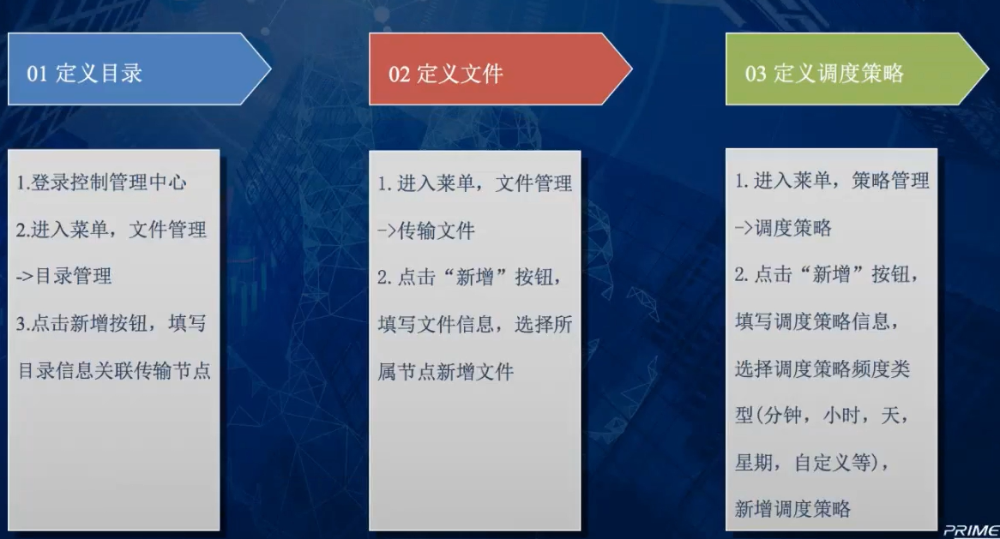

# 安装

* 安装顺序

```
BFT数据库初始化、BFT Console、BFT Server、BFT LogCenter、BFT Agent。
```


# 框架


```
client
console
agent
server
log

------------------------------------------
服务器A[文件a]   ------> 服务器B[文件b]
1. 直接传输，大文件直接传输是有问题，不能直接传输
2. primeton 给出一个访问
服务器A 安装一个软件 agent1,  【agent1 将文件发送给 server】
服务器B 安装一个软件 agent2,  【server 将文件发送给 agent2】
有一个 server  【用来管理 agent 发送的文件】
有一个中台总控：  console 【用来管理 server】

	server <---- 传输节点1【】 <----  agent
		    |-----传输节点2
	
	server  ---- 传输节点【】  ----> agent
------------------------------------------
         console -----> log
         
         
接受【agent】    发送[agent]


传输节点	

          server
```


# 调度策略




