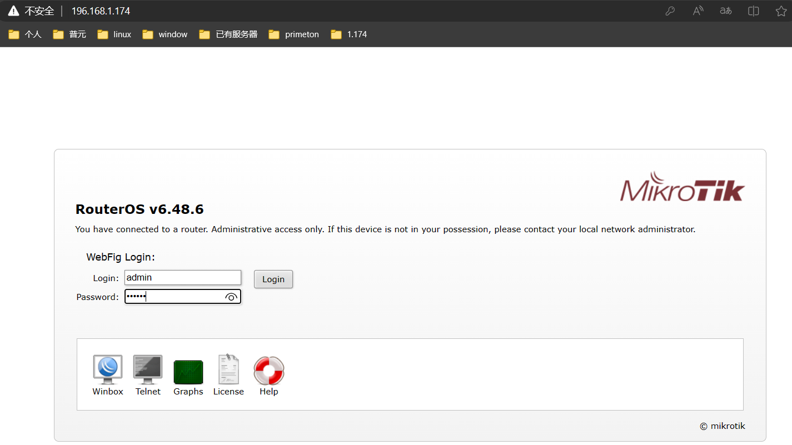

## 介质

## 前置软件

* nginx
* mysql

## 后续配置

* 证书

* 驱动

* 配置

  ```
  mysql: 驱动名称。连接url. name. password
  redis：ip地址， 端口，
  es： ip 地址， 端口， name, password, certificate证书
  	elastic: primeton
  ```

## 日志中心

```
日志中心是收集、缓冲、存储、展示的标准日志中心架构，收集各应用产生的本地日志数据，进行汇总，可以进行应用日志查看，检索，链路分析。

说明

使用 ESB 版本时，请务必先安装 、配置 ElasticSearch。
本章节均已单实例部署进行介绍，如用户需要部署集群模式，请参考官方文档。
如下安装包配置文件内容只列出关键配置项，其余内容省略（均是缺省配置值），详情请参考官方文档。
如果想用 Kibana 监控日志，以下是 ESB 的日志说明
primeton_esb_log_*：交易日志
primeton_esb_mq_state_*：MQ状态
primeton_esb_node_log_*：调用链日志
primeton_esb_system_resource_*：系统资源（CPU\内存）

primeton_esb_system_thread_*：全局线程池
primeton_esb_thread_*：模型使用的线程池
```

## governor 配置

```
1. config\application.properties   
2. config\application-esb.properties 
3. config/ESB/config/user-config.xml
```

## 微服务 == governor

```java
Primeton_ESB_8.6_GA_Console.tar
Primeton_ESB_8.6_GA_Governor.tar

===== governor
// 微服务的数据库和非微服务的数据库不在一起吗？
// 微服务版本的数据库都在 esb-govenor 当中    
esb 初始化
	eos/Mysql/eos_all.sql
    esb/Mysql/2-schema-esb-mysql.sql  
    esb/Mysql/3-data-esb-mysql.sql
    
    
// mysql 驱动

// 配置
${esb-governor安装目录}\config\
    application.properties   == redis,governor 启动端口，  mysql方言
    application-afc.properties == afc租户编码
    application-esb.properties == es
    ESB/config/user-config.xml == mysql配置
  
====nginx
    nginx.conf配置文件: 路由跳转
==eos-->/web/afcenter
	Console里esb目录，复制到介质EOS_Platform_8.2的前端资源/web/afcenter内
    ===> 执行./nginx -s reload命令重启nginx
    
    
====afcenter
afcenter 添加
    mysql数据库添加：esb/Mysql/1-esb-afc-data.sql
	redis host、port、password  
        
web页面
	配置： 组织权限中心“->“菜单管理”→“PC端菜单”，为企业服务总线配置首页        
     验证： 
        访问http://nginx机器IP:前端Port，使用esb管理员登录，用户名/密码为：esbadmin/000000，点击菜单“首页”>“控制台”
		不是直
```





## 集群化服务 == governor


## server 配置

```
数据库驱动包拷贝到“Primeton_ESB_8.6_GA_Server\server\libs”
Primeton_ESB_8.6_GA_Server\server\bin\start.sh”  == jdk 版本

// mysql redis es
Primeton_ESB_8.6_GA_Server\server\conf\application.yml

// id
Primeton_ESB_8.6_GA_Server\server\EOS\_srv\startup.conf”
```


## 账号密码问题

```
启动完成后以ESB管理员身份（esbadmin/000000）登录ESB Governor， 在浏览器地址栏输入http://ip:8080”（ip地址为安装ESB Governor的服务器地址）进入如下界面，表示ESB Governor系统部署成功。


说明

此版本支持三员管理，三员管理分为系统管理员、安全管理员、安全审计员

系统管理员负责创建用户、删除用户，系统管理员用户名：sysesbadmin，初始密码：000000

安全管理员负责给用户分配角色，角色权限设置，安全管理员用户名：security，初始密码：000000

安全审计员负责查看Governor操作日志，安全审计员用户名：audit，初始密码：000000
```


## 搭建成功标志

```
server: ESB Server started successfully.
governor: Appserver started on port(s): 8080 (http) with context path
```


## 微服务版本

```shell
// 前端
Primeton_ESB_8.6_GA_Console.tar
// 后端
Primeton_ESB_8.6_GA_Governor.tar


1.先创建AFCenter的数据库，执行AFCenter的初始化脚本。

2.安装ESB Governor，在AFCenter的数据库执行${esb-governor安装目录}/db-scripts/esb/Mysql/1-esb-afc-data.sql。

3.安装AFCenter。

4.启动AFCenter。

5.启动ESB Governor。

如果是ESB要集成到现有的AFCenter环境，那么ESB安装完成后，需要使用admin用户手动为系统管理员、安全管理员配置各自的权限，具体可参考05.11 admin用户手动授权。
```


