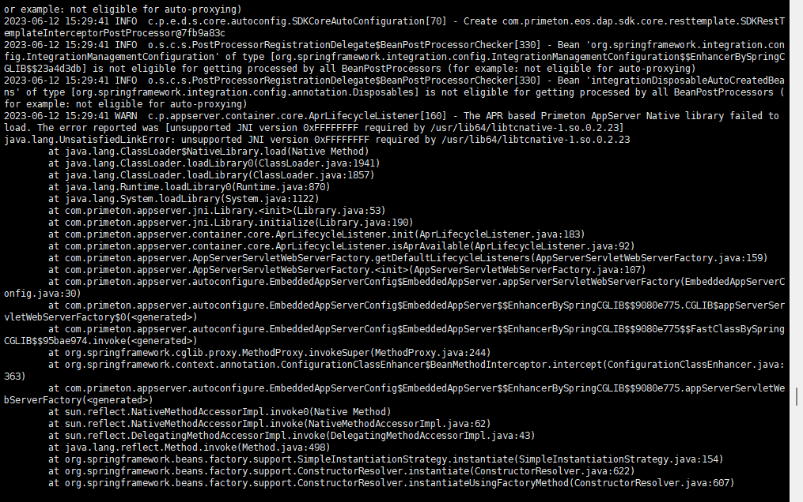

# 补丁

```
@所有人 已出补丁ESB_8.6_GOVERNOR_20230608_P1 ，解决ESB governor某一时间点之后的，业务监控查不出来内容，ES报错：IllegalArgumentException：Fielddata is disabled on text fields by default.Set fielddata=true on [0.timestamp] in order to load fielddata in memory by uninverting the inverted index.
可在ame-客服售后-我的小补丁申请 发起申请
```


# 之前

## esb 证书

````
ESB8.6GA介质更新公告：由于License原因，2023年4月19日更新了介质，请务必拿最新的介质使用！
———————进群须知-———————本群为普元ESB内部学习互助交流群，请大家进群修改自己的群昵称。格式为【事业部-姓名】；不可在群里发布与学习无关的内容，否则将会被踢出群聊。
—————ESB8.6GA使用文档—————http://doc.primeton.com/pages/viewpage.action?pageId=82157558登录账号：read/readprimeton
————————介质申请————————链接：https://pan.baidu.com/s/1j-SkRXq9faqUnPMOkd20Ng?pwd=1djb
提取码：1djb
地址定期更新，最新地址请查阅文档库:https://file.primeton.com:27866/main/index.html，路径：公司文档>2_共享文档库>01_普元产品材料>00_1产品介质下载地址，账号密码同ame+。
——————关于问题解答———————提问前，请务必先阅读产品安装指南、用户操作手册、快速入门等文档产品安装、使用相关问题，请提问者提按照如下原则进行提问：1. 问题描述：包括页面错误提示、操作步骤及相关页面截图等2. 错误信息：包括异常日志、浏览器控制台错误信息等3. 环境信息：产品配置文件、数据库类型及版本、数据库驱动版本、操作系统等请提问者务必提供以上涉及到的信息，提供更详细的信息更有利于我们判断问题原因，避免浪费时间。对于问题描述不清楚的提问，负责支持的同事有权选择不回答。
````


# 06-09

## 订阅功能的超时时间 √

```
改完参数就可以了
```


# 06-12




```
两个办法，
	一个是安装tomcat的apr动态链接库，启用apr加速能力，提高性能。
	另一个是放弃apr，使用普通的方式，方法就是删除掉系统中的apr包。我们上次环境主要是功能测试，采用的是简单的删除 apr 包的方式 
	
	
参考
	 https://blog.csdn.net/clj198606061111/article/details/51168459?spm=1001.2101.3001.6650.4&utm_medium=distribute.pc_relevant.none-task-blog-2%7Edefault%7ECTRLIST%7ERate-4-51168459-blog-13008003.235%5Ev36%5Epc_relevant_default_base3&depth_1-utm_source=distribute.pc_relevant.none-task-blog-2%7Edefault%7ECTRLIST%7ERate-4-51168459-blog-13008003.235%5Ev36%5Epc_relevant_default_base3&utm_relevant_index=9 
	 
	 
	 
	 
```

