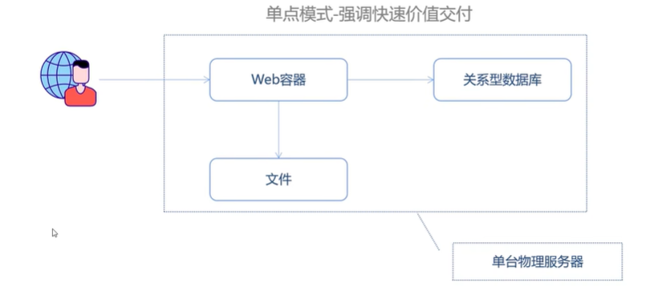
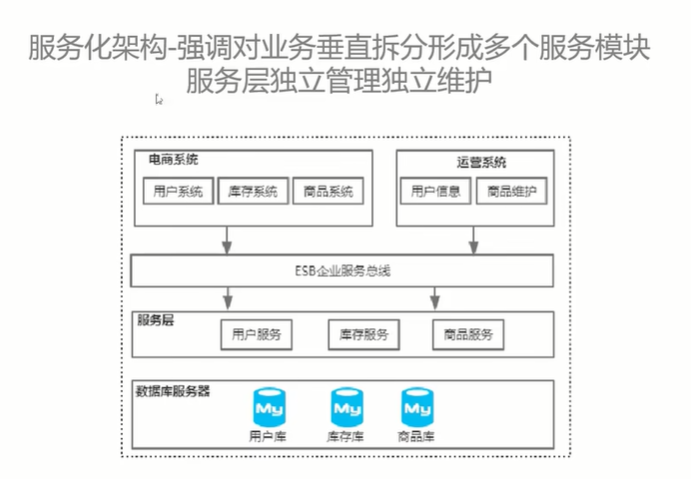
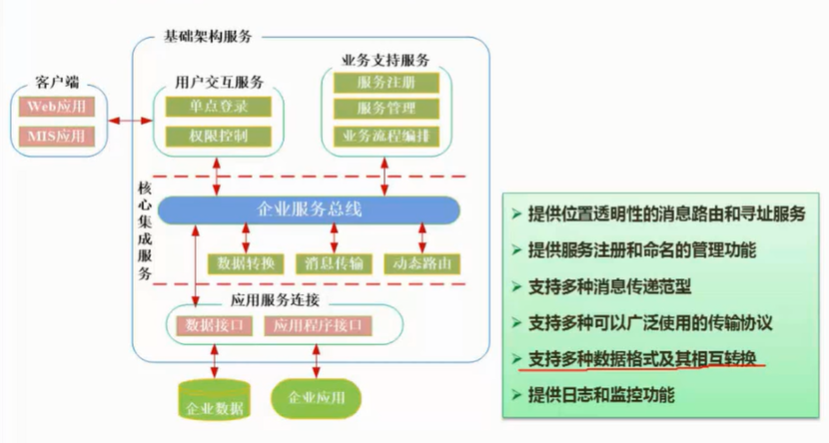
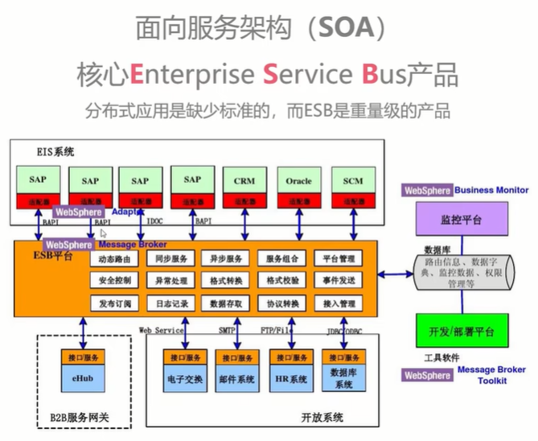
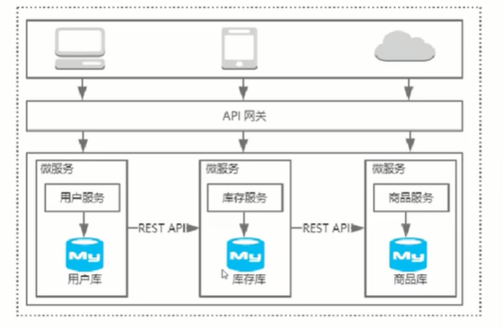
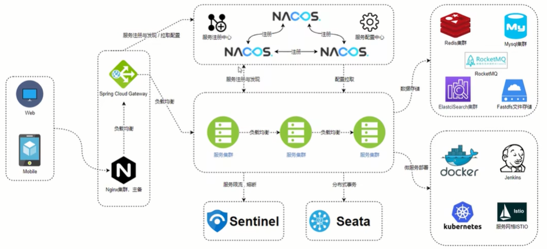
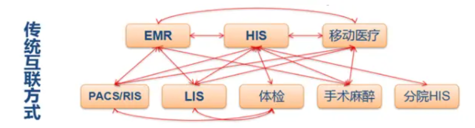

## cn.pool.ntp.org

### 概述

```java
    cn.pool.ntp.org 是池中的一个服务器地址，它由中国地区的 NTP 服务器提供支持。
这个池中的服务器由一些中国的组织和个人志愿者提供和维护，以确保在中国范围内的计算机
系统可以获得可靠的时间同步服务。

通过连接到 cn.pool.ntp.org 时间服务器，计算机系统可以获取准确的时间信息，以保持系统时间的准确性，并在需要时进行时间同步。这对于许多应用和系统来说非常重要，例如日志记录、安全验证、时间戳等。

请注意，cn.pool.ntp.org 只是中国地区的一个 NTP 服务器池，不属于特定机构或组织。
它是由社区合作维护的，以为用户提供准确的时间服务。
```

### 时间同步

```java
yum -y install ntp

// 时间同步
ntp cn.pool.ntp.org
```

## selinux linux安全控制

### 概述

```java
  CentOS 中，/etc/selinux 文件夹包含与 SELinux（Security-Enhanced Linux）相关的配置文件和策略
  
  
  SELLinux: （Security-Enhanced Linux）是一个在 Linux 操作系统中实施强制访问控
  制（MAC）的安全子系统。它在操作系统内核层面提供了额外的安全机制，
  用于保护系统资源和限制进程的权限。
```

## 防火墙

* 防火墙需要关闭

```


iptables:
iptables 是 Linux 系统中传统的防火墙管理工具。
它基于内核的 netfilter 框架，通过在网络协议栈中的不同层次拦截和处理数据包来实现防火墙功能。
iptables 使用规则链（chains）和规则（rules）来控制进出系统的网络流量。
它的配置和管理是通过直接编辑防火墙规则来完成，通常使用命令行工具进行操作。


firewalld:
firewalld 是一种基于动态防火墙管理器的解决方案，引入了服务和区域的概念。
它提供了更高级和更灵活的防火墙管理功能，允许根据应用程序、端口、服务等定义防火墙规则。
firewalld 使用网络连接跟踪和区域（zone）来管理和控制网络流量。
它支持动态更新防火墙规则，能够在运行时添加、删除和修改规则，而无需重启防火墙服务。
firewalld 还提供了图形界面和命令行接口（firewall-cmd）供用户配置和管理防火墙
```


### 操作

```
确保 Selinux 调整为 disabled 或者 permissive。修改 /etc/selinux/config 文件需要重新启动主机


# This file controls the state of SELinux on the system.
# SELINUX= can take one of these three values:
#     enforcing - SELinux security policy is enforced.
#     permissive - SELinux prints warnings instead of enforcing.
#     disabled - No SELinux policy is loaded.
SELINUX=enforcing
# SELINUXTYPE= can take one of three values:
#     targeted - Targeted processes are protected,
#     minimum - Modification of targeted policy. Only selected processes are protected.
#     mls - Multi Level Security protection.
SELINUXTYPE=targeted


```


## 版本

```
"la" 缩写通常指的是 "Latest Available"（最新可用版本）或者 "Latest Release"（最新发布版本）。这个术语表示指向软件最新可用的稳定版本或发布版本。

```


## 软件下载

```java
安装 wget
sudo yum wget
sudo yum install wget

    
// 常用命令
sz:  服务端获取本地文件
rz： 服务端下载文件到本地

// 软件安装
// mysql 
wget https://dev.mysql.com/get/Downloads/MySQL-5.7/mysql-5.7.21-linux-glibc2.12-x86_64.tar.gz


```


# 服务架构演进

## 介绍

### 服务架构 -- 单体架构

```
单点架构存在的问题
    资源利用率差
    不具备分区容错性
    查询效率低
改进办法
    部署应用集群
    部署分布式缓存
    实现数据库高可用HA/读写分离改造
```




### 服务结构 -- 集群结构


### 服务结构 -- 服务化结构  soa                       

* 服务导向架构(Service Oriented Architecture， SOA)发展而来。                                                                                                                                                                                                                                                                                                                                                                                                                                                                                                                                                                                                                                                                                                                                                                                              


#### esb

* 大家所有消息的转换，都需要走 esb 平台

```java
// SOA的问题
·各个子系统之间没有采用统一的通信标准,导致系统间通信与数据交互间变得异常复杂.
·ESB成本超级高，没有好用的开源，被大厂绑架
·ESB属于重量级产品，部署规划异常笨重
// 解决方案:
引入微服务架构模式
```








#### 微服务结构

```
微服务架构风格是一种将单个应用程序开发为一组小型服务的方法，每个小服务运行在自己的进程中，并且以轻量级机制 (通常是HTTP REST API) 通信。这些服务是围绕业务能力建立的并且可以由完全自动化的部署机构独立部署。这些服务的集中管理只有最低限度，可以用不同的编程语言编写并使用不同的数据存储技术。
```







# ESB

## 介绍

* ESB 的存在主要是为了整合企业内部的应用，使企业内的应用能融为一体，而不是成为一个个信息孤岛




# 域和系统

```
域是一种逻辑上的分类或组织方式，用于将不同的系统和服务按照其所属的业务领域、部门或功能模块进行划分。它帮助企业在ESB中更好地组织、管理和集成各个系统和服务。

=============
HR域：包含人力资源相关的系统和服务，例如员工管理系统、薪资管理系统、培训管理系统等。

销售域：包含销售相关的系统和服务，例如订单管理系统、客户关系管理系统、销售报表系统等。

财务域：包含财务相关的系统和服务，例如会计系统、报销系统、支付系统等。

物流域：包含物流和供应链相关的系统和服务，例如库存管理系统、运输管理系统、供应商接口等。
```


