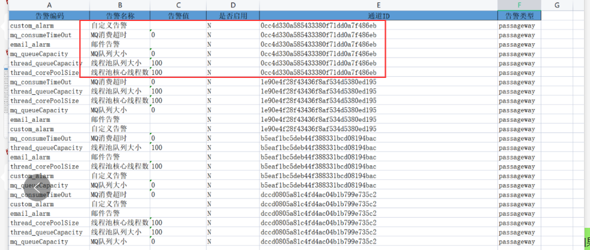
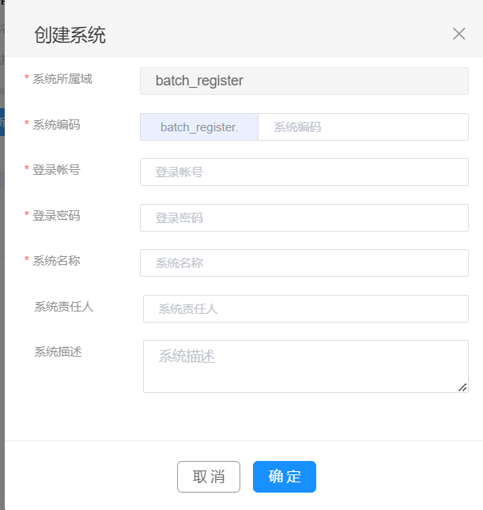

# 表单项目

* 表单名称

* 接口编号

* xxx

* 接口名称

* 接口描述

* 系统测试地址

  * 系统 uat 测试地址 【系统测试地址一致】
  * 测试系统认证令牌
  * 测试 esb 对应地址【esb管理员补录】

* 正式系统地址

  * 正式系统认证令牌

    ```
    ●应用客户端ID：981647E0-1D12-4I14-ADV8-C3F04ED2F92B
    ●接口认证用户：LiveUser
    ●接口认证码：S09738Rs#99#
    
    // erp 有正式令牌
    ```

    

  * 正式系统 esb 对应地址

```
系统测试地址
http://192.168.188.214:8080/api/workflow/paService/doForceDrawBack
系统 uat 测试地址
http://192.168.188.214:8080/api/workflow/paService/doForceDrawBack
测试 esb 对应地址
http://192.168.188.192:9088/api/Domain/meikeoa/rest/oa/oa_wms_0002/doForceDrawBack

====================

正式系统地址
http://192.168.188.214:8080/api/workflow/paService/doForceDrawBack
正式系统
http://192.168.188.220:9088/api/Domain/meikeoa/rest/oa/oa_wms_0002/doForceDrawBack

```


# 批量操作

## 目录结构

```
双击打开exportModelnfo文件目录，解压后文件目录如下：
            wsdl:存放离线的wsdl文件
            certificate:存放需要导入的jks证书文件
            readme:导入文件的相关操作说明
            esb_resource.xlsx:按照数据表sheet页存放数据
```


## == 表格信息


```
通道信息
通道告警配置

域信息
系统信息
服务信息
	服务路由关系表服务
	服务扩展表
	服务规格信息表
	
	webservice 端口
	webservice 接口
	
	调用关系信息表
	
	发布订阅-主题队列
	发布订阅-订阅关系表
	发布订阅-发布者
	
	数据服务信息表
	数据源信息表
	

endpoint表
	endpoint路由表
	报文转换表
接口信息表
	接口扩展表
    证书信息表
    wsdl 配置

```

## 删除

```

```


## 

## webservice

## -----

## 通道

```java
// 通道信息

通道ID
通道名称
通道类型
通道端口
协议
是否启用告警
-----------------
MQ地址   牵扯到 jms 协议的
MQ端口   牵扯到 jms 协议的
MQ用户名
MQ密码
证书     https 协议

// 通道告警配置
告警编码
告警名称 名称
告警值   
是否启用
通道ID
告警类型  type

    

```



## 域

```
域编码	域名称	域描述

1. 域编码怎么处理
2. 
```

## 系统

```
系统编码	系统名称	系统所属域	登陆账号	登陆密码	系统责任人	系统描述	系统状态

```



## 服务

```
WSDL编号	服务描述	最近更改人	服务状态	服务责任人	服务类型	服务版本	

是否告警	责任人邮箱	自定义告警	自定义告警配置

```


# 第一个测试

```
通道信息

域信息
系统信息
服务信息
	服务路由关系表服务
	服务扩展表
	服务规格信息表
	
	webservice 端口
	webservice 接口
	
	调用关系信息表
 
	
endpoint表
	endpoint路由表
	报文转换表
接口信息表
	接口扩展表
    证书信息表
    wsdl 配置


http://192.168.188.214:8080/api/workflow/paService/doForceDrawBack	http://192.168.188.192:9088/api/Domain/meikeoa/rest/oa/oa_crm_0002/doForceDrawBack

```


# 批量操作导入流程

1. 通道  === 提前创建
2. 系统 ， 域名， 服务 == 

```java
 
// 创建后不需要改动的 
1. 通道信息
2. 通道告警信息        
3. 域信息  -- 只有一个域

// 可以单独创建，不影响其他表的
系统信息 -- 不同的信息
服务信息 -- 牵扯一个系统编码
    服务扩展信息 -- 代理端口，其实是通道端口
接口信息 -- 牵扯一个服务编码
    接口扩展表

    
     
// 牵扯到 id  的
endpoint-- id
服务路由关系表服务 -- endpoint-id

    
    
// 实验一
直接写，不给创建d    
```


