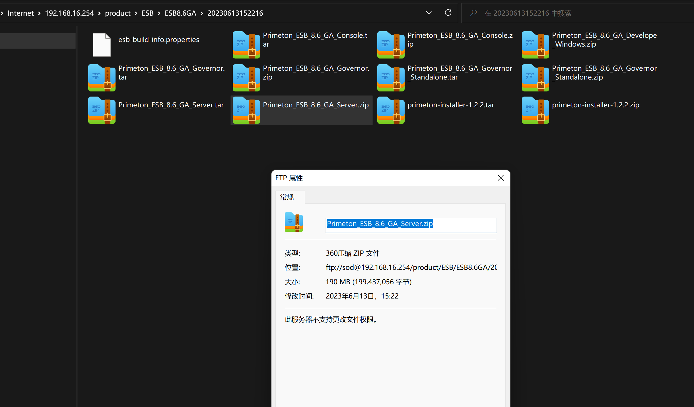

# 版本信息




# 发布手册

【腾讯文档】中煤科发布手册
https://docs.qq.com/doc/DRWp2bUdHY1FSSVd2?scene=a6dbc0c30098640c1043fb728NDGq1


# == 测试开发

## 账号信息

# 环境

## 测试

```
操作系统： centos7.5 1804


数据库：sqlserver 2016   
    username: sa
    password: CHU90*D 
	url: jdbc:sqlserver://192.168.188.83:1433;SelectMethod=cursor;DatabaseName=esb86
	driver-class-name: com.microsoft.sqlserver.jdbc.SQLServerDriver


安装机器：192.168.16.28　账号/密码：root/primeton


// 参考a
SQL Server2008/2016：
   database-platform: org.hibernate.dialect.SQLServer2008Dialect
   url:jdbc:sqlserver://192.168.16.153:1433;SelectMethod=cursor;DatabaseName=esb86
   driver-class-name: com.microsoft.sqlserver.jdbc.SQLServerDriver
   
   
   firewall-cmd --list-all | grep 8080
```

# 环境信息

```
https://192.168.187.34:9200/
elastic primeton000000


```

# vpn

```
中煤科vpn
用户名为姓名全拼，初始密码：Ccteg@2023【priemton#】
https://222.66.43.164:4431
软件 atrust
```


# 文档

```
【腾讯文档】中煤科发布手册
https://docs.qq.com/doc/DRWp2bUdHY1FSSVd2?scene=a6dbc0c30098640c1043fb728NDGq1


```


# 问题

```
1
```

