## 具体

```
请求 -- 报文转换 -- 发到 esb， 由 esb 发出
        java 文件【从数据库当中查询的】
  请求字段 --》 java转换为响应字段 -- 发送给对应的 esb -- esb 转发        

请求 -- 发出到 esb， 由 esb 发出
   请求字段 -- 发送给对应的 esb, esb 转发    
	
------------------------------------------------------
转换的业务流程是什么， 都需要怎么转换， 


```


## 思路

```java


之前项目现场这边有两个转换的接口是通过CRM(NCC)进行了中转路由实现，涉及crm的输入和输出接口分别为
crm 进行中转路由实现

crm的输入和输出接口
1.ERP-MDM-0001
输入：客户目标调用地址：http://192.168.188.32:53258/WebService.asmx?op=CallErpWebService
输出：    加工调用地址：http://192.168.188.206/uapws/rest/meike/mdmCustomer/receiveCustomer
2.ERP-MDM-0002
输入： 供应商目标调用地址：http://192.168.188.32:53258/WebService.asmx?op=CallErpWebService
输出:      加工调用地址： http://192.168.188.206/uapws/rest/meike/mdmSupplier/receiveSupplier


烦请看下之前客开经理交接的代码，把这块的代码找一下给到总线团队的同事以便于进行功能迁移
-------------------------------


    
    
我想请问下， ERP-MDM-0001， ERP-MDM-0002   这两个接口进行报文转换的情况，我想问下
    
-------------------------------
问下，现在客户有两个接口【mdm --> erp】存在报文转换， 原本是通过一个中间层【crm模块】进行数据转换的，现在需要去掉中间层 crm, 将数据报文转换迁移到我们的 ESB 上，但是 crm 存在一个循环发送请求的逻辑：【就是 mdm 传递给 crm 的参数有一个数组， 在 crm 中使用一个循环逻辑，遍历这个数组参数，然后对数组中每个元素都进行一个请求发送】，想问下，我们把数据迁移到我们的 esb 系统上，该怎么处理这个循环发送请求的状况？
    
    
1. 谁调用谁
	ERP 系统开发环境提供给 MDM 系统的客户主档信息接口
		原本的： MDM --[http]--> (crm 接口参数) --[ws]--> ERP 
         我们的： MDM --[  ]-->       esb     --[ws]--> ERP
    
    
    代理服务： mdm --[http--]
    中介服务： 服务 -- [ws]
    业务服务： erp
    
    代理服务        中介服务          业务服务
    mdm --[http] --  ws  ---[ws]---  erp
    
		// 原本的： MDM --[ws]--> (crm 接口参数) --[ws]--> ERP , 参数传递的逻辑    
    	data [data1, data2, data3, data4, ...]
    	crm 转换过程存在一个循环发送参数数组的数据，然后将所有循环发送的请求的响应进行封装，
    
 
         
         	
         
         
         
         
2. 现有接口是谁改的？
	crm 在改动
3. 改哪些内容
	主要是其中的字段进行拆分，进行分批发送
	
```


## MDMDataResource -- 客户分析

```
1.客户目标调用地址：http://192.168.188.32:53258/WebService.asmx?op=CallErpWebService
      加工调用地址：http://192.168.188.206/uapws/rest/meike/mdmCustomer/receiveCustomer


token:
	"NCSystem".getBytes(), 
	"pfxx".getBytes()
	
	
```

### 请求报文

```json
结构体
@Path("meike/mdmCustomer")
@Path("receiveCustomer")
// receiveClient： 接受客户数据,进行格式转换
传参：     
jSONObject[JSONObject] {
    "masterData"： [],
    
}  

token: 
	.token("NCSystem".getBytes(), "pfxx".getBytes());

函数： {
    变量： JSONObject{


    		 j1} 
 	erp 信息：走数据库
        
}

每个 "masterData" 中的数据 {
        	result3， result4，
        	custDataResult, custBankResult, custAddressResult, custContactResult，
        	sendJson, mdm    
    		jsonarr, jsonarr1, jsonarr2, jsonarr3                
		    array4,                
}{
// 每个 masterData 一个 sendJson
// 客户数据格式转换   
    
sendJson 映射关系 {
    "InterfaceType" ：erpcustomerinterfacetype, 公用
    "MessageId" ： UUID.randomUUID() 自动生成, 公用
	"CompanyCode" ：   erpcustomercompanycode, 公用
    "AuthorizedCode" ：  erpcustomerauthorizedcode, 公用
	"InterfaceUser" ：     erpcustomerinterfaceuser, 公用 
     // 数据库查询结束
	"CustTable": [{ 
        "AccountNum": [masterdata.bd_customer_code]
        "NCCCustAccount": [masterdata.bd_customer_def2]
        "CustName": [masterdata.bd_customer_name]
        "TaxID": [masterdata.taxpayerid]
        "Salesclassification": [masterdata.Salesclassification]
        "CustGroup": [masterdata.CustGroup]
        "CustClassificationId": [masterdata.CustClassificationId]
        "CustClassification": [masterdata.pk_custclass]
        "Currency": [masterdata.pk_currtype_@currency_id]
        "LanguageId": [masterdata.LanguageId]
        "InclTax": [masterdata.pk_custtaxes]
        "TaxGroup": [masterdata.CustomerTaxRate_name]
        "enablestate": [masterdata.enablestate]
        "dr": 【masterdata.dr】
		"sub_CustBankAccount" :[ 【masterdata.sub_Cust_Bank】
			{
				"BankName": 【masterdata.sub_Cust_Bank.?.bd_bankdoc_name】  
				"AccountNum": 【masterdata.sub_Cust_Bank.?.accnum】  
				"Currency": 【masterdata.sub_Cust_Bank.?.bd_currtype_name_@currency_id】  
				"dr": 【masterdata.sub_Cust_Bank.?.dr】  
				"MDMID": 【masterdata.sub_Cust_Bank.?.pk_mdm】                            
             }, 
            
        ],
		"sub_CustAddress"：[ 【masterdata.sub_Cust_address】
            {
            	"AddressType"： 【masterdata.sub_Cust_address.?.AddressType】
            	"CountryRegionId"： 【masterdata.sub_Cust_address.?.CountryRegionId】
            	"State"： 【masterdata.sub_Cust_address.?.State】
            	"City"： 【masterdata.sub_Cust_address.?.City】
            	"Street"： 【masterdata.sub_Cust_address.?.Street】
            	"dr"： 【masterdata.sub_Cust_address.?.dr】
            	"MDMID"： 【masterdata.sub_Cust_address.?.MDMID】
            	"Country"： 【masterdata.sub_Cust_address.?.Country】                           
                           
            }，
		   {}
        ],
		"sub_CustContact": [ 【masterdata.sub_cust_contact】
            {
                 "MDMID"： 【masterdata.sub_cust_contact.?.MDMID】 
                 "Email"： 【"5922@qq.com"】
                 "ContactPersonName"： 【masterdata.sub_cust_contact.?.name】
                 "Title"： 【masterdata.sub_cust_contact.?.bd_linkman_vjob】
                 "Phone"： 【masterdata.sub_cust_contact.?.bd_linkman_phone】
                 "CellularPhone"： 【masterdata.sub_cust_contact.?.bd_linkman_cell】
                 "dr"： 【masterdata.sub_cust_contact.?.dr】
                 "Phone"： 【masterdata.sub_cust_contact.?.bd_linkman_phone】                            
            },
		    {}
        ]

    }]
        
    ]


}  
} 
```


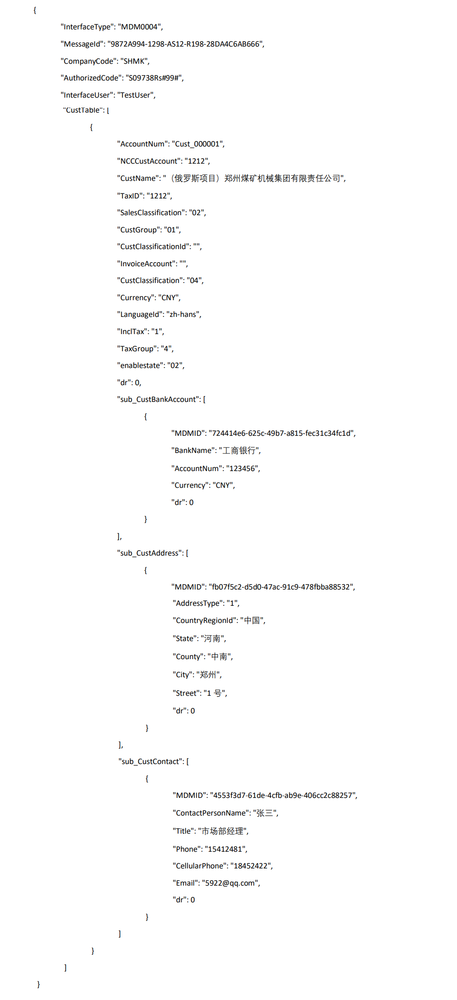

### 响应报文

```json
// erp 响应的报文
{
    "InterfaceType":
    "MessageId":
    "Status":
    "ErrorMessage"
    "CustTable": [
    	{
    		"AccountNum": 
    		"Status":
    		"ErrorMessage":
		}
    ]
}

// 对响应的报文进行封装
// esbResult.Status == 0 ? "true" : "false" === false
{
    result4:{
        "success": esbResult.Status == 0 ? "true" : "false" ===> false
        "message": 【CustTable.?.ErrorMessage  只有 status 是  false 的时候才会】
        "mdMappings": [
        	
        ]
    }
}

// esbResult.Status == 0 ? "true" : "false" ===> true
    result4:{
        "success":  esbResult.Status == 0 ? "true" : "false" ===> true
        "message":  "成功"
        "mdMappings": [
        	{
        		"success", bool
   			}
        ]
    }
```


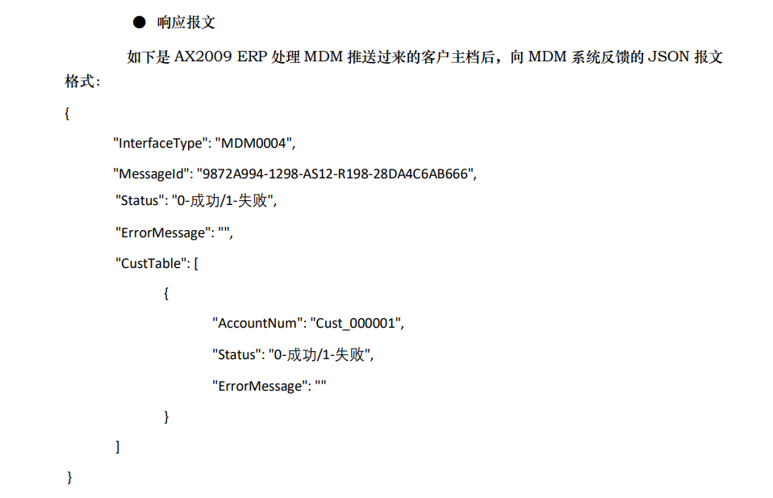

### java 

```java
package nc.pubitf.meike.rest;

/**
 * 接收接口
 * <p>
 * Title: ReceiveDataResource
 * </p>
 * <p>
 * Description:接受MDM下发的客户数据格式
 * </p>
 * 
 * @author wuzx
 * @date 2022-08-10 13:30:45
 */
@Path("meike/mdmCustomer")
public class MDMDataResource extends AbstractUAPRestResource {
	LocalItf local = (LocalItf) NCLocator.getInstance().lookup(LocalItf.class.getName());

	/**
	 * 
	 * receiveClient： 接受客户数据,进行格式转换
	 * 
	 * @param
	 * @return JSONObject 创 建 人 ：wuzx 创建时间：2022年8月10日-下午14:14:23
	 * @throws BusinessException
	 */
	@POST
	@Path("receiveCustomer")
	public JSONObject receiveClient(JSONObject jSONObject) throws BusinessException {
		// 设置token
		NCLocator
            .getInstance()
            .lookup(ISecurityTokenCallback.class)
            .token("NCSystem".getBytes(), "pfxx".getBytes());
 
		// 记录日志
 
		try {
 
						
			//-----liuyq 20221112采用数据库获取方式20221112 START-----
             //-----数据库查询
			Map<String, Object> erpParam = jdbcUtils.getERPParam();
			
			String address=StrUtil.nullToEmpty((String)erpParam.get("erpapiaddress"));
			String method=StrUtil.nullToEmpty((String)erpParam.get("erpmethod"));
			String clientAppId=StrUtil.nullToEmpty((String)erpParam.get("erpclientappid"));
			
			String InterfaceType=StrUtil.nullToEmpty((String)erpParam.get("erpcustomerinterfacetype"));
			String CompanyCode=StrUtil.nullToEmpty((String)erpParam.get("erpcustomercompanycode"));
			String AuthorizedCode=StrUtil.nullToEmpty((String)erpParam.get("erpcustomerauthorizedcode"));
			String InterfaceUser=StrUtil.nullToEmpty((String)erpParam.get("erpcustomerinterfaceuser"));
			
			//参数控制是否走ESB 
			//组装ESB地址
			if("Y".equals(send_esb)) {
				Map<String, Object> getEsbUrlParam = jdbcUtils.getMdmEsbUrl("getEsbUrl");
				String esbUrl =(String)getEsbUrlParam.get("interface_esb_url");				
				Map<String, Object> esbUrlParam = jdbcUtils.getMdmEsbUrl("sendERPCustomer");
				String interface_esb_url =(String)esbUrlParam.get("interface_esb_url");				
				address=esbUrl+interface_esb_url;
			}
			//-----liuyq 20221112采用数据库获取方式20221112 END-----
			
			/**
			 * 客户数据格式转换
			 */
			JSONArray custResult = jSONObject.getJSONArray("masterData");
			for (int i = 0; i < custResult.size(); i++) {
 
				
				sendJson.put("InterfaceType", InterfaceType);
				sendJson.put("MessageId", UUID.randomUUID());
				sendJson.put("CompanyCode", CompanyCode);
				sendJson.put("AuthorizedCode",AuthorizedCode);
				sendJson.put("InterfaceUser",InterfaceUser);
				
				JSONObject custObject = custResult.getJSONObject(i);
//				custObject = JSONObject.parseObject(custObject.toString());
				String masterData = json.getString("masterData");
				String AccountNum = custObject.getString("bd_customer_code");
				String NCCCustAccount = custObject.getString("bd_customer_def2");
				String CustName = custObject.getString("bd_customer_name");
				String TaxID = custObject.getString("taxpayerid");
				String SalesClassification = custObject.getString("Salesclassification");
				String CustGroup = custObject.getString("CustGroup");
				String CustClassificationId = custObject.getString("CustClassificationId");
				String InvoiceAccount = custObject.getString("InvoiceAccount");
				String CustClassification = custObject.getString("pk_custclass");
				String Currency = custObject.getString("pk_currtype_@currency_id");
				String LanguageId = custObject.getString("LanguageId");
				String InclTax = custObject.getString("pk_custtaxes");
				String TaxGroup = custObject.getString("CustomerTaxRate_name");
				String enablestate = custObject.getString("enablestate");
				Integer dr=custObject.getInteger("dr");
				custDataResult.put("AccountNum", AccountNum);
				custDataResult.put("NCCCustAccount", NCCCustAccount);
				custDataResult.put("CustName", CustName);
				custDataResult.put("TaxID", TaxID);
				custDataResult.put("SalesClassification", SalesClassification);
				custDataResult.put("CustGroup", CustGroup);
				custDataResult.put("CustClassificationId", CustClassificationId);
				custDataResult.put("InvoiceAccount", InvoiceAccount);
				custDataResult.put("CustClassification", CustClassification);
				custDataResult.put("Currency", Currency);
				custDataResult.put("LanguageId", LanguageId);
				custDataResult.put("InclTax", InclTax);
				custDataResult.put("TaxGroup", TaxGroup);
				custDataResult.put("enablestate", enablestate);		
				custDataResult.put("dr", dr);
//				custDataResult.put("MDMID", MDMID);
				jsonarr.add(custDataResult);
//				jsonarr11.add(custDataResult11);

				/**
				 * 客户银行格式转换
				 */
				JSONArray custBank = (JSONArray) custObject.get("sub_Cust_Bank");
				for (int j = 0; j < custBank.size(); j++) {
					JSONObject object = custBank.getJSONObject(j);
					custBankResult=new JSONObject();
					String MDMID = object.getString("pk_mdm");
					String BankName1 = object.getString("bd_bankdoc_name");
					String AccountNum2 = object.getString("accnum");
					String Currency1 = object.getString("bd_currtype_name_@currency_id");
					Integer dr1=object.getInteger("dr");
//					String dr1 = object.getString("dr");
					custBankResult.put("BankName", BankName1);
					custBankResult.put("AccountNum", AccountNum2);
					custBankResult.put("Currency", Currency1);
					custBankResult.put("dr", dr1);
					custBankResult.put("MDMID", MDMID);
					jsonarr1.add(custBankResult);
				}
				// json整合
				custDataResult.put("sub_CustBankAccount", jsonarr1);
				/**
				 * 客户地址格式转换
				 */
				JSONArray custAddress = (JSONArray) custObject.get("sub_Cust_address");
				for (int j = 0; j < custAddress.size(); j++) {
					JSONObject object = custAddress.getJSONObject(j);
					custAddressResult=new JSONObject();
					String MDMID = object.getString("pk_mdm");
					String AddressType = object.getString("AddressType");
					String CountryRegionId = object.getString("CountryRegionId");
					String State = object.getString("State");
					String County = object.getString("County");
					String City = object.getString("City");
					String Street = object.getString("Street");
					Integer dr1=object.getInteger("dr");
//					String dr1 = object.getString("dr");
					custAddressResult.put("AddressType", AddressType);
					custAddressResult.put("CountryRegionId", CountryRegionId);
					custAddressResult.put("State", State);
					custAddressResult.put("County", County);
					custAddressResult.put("City", City);
					custAddressResult.put("Street", Street);
					custAddressResult.put("dr", dr1);
					custAddressResult.put("MDMID", MDMID);
					jsonarr2.add(custAddressResult);
				}

				// json整合
				custDataResult.put("sub_CustAddress", jsonarr2);
				/**
				 * 客户联系格式转换
				 */
				JSONArray custContact = (JSONArray) custObject.get("sub_cust_contact");
				for (int j = 0; j < custContact.size(); j++) {
					JSONObject object = custContact.getJSONObject(j);
					custContactResult=new JSONObject();
					String MDMID = object.getString("pk_mdm");
					String ContactPersonName = object.getString("name");
					String Title = object.getString("bd_linkman_vjob");
					String Phone = object.getString("bd_linkman_phone");
					String CellularPhone = object.getString("bd_linkman_cell");
//					String Email = object.getString("bd_linkman_email");
//					String dr1 = object.getString("dr");
					Integer dr1=object.getInteger("dr");
					custContactResult.put("Email", "5922@qq.com");
					custContactResult.put("ContactPersonName", ContactPersonName);
					custContactResult.put("Title", Title);
					custContactResult.put("Phone", Phone);
					custContactResult.put("CellularPhone", CellularPhone);
					custContactResult.put("dr", dr1);
					custContactResult.put("MDMID", MDMID);
					jsonarr3.add(custContactResult);
				}
				custDataResult.put("sub_CustContact", jsonarr3);
				// json整合
				sendJson.put("CustTable", jsonarr);
				
                
                
                  /*
	              esb 地址	
                  
                  */
				//-----liuyq 20221112采用数据库获取方式20221112 START-----
//				String address = "http://192.168.188.192:9088/api/Domain/meikeerp/ws/erp/erp_mdm_0001/CallErpWebService";
//				String clientAppId = "63578e34-b925-8888-8598-d9d8788200f7";
				HttpConnection httpConnection = new HttpConnection();
				String esbResult="";
				if("Y".equals(send_esb)) {
					esbResult =httpConnection.callERPWebserviceByESB(address, clientAppId,  sendJson.toString());
				}else {
					JSONObject jsonResult = httpConnection.callERPWebserviceASMX(address, method, clientAppId, sendJson.toString());
					if(jsonResult!=null) {
						esbResult=jsonResult.toJSONString();
					}
				}
				//-----liuyq 20221112采用数据库获取方式20221112 END-----
				result3=JSONObject.parseObject(esbResult);
				
				String message = "成功！";
				String bool = result3.getInteger("Status") == 0 ? "true" : "false";

				JSONArray s= (JSONArray) result3.get("CustTable");
				String ErrorMessage=null;
				if(bool=="false") {
					for(int j=0;j<s.size();j++) {
						JSONObject object = s.getJSONObject(j);
						ErrorMessage = object.getString("ErrorMessage");
					}
				}
				
				if(bool=="false") {
					result4.put("success", bool);
					result4.put("message", ErrorMessage);
					mdm.put("mdmCode", "主数据的编码");
					mdm.put("entityCode", "主数据模型的编码");
					mdm.put("busiDataId", "busiDataId");
					mdm.put("message", "该条主数据消费失败！ERP返回报文："+esbResult);
					mdm.put("success", bool);
				}else {
					result4.put("success", bool);
					result4.put("message", message);
					mdm.put("mdmCode", "主数据的编码");
					mdm.put("entityCode", "主数据模型的编码");
					mdm.put("busiDataId", "busiDataId");
					mdm.put("message", "该条主数据消费成功！ERP返回报文："+esbResult);
					mdm.put("success", bool);
				}
				
				array4.add(mdm);
				result4.put("mdMappings", array4);

			}
			

		} catch (Exception e) {
			result4.put("mdMappings", "");//Array	数据的血缘关系列表
			result4.put("success","false");//Boolean	数据分发总体上是成功或失败
			result4.put("message", "供应商转换失败："+e.getMessage());//数据分发返回的详情信息
		} finally {
			logsVO.setMessage(result3.toString());
			logsVO.setEnd_time(new UFDateTime());
			// 独立事物操作日志数据
			local.operationVO_RequiresNew(logsVO, PowerActionEnum.INSERT.getActioncode());
		}
		return result4;

	}

	@Override
	public String getModule() {
		// TODO Auto-generated method stub
		return "meike";
	}

}

```

### 拆分

#### 1

```
```


#### 2

#### 3


## supplier-resource  - 供应商

```
2.
	供应商目标调用地址：http://192.168.188.32:53258/WebService.asmx?op=CallErpWebService
	      加工调用地址：http://192.168.188.206/uapws/rest/meike/mdmSupplier/receiveSupplier
token: 
	"NCSystem".getBytes(),
     "pfxx".getBytes()			

拼接 returnMessage 
returnMessage
```

### 报文拆分

```json

CustTable ---- masterData[
{
	"AccountNum"  ---- bd_customer_code
	"NCCCustAccount"  ---- bd_customer_def2
	"CustName"  ----  bd_customer_name
	"TaxID"  ----  taxpayerid 
	==== "SalesClassification"  ----   Salesclassification
	"CustGroup"  ----   CustGroup
	==== "CustClassificationId"  ----   CustClassificationId
	==== "InvoiceAccount"  ----   InvoiceAccount
	"CustClassification"  ----   pk_custclass
	"Currency"  ----   pk_currtype_@currency_id
	==== "LanguageId"  ----   LanguageId
	"InclTax"  ----   pk_custtaxes
	"TaxGroup"  ----   CustomerTaxRate_name
	==== "enablestate"  ----   enablestate		
	==== "dr"  ----   dr
	
	
	sub_CustBankAccount --- sub_Cust_Bank
	{
		"BankName"  ----  bd_bankdoc_name
		"AccountNum"  ----  accnum
		"Currency"  ----  bd_currtype_name_@currency_id
		==== "dr"  ----  dr
		"MDMID"  ----  pk_mdm
	}
	
	sub_CustAddress ---- sub_Cust_address
	{
		
	}
	
}
```


# MDMDataResource

## 请求报文

```java
  
函数级别{
    JSONObject： 
}


				/*
				
				jSONObject --> json[
					masterData, 
					masterData
				]
				masterData --> custObject
				-------------------
				custDataResult.put
				
				一个 masterData 一个发送 sendJson
				sendJson:{
					sendJson.put("InterfaceType", InterfaceType);
					sendJson.put("MessageId", UUID.randomUUID());
					sendJson.put("CompanyCode", CompanyCode);
					sendJson.put("AuthorizedCode",AuthorizedCode);
					sendJson.put("InterfaceUser",InterfaceUser);	
				}
				
				
				每个 msterData 发送的的信息需要封装到 result4 中进行返回
				 			
				result4 {
					"mdMappings", array4{

						result4.put("message", message);
						mdm.put("mdmCode", "主数据的编码");
						mdm.put("entityCode", "主数据模型的编码");
						mdm.put("busiDataId", "busiDataId");
						mdm.put("message", "该条主数据消费成功！ERP返回报文："+esbResult);
						mdm.put("success", bool);
						
						array4.add(mdm);
						result4.put("success", bool);
					}
				}
				
				*/
```


## 

# 转换后的报文

```
result4 {
    ("success", bool)
    ("message", message);
	md-mapping: array4{
		mdm{
            mdm.put("mdmCode", "主数据的编码");
            mdm.put("entityCode", "主数据模型的编码");
            mdm.put("busiDataId", "busiDataId");
            mdm.put("message", "该条主数据消费失败！ERP返回报文："+esbResult);
            mdm.put("success", bool);
		}
	}
}


------------
```


# 报文

```java
接口参数通过 crm 进行数据转换， 数据转换前、转换后的详细信息， 请问下有这个记录文档吗？我们想对照着比较一下， 还有就是源码中存在一个 http 的循环请求，中午探讨了认为循环中的每次 http 请求是对一个表单的数据进行提交，想确认这个循环 http 请求，是进行的参数拼接还是说直接提交了数据？因为这个 http 循环请求，是有点儿不太合乎常理，我确定的信息有点儿模糊，所以想

```


* 问题一

  ```'
  1. 源代码中的 http 请求循环是什么作用？ 是进行参数拼接的？ 还是单次请求？
      [中午探讨了认为循环中的每次 http 请求是对一个表单的数据进行提交, 就是内部进行拆分之后，然后发送请求。再具体的使用作用和场景没有讨论出来·]
  ```

  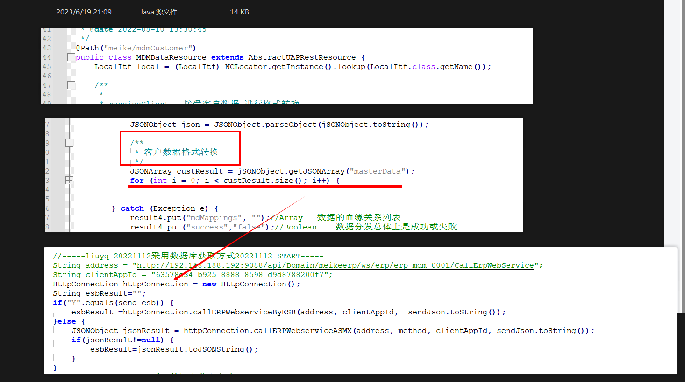

* 问题二

  ```
  原本的： MDM --[http]--> (crm 接口参数) --[ws]--> ERP 
  
  2. 源码中的返回值 result4, 这个对象是对循环中每次请求的结果进行拼装，这个 result4 是 crm 自身日志落库使用的，还是全部返回给 mdm 的信息？
  
  ```

  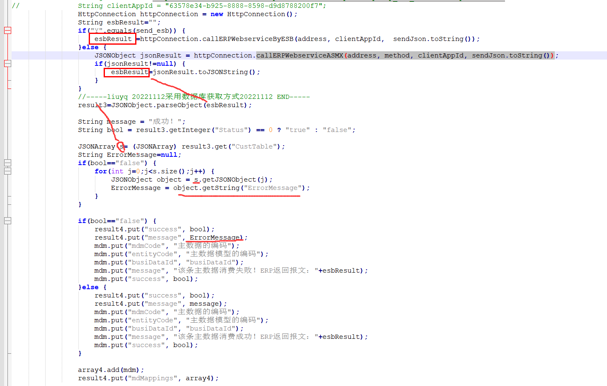

* 问题三

  ```
  给的接口文档中的参考例子是代码中单次请求的请求和响应报文，即循环发送请求的时候，单次发送请求的请求响应报文，所以需要询问这个循环 http 请求的作用， 达到尽量少动甚至不动原本的代码
  ```

# 解决方案

```
1. 利用中介服务， 将 crm 系统中的报文转换的 java 放入中介服务中，使用 中介服务进行循环发送
```


# 06-25

```

何如:
1、确认一下参数的变化（入参-出参）
入参： 
{

}
出参：


2、把调用erp的接口地址发到erp沟通群里 看看erp是否有批量更新接口


3、一共2个接口，另外一个是啥情况？
	两个接口是一样的情况

何如:


```


# ==

# json path

# json 转换

## 报文体

````json
{
   "id": "1",    // 1
   "name": "哈哈哈名字",
   "address": "地址1",
   "books":    {
      "1":       {
         "id": "1",
         "name": "名称1",
         "isbn": "isbn1",
         "author": "作者1",
         "price": 45.32
      },
      "2":       {
         "id": "2",
         "name": "名称2",
         "isbn": "isbn2",
         "author": "作者2",
         "price": 33.3
      }
   }
}

````


## 字段

```json
   "id": "1",    // 1
   "name": "哈哈哈名字",
   "address": "地址1",
```


* 修改名称

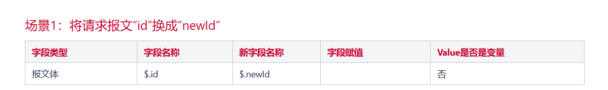


## 对象

```json
   "books":    {
      "1":       {
         "id": "1",
         "name": "名称1",
         "isbn": "isbn1",
         "author": "作者1",
         "price": 45.32
      },
      "2":       {
         "id": "2",
         "name": "名称2",
         "isbn": "isbn2",
         "author": "作者2",
         "price": 33.3
      }
   }
```

### 字段

* 变量名  ----  新增

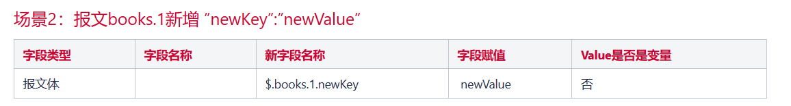

* 变量  ----  删除

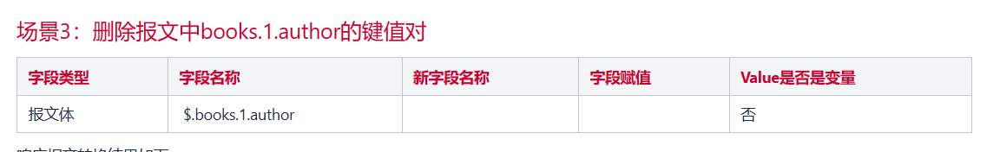

* 变量值  ----  修改

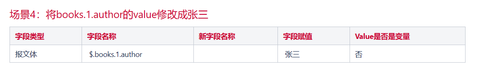

* 变量引用

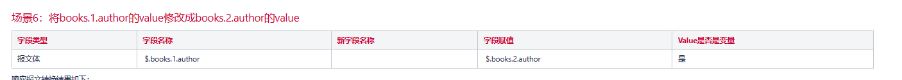

* 变量名更改 -- 变量值引用

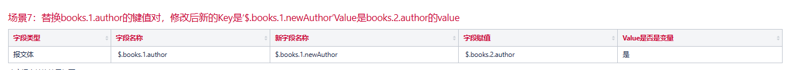


## 数组

## 请求头！！

```
字段类型改为报文头

请求头不加 $. 就直接使用的 属性值
```


* 新增


* 修改key


* 修改value -- 值引用 

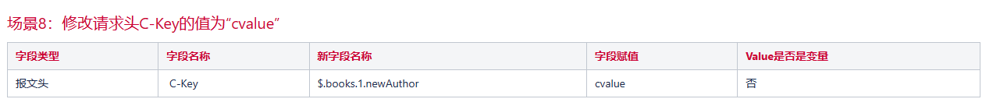

* 修改value -- 变量引用

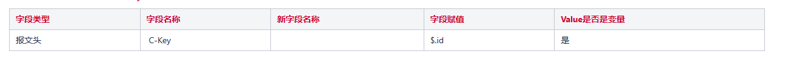

* 追加 value

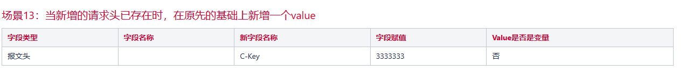

* 删除

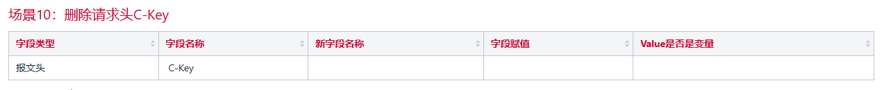


# xml 转换

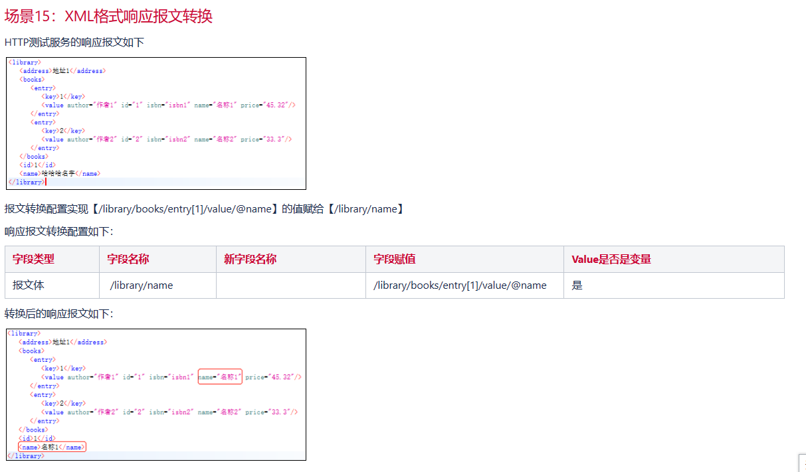

# xml 和 json 互转

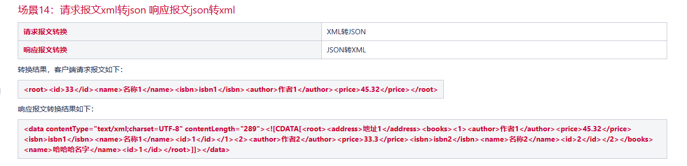


# 注意

1. 有两个特殊字段需要配置

* appid 和另一个


## UUID 问题

4

## 报文前面的信息

* 这几个数据是否是固定的数据？还是说变动的数据

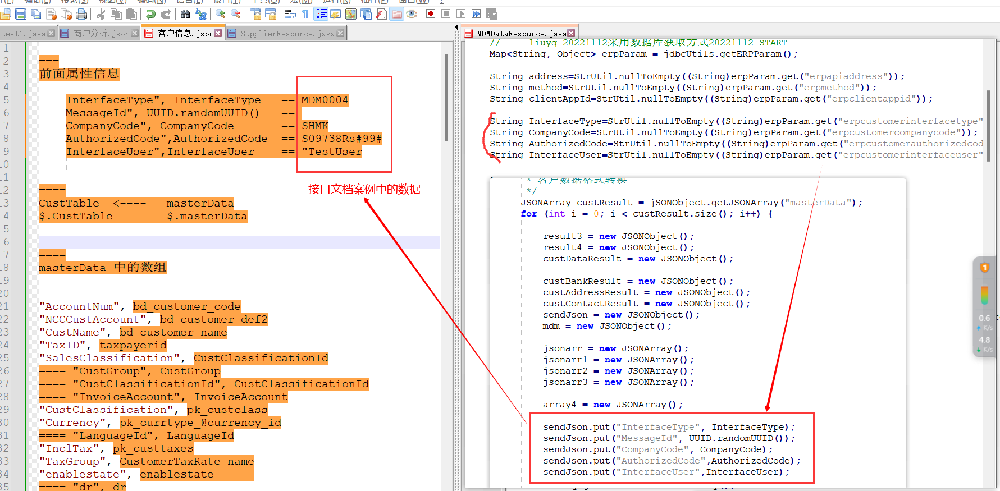


## 问题


```json

字段名称
$.SOAPAction

字段赋值
http://tempuri.org/CallErpWebService

{
  "SOAPAction": "",
  "remote.addr": "192.168.188.214:61445",
  "$tip_consumer.message.req.encoding": "UTF-8",
  "$tip_consumer.message.resp.encoding": "UTF-8",
  "$tip_restful": false,
  "OperationCode": "zmkg.erp.service53258.ERP-MDM-0001",
  "Connection": "keep-alive",
  "User-Agent": "Apache-HttpClient/4.4.1 (Java/1.8.0_151)",
  "Host": "192.168.187.35:9089",
  "$tip_protocol": "HTTP/1.1",
  "Accept-Encoding": "gzip,deflate",
  "$tip_timeout": 200000,
  "$tip_method": "POST",
  "$tip_pathInfo": "/esb/WebService.asmx",
  "$tip_real_url": "http://192.168.187.35:9089/esb/WebService.asmx",
  "$http_protocol": "http",
  "ClientId": "zmkg.oa",
  "Content-Length": "611",
  "receiverKey": "/esb/WebService.asmx",
  "Content-Type": "text/xml"
}
<?xml version="1.0" encoding="UTF-8"?>
<soapenv:Envelope xmlns:soapenv="http://schemas.xmlsoap.org/soap/envelope/">
    <soapenv:Body>
        <tem:CallErpWebService xmlns:tem="http://tempuri.org/">
            <tem:_clientAppId>
                63578e34-b925-8888-8598-d9d8788200f7
            </tem:_clientAppId>
            <tem:_requestMessage>
                {"InterfaceType":"OA0004","MessageId":"555998","CompanyCode":"SHMK","AuthorizedCode":"AB9Y#S0#","InterfaceUser":"TestUser","ReceiptInfo":{"WMSShipmentId":"SO202306270002","TransDate":"2023-06-27","SourceSalesid":"CP23-02-0139","JournalId":"044996_084"}}
            </tem:_requestMessage>
        </tem:CallErpWebService>
    </soapenv:Body>
</soapenv:Envelope>
```

