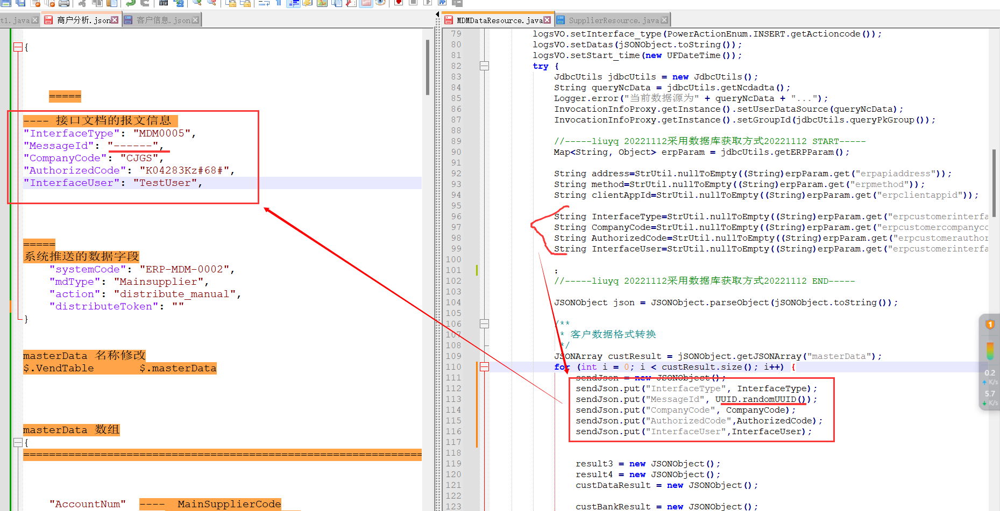

# 06-27

## 接口报文体问题

## 商户

1. 报文体前面的信息，源码上是从数据库获取的， 这个数据是否是固定死的？还是说不同系统是不同

   * 原本报文中的下面字段是舍弃的

     ```
     mdm 推送的报文中的字段
     
         "systemCode": "ERP-MDM-0002", 
         "mdType": "Mainsupplier", 
         "action": "distribute_manual", 
         "distributeToken": ""
     
     =====
     接口文档中的
         "InterfaceType": "MDM0005",
         "MessageId": "------",    
         "CompanyCode": "CJGS",  
         "AuthorizedCode": "K04283Kz#68#",
         "InterfaceUser": "TestUser",	
     ```

     



