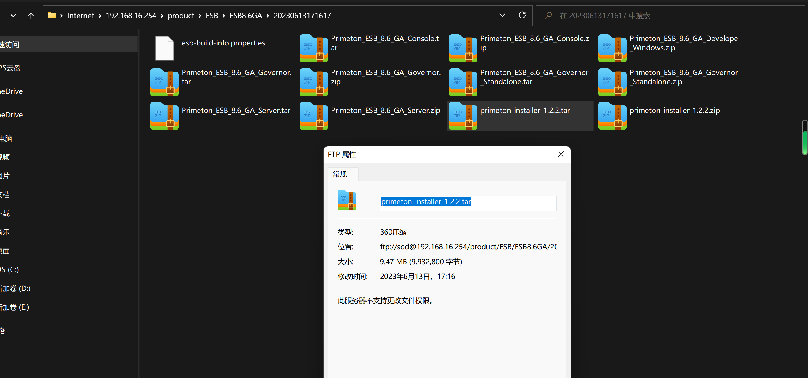

# ESB 参数




# 哑安装 -- 新安装


## 准备工作


## 安装

```bash
tar_form="primeton-installer-*.tar" &&
config_file="config/install.properties" &&
config_dir=$(dirname $config_file) &&
app_jar=$(ls $tar_form) &&
app_dir=$(basename "$app_jar" .tar) &&
prepare_dir="prepare"

vim ${prepare_dir}/${app_dir}/${config_file} &&
dos2unix ${prepare_dir}/${app_dir}/${config_file} &&
```


## == 安装

```bash
基本不存在首次安装，都是安装过好几遍的东西，然后才进入现场进行安装的


setup
    elasticsearch-8.1.2-linux-x86_64.tar.gz
    jdk-8u251-linux-x64.tar.gz

    mysql-connector-java-5.1.32.jar
    Primeton_ESB_8.6_GA_Console.tar
    Primeton_ESB_8.6_GA_Governor.tar
    Primeton_ESB_8.6_GA_Governor_Standalone.tar
    Primeton_ESB_8.6_GA_Server.tar
    sqljdbc-4.0.0.jar
    
    安装文件夹
    
    # 准备文件夹
    prepare: { 
    	不同的数据库驱动
    	elasticsearch
    		config-elasticsearch.yml
    		https 证书： 这个是每次安装生成的，不能进行备份
    		
    	installer
    		config-install.properties
    }''

```


## installer -- governor/standalone

```bash
#!/bin/bash
echo "==============================项目不同，会出现变化的地方================================"  &&
db_driver='mysql-connector-java-5.1.32.jar' &&
app_ip="" &&
app_port="8080" &&

echo "======================================================================================"  &&
echo "====================== primeton-installer 固定信息==========================="  &&
tar_form="primeton-installer-*.tar" &&
db_lib_dir="drivers" &&
config_file="config/install.properties" &&
start_sh="install.sh" &&

app_jar=$(ls $tar_form) &&
app_dir=$(basename "$app_jar" .tar) &&
abs_dir=$(pwd) &&
config_dir=$(dirname $config_file) &&

echo "======================================================================================"  &&
echo "======================创建 ${app_jar} 安装文件夹， 并进行解压==========================="  &&
mkdir $app_dir  &&
tar -vxf $app_jar -C $app_dir  &&
clear  &&
ll  &&


echo "======================================================================================"  &&
echo "======================复制数据库驱动==========================="  &&
echo $(ls $app_dir/$db_lib_dir | grep sql) &&
cp $db_driver $app_dir/$db_lib_dir &&
echo $(ls $app_dir/$db_lib_dir | grep sql) &&

echo "=================================复制安装文件和配置文件======================================"  &&
cp -r $app_dir/config/template/governor/standalone/* $app_dir/config &&

vim $app_dir/$config_file &&


echo "=================================提示信息======================================"  &&
governor_dir=$(grep "^destPath=" $app_dir/$config_file | cut -d'=' -f2)
echo -n "


===== 哑安装 ======
bash ${app_dir}/${start_sh}


===== 注意 ======
1. 为了保证密码安全，哑安装成功后，请立即删除
	rm ${abs_dir}/${app_dir}/install.properties
2. 数据库初始化
如果安装ESB Server时已经初始化过数据库，需要将initDB和forceInitDB的配置改为false，不再执行初始化脚本，如下：
	initDB=false
	forceInitDB=false
2. MySQL哑安装需要使用5.x版本的驱动，
	如果ESB Governor运行时想使用8.x版本，可以在哑安装完成后，手动删除${esb-governor安装目录}/lib目录的5.x驱动，重新放入8.x驱动		

===== governor ======
cd ${governor_dir}
1. 进入 governor 安装目录，执行  进行启动
bash start.sh

2. 停止 governor 服务 
bash shutdown.sh

==== 查看日志信息 ====	
tail -50f logs/eos-trace.log
启动成功信息： AppServer started on port(s) ... 
tail -50f logs/eos-trace.log | grep "AppServer started on port(s)"

==== 部署成功，web 登录登录 ESB 控制管理中心 ==== 。
http://${ip}:${app_port}
http://${ip}:${app_port}/#/login”


=== 账号密码信息
ESB管理员身份（esbadmin/000000）
系统管理员用户名：sysesbadmin，初始密码：000000
	系统管理员负责创建用户、删除用户，
安全管理员用户名：security，初始密码：000000
	安全管理员负责给用户分配角色，角色权限设置，
安全审计员用户名：audit，初始密码：000000
	安全审计员负责查看Governor操作日志，

=== 注意 

" &&


```


## installer -- server

```bash
 
#!/bin/bash
echo "==============================项目不同，会出现变化的地方================================"  &&
db_driver='mysql-connector-java-5.1.32.jar' &&
app_ip="" &&
app_port="8080" &&

echo "======================================================================================"  &&
echo "====================== primeton-installer 固定信息==========================="  &&
tar_form="primeton-installer-*.tar" &&
db_lib_dir="drivers" &&
config_file="config/install.properties" &&
start_sh="install.sh" &&

app_jar=$(ls $tar_form) &&
app_dir=$(basename "$app_jar" .tar) &&
abs_dir=$(pwd) &&
config_dir=$(dirname $config_file) &&

echo "======================================================================================"  &&
echo "======================创建 ${app_jar} 安装文件夹， 并进行解压==========================="  &&
mkdir $app_dir  &&
tar -vxf $app_jar -C $app_dir  &&
clear  &&
ll  &&


echo "======================================================================================"  &&
echo "======================复制数据库驱动==========================="  &&
echo $(ls $app_dir/$db_lib_dir | grep sql) &&
cp $db_driver $app_dir/$db_lib_dir &&
echo $(ls $app_dir/$db_lib_dir | grep sql) &&

echo "=================================复制安装文件和配置文件======================================"  &&
cp -r $app_dir/config/template/server/* $app_dir/config &&

vim $app_dir/$config_file &&


echo "=================================提示信息======================================"  &&
server_dir=$(grep "^destPath=" $app_dir/$config_file | cut -d'=' -f2)
echo -n "
== 

===== 注意 ======
1. 为了保证密码安全，哑安装成功后，请立即删除
	rm ${abs_dir}/${app_dir}/install.properties
2. 数据库初始化
如果安装ESB Server时已经初始化过数据库，需要将initDB和forceInitDB的配置改为false，不再执行初始化脚本，如下：
	initDB=false
	forceInitDB=false
2. MySQL哑安装需要使用5.x版本的驱动，
	如果ESB Governor运行时想使用8.x版本，可以在哑安装完成后，手动删除${esb-governor安装目录}/lib目录的5.x驱动，重新放入8.x驱动		

===== 哑安装 ======
设置“install.sh”文件中“JAVA_HOME”的值为本地JDK1.8 版本路径
	export P_I_JAVA_HOME=/opt/jdk1.8.0_250
启动
	bash ${app_dir}/${start_sh}


===== server ======
cd ${server_dir}
1. 进入 governor 安装目录，执行  进行启动
	nohup ./startServer.sh &

2. 停止 governor 服务
	安装目录“server\bin\stop.sh文件，设置“JAVA_HOME”的值为本地JDK1.8 版本路径
		export JAVA_HOME=/opt/jdk1.8.0_250
	停止
		bash shutdown.sh

==== 查看日志信息 ====	
tail -50f logs/eos-trace.log
启动成功信息： AppServer started on port(s) ... 
tail -50f logs/eos-trace.log | grep "AppServer started on port(s)"

=== 注意 

" &&


```


## installer -- studio

```
```


# 解压安装 -- 新安装

## ==富国-new

### 准备

```bash
├── prepare
│   ├── db-driver
│   │   ├── mysql.jar
│   ├── config
│   │   ├── server
│   │   ├    ├── xxx.config
│   │   ├── governor-standalone
```


### 解压复制

```bash
#!/bash/bin
echo "=====旧的安装包的配置文件到 prepared 文件夹=====" &&
declare -A app_dirs
declare -A app_configs

# 安装文件夹
version="7.5.0"
installer="primeton-installer-1.2.0"
db-driver=""


# 需要更改软件安装位置
base_app="$(pwd)"
prepare="$(pwd)/prepare" 
app_suffix=".tar"

app_dirs["governor-standalone"]="Primeton_ESB_${version}_GA_Governor_Standalone"
app_dirs["governor-standalone"]="Primeton_ESB_${version}_GA_Governor_Standalone"


# 先解压 console, server, logcenter
for key in ${!app_dirs[*]}
do  	
	echo "======================创建 ${app_jar} 安装文件夹， 并进行解压==========================="
	app=$key
	app_dir=${app_dirs[$key]} 	
    mkdir $app_dir
    tar -vxf ${app_jar}${app_suffix} -C $app_dir
    echo "app 安装完毕"
done


# 复制 数据库驱动
lib_dir=""
for key in ${!app_dirs[*]};
do
	app=$key
	app_dir=${app_dirs[$key]} 	
	if [$app_name eq "governor-standalone"]; then
    	lib_dir="lib"
	elif [$app_name eq "server"]; then
    	lib_dir="libs"      
    fi
    cp ${prepare}/db-driver/${db-driver} ${app_dir}/${lib_dir}
done


app_configs["governor-standalone"]="config/application.properties"
app_configs["governor-standalone-esb"]="config/application-esb.properties "
app_configs["governor-standalone-user"]="config/ESB/config/user-config.xml"

app_configs["server"]="server/config/application.properties"
app_configs["server-start"]="server/bin/start.sh"
app_configs["server-startup"]="server/EOS/_srv/startup.conf”"


# 复制配置文件
for key in ${!app_dirs[*]}
do  	
	app=$key
	app_dir=${app_dirs[$key]} 	
	if [$app_name eq "governor-standalone"]; then
    	cp $prepare/${app}/${app_configs["governor-standalone"]} ${app_dir}/${app_configs["governor-standalone"]}
    	cp $prepare/${app}/${app_configs["governor-standalone-esb"]} ${app_dir}/${app_configs["governor-standalone-esb"]}
    	cp $prepare/${app}/${app_configs["governor-standalone-user"]} ${app_dir}/${app_configs["governor-standalone-user"]}
    	
	elif [$app_name eq "server"]; then
    	cp $prepare/${app}/${app_configs["server"]} ${app_dir}/${app_configs["server"]}
    	cp $prepare/${app}/${app_configs["server-start"]} ${app_dir}/${app_configs["server-start"]}
    	cp $prepare/${app}/${app_configs["server-startup"]} ${app_dir}/${app_configs["gserver-startup"]}     
    fi
    
    x
	# 启动
	bash ${installer_name}/install.sh  
    
    
done
```


## 安装准备

## governor-standlone

```bash
echo "==============================项目不同，会出现变化的地方================================"  &&
db_driver='mysql-connector-java-5.1.32.jar' &&
app_ip="-----" &&
echo "======================================================================================"  &&
echo "====================== Governor 固定信息==========================="  &&
tar_form=".tar" &&
db_lib_dir="lib" &&
app_jar=$(ls $tar_form) &&
app_dir=$(basename "$app_jar" .tar) &&
abs_app_dir=$(pwd) &&
echo "======================================================================================"  &&
;
echo "======================================================================================"  &&
echo "======================复制数据库驱动==========================="  &&
echo 没有复制驱动----$(ls $app_dir/$db_lib_dir | grep sql) &&
cp $db_driver $app_dir/$db_lib_dir &&
echo 复制驱动完成----$(ls $app_dir/$db_lib_dir | grep sql) &&
echo "======================================================================================"  &&
echo "=================================配置文件编辑======================================"  &&
echo -n "
端口， redis, jpa数据库方言
	vim $app_dir/config/application.properties
es 
	vim $app_dir/config/application-esb.properties
	
mysql: databaseType, driver, url, username, password
	vim $app_dir/config/ESB/config/user-config.xml	
"
 
echo "======================================================================================"  &&
echo "=================================提示信息======================================"  &&
echo -n "

	
启动
	bash $app_dir/bin/startup.sh
日志
	tail -50f $app_dir/logs/eos-trace.log
	tail -50f $app_dir/logs/eos-trace.log | grep -i AppServer started on ports(s)

==== 部署成功，web 登录登录 ESB 控制管理中心 ==== 。
http://${ip}:${app_port}
http://${ip}:${app_port}/#/login


=== 账号密码信息
ESB管理员身份（esbadmin/000000）
系统管理员用户名：sysesbadmin，初始密码：000000
	系统管理员负责创建用户、删除用户，
安全管理员用户名：security，初始密码：000000
	安全管理员负责给用户分配角色，角色权限设置，
安全审计员用户名：audit，初始密码：000000
	安全审计员负责查看Governor操作日志

" &&
echo "=================================项目启动======================================"  &&
echo "需要停止原本的项目，然后进行启动" &&
cd $app_dir &&
ls -l &&
```


## server

```bash
echo "==============================项目不同，会出现变化的地方================================"  &&
db_driver='mysql-connector-java-5.1.32.jar' &&
app_ip="-----" &&
echo "======================================================================================"  &&
echo "====================== Governor 固定信息==========================="  &&
tar_form="Primeton_ESB_*_GA_Server.tar" &&
db_lib_dir="libs" &&
app_jar=$(ls $tar_form) &&
app_dir=$(basename "$app_jar" .tar) &&
abs_app_dir=$(pwd) &&
echo "======================================================================================"  &&
echo "======================创建 ${app_jar} 安装文件夹， 并进行解压==========================="  &&
mkdir $app_dir  &&
tar -vxf $app_jar -C $app_dir  &&
clear  &&
ll  &&
echo "======================================================================================"  &&
echo "======================复制数据库驱动==========================="  &&
echo 没有复制驱动----$(ls $app_dir/$db_lib_dir | grep sql) &&
cp $db_driver $app_dir/$db_lib_dir &&
echo 复制驱动完成----$(ls $app_dir/$db_lib_dir | grep sql) &&
echo "======================================================================================"  &&
echo "=================================配置文件编辑======================================"  &&
echo -n "
启动文件改为本地 jdk 路径， 使用默认的不用改
	---- export JAVA_HOME=/opt/jdk1.8.0_250
	vim $app_dir/server/bin/start.sh
数据库方言--mysql, redis, es, eos, 
	vim $app_dir/server/conf/application.yml
port.ip
	vim $app_dir/server/EOS/_srv/startup.conf
	
mysql: databaseType, driver, url, username, password
	vim $app_dir/config/ESB/config/user-config.xml	
"
 
echo "======================================================================================"  &&
echo "=================================提示信息======================================"  &&
echo -n "
	
启动
	cd $app_dir 
	nohup ./startServer.sh & 
日志
	tail -50f $app_dir/logs/eos-trace.log
	tail -50f $app_dir/logs/eos-trace.log | grep -i AppServer started on ports(s)

==== 部署成功 ==== 。
  启动界面出现“ESB Server started  successfully ”，表示ESB Server启动成功


" &&
```


## == 函数

## server

```bash
echo "==============================项目不同，会出现变化的地方================================"  &&
db_driver='mysql-connector-java-5.1.32.jar' &&
app_ip="-----" &&
echo "======================================================================================"  &&
echo "====================== server 固定信息==========================="  &&
tar_form="*Console.tar" &&
db_lib_dir="libs" &&
config_file="conf/application.properties" &&
start_sh="startBFTConsole.sh" &&
stop_sh="stopBFTConsole.sh" &&
log_file="logs/eos-trace.log"
app_jar=$(ls $tar_form) &&
app_dir=$(basename "$app_jar" .tar) &&
abs_app_dir=$(pwd) &&
echo "======================================================================================"  &&
echo "======================创建 ${app_jar} 安装文件夹， 并进行解压==========================="  &&
mkdir $app_dir  &&
tar -vxf $app_jar -C $app_dir  &&
clear  &&
ll  &&
echo "======================================================================================"  &&
echo "======================复制数据库驱动==========================="  &&
echo 没有复制驱动----$(ls $app_dir/$db_lib_dir | grep sql) &&
cp $db_driver $app_dir/$db_lib_dir &&
echo 复制驱动完成----$(ls $app_dir/$db_lib_dir | grep sql) &&
echo "======================================================================================"  &&
echo "=================================复制旧的配置文件======================================"  &&
config_dir=$(dirname $config_file) &&
mkdir ${app_dir}/tmp &&
cp $app_dir/$config_file $app_dir/${config_file}.bak &&
rm $app_dir/$config_file &&
cp ${old_app_dir}/$config_file $app_dir/tmp &&
cp ${old_app_dir}/$config_file $app_dir/$config_dir &&
echo "======================================================================================"  &&
echo "=================================提示信息======================================"  &&
echo -n "
旧配置文件路径--${old_app_dir}/${config_file}
新配置文件路径--${app_dir}/${config_file}

==== 查看日志信息 ====	
tail -50f ${abs_app_dir}/${app_dir}/${log_file}
启动成功信息： AppServer started on port(s) ... 
tail -50f ${abs_app_dir}/${app_dir}/${log_file} | grep AppServer started on port(s)

==== 部署成功，web 登录登录BFT控制管理中心 ====
http://${app_ip："ip"}:28082/bftconsole

=== 账号密码信息
系统管理员用户：sysadmin，初始密码：0000000
操作员 ：operator，初始密码：000000

=== 注意
管理服务器（BFTServer）需要在控制管理中心（BFTConsole）进行注册后才可正常启动，
替换升级的不需要，因为没改变什么


=== 启动
    echo "需要停止原本的项目，然后进行启动" &&
    cd $app_dir &&
    bash ${old_app_dir}/$stop_sh &&  停止原本的项目
    bash $start_sh
=== 关闭
	bash shutdown.sh
" &&
echo "=================================项目启动======================================"  &&
echo "需要停止原本的项目，然后进行启动" &&
cd $app_dir &&
ls -l &&
```


```bash
 
#!/bin/bash
echo "==============================项目不同，会出现变化的地方================================"  &&
db_driver='mysql-connector-java-5.1.32.jar' &&
app_ip="" &&
app_port="8080" &&

echo "======================================================================================"  &&
echo "====================== primeton-installer 固定信息==========================="  &&
tar_form="primeton-installer-*.tar" &&
db_lib_dir="drivers" &&
config_file="config/install.properties" &&
start_sh="install.sh" &&

app_jar=$(ls $tar_form) &&
app_dir=$(basename "$app_jar" .tar) &&
abs_dir=$(pwd) &&
config_dir=$(dirname $config_file) &&


echo "======================创建 ${app_jar} 安装文件夹， 并进行解压==========================="  &&
setup() {
	echo "创建 app 安装文件夹并进行安装" \
    mkdir $app_dir  &&
    tar -vxf $app_jar -C $app_dir  &&
    clear  &&
    ll  &&
}
setup &&


echo "======================================================================================"  &&
echo "======================复制数据库驱动==========================="  &&
copy_db_driver() {
	echo "将数据库驱动复制到当前 app 的 lib 文件中"
    echo $(ls $app_dir/$db_lib_dir | grep sql) &&
    cp $db_driver $app_dir/$db_lib_dir &&
    echo $(ls $app_dir/$db_lib_dir | grep sql) &&
}
copy_db_driver()

echo "=================================复制安装文件和配置文件======================================"  &&
copy_run_app() {
	echo "哑安装将 app 对应的文件夹复制到对应的文件夹中"
    cp -r $app_dir/config/template/server/* $app_dir/config &&
    vim $app_dir/$config_file &&
}
copy_run_app()

copy_run_app_config() {
	echo " 重复利用之前已经使用过的配置文件 "
	cp ${prepare}/$app_dir/$config_file $app_dir/$config_dir
	vim $app_dir/$config_file &&
}
copy_run_app_config()


before_run() {
	echo "设置“install.sh”文件中“JAVA_HOME”的值为本地JDK1.8 版本路径"
	echo " export P_I_JAVA_HOME=/opt/jdk1.8.0_250 "
	read answer;
	if [ "$answer" != "y" ]; then  
      echo "Exiting script."  
      exit 0  
    fi 
	
}
before_run()

run() {
	bash ${app_dir}/${start_sh}
}
run()
echo "=================================提示信息======================================"  &&
server_dir=$(grep "^destPath=" $app_dir/$config_file | cut -d'=' -f2)
echo -n "
== 

===== 注意 ======
1. 为了保证密码安全，哑安装成功后，请立即删除
	rm ${abs_dir}/${app_dir}/install.properties
2. 数据库初始化
如果安装ESB Server时已经初始化过数据库，需要将initDB和forceInitDB的配置改为false，不再执行初始化脚本，如下：
	initDB=false
	forceInitDB=false
2. MySQL哑安装需要使用5.x版本的驱动，
	如果ESB Governor运行时想使用8.x版本，可以在哑安装完成后，手动删除${esb-governor安装目录}/lib目录的5.x驱动，重新放入8.x驱动		

 ===== server ======
cd ${server_dir}
1. 进入 governor 安装目录，执行  进行启动
	nohup ./startServer.sh &

2. 停止 governor 服务
	安装目录“server\bin\stop.sh文件，设置“JAVA_HOME”的值为本地JDK1.8 版本路径
		export JAVA_HOME=/opt/jdk1.8.0_250
	停止
		bash shutdown.sh

==== 查看日志信息 ====	
tail -50f logs/eos-trace.log
启动成功信息： AppServer started on port(s) ... 
tail -50f logs/eos-trace.log | grep "AppServer started on port(s)"

=== 注意 

" &&


```


