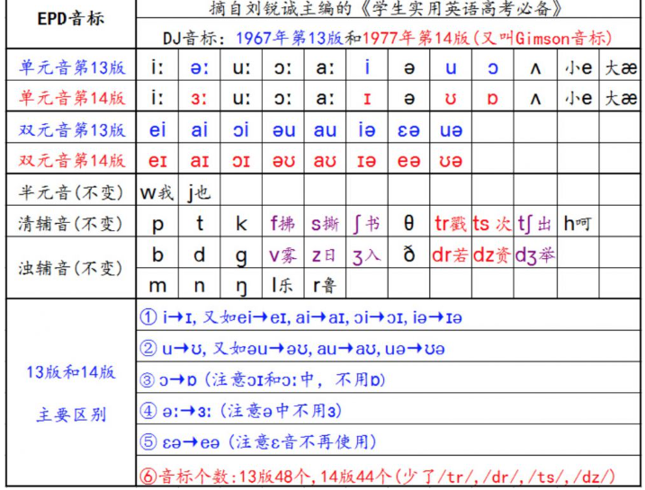

1. 先将所有的国际音标存入数据库，就是将其 unicode 编码存储到数据库

   ```java
   
   
   // 音素表 {
   音素 id
   音素 w
   unicode 编码：
   html 编码：
   辅助发音 "辅音"
   group:   //  同一音标的不同变化版本
   版本： IPA88
   是否删除：     
   
   }
   
   
   // 版本信息 {
   版本：IPA88
   发布年份： 1967年
   别称： DJ
   版本id: 1
   音素数量： 
   
   }
   ```

2. 需要给出一个音标的演变史，这个还是用静态页面， 只不过数据是放在数据库， 然后是使用模板进行设置

   ```
   这个主要就是不同版本记录
   ```

   

3. 改用静态页面就用静态页面，没必要非得使用动态渲染，这些死的数据，没必要进一次数据库

   * 比如下面的表格， 直接各给个静态页面即可，没必要进行数据库查询，这种的八辈子都不变的啊

