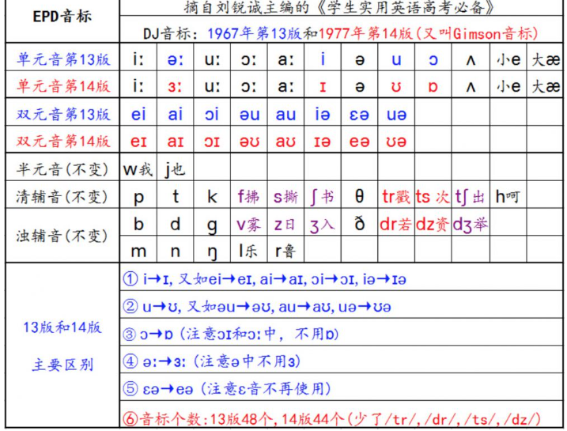
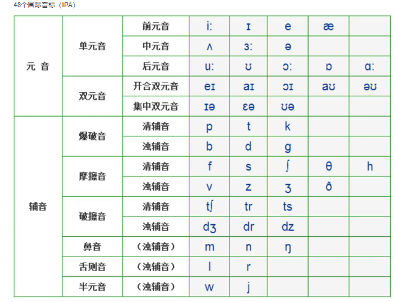

# 1. 音标存储

## 音标素材

### == mysql 存储

### 基础存储

### 对比存储

### 数据库设计

#### 不同类型的对比

| id   | IPA(1977, 14版) | kk   | G    |      |
| ---- | --------------- | ---- | ---- | ---- |
| 1    | ɑ:              |      |      |      |
| 2    | i:              |      |      |      |
| 3    | ɜ:              |      |      |      |
| 4    | ɔ:              |      |      |      |
| 5    | u:              |      |      |      |
| 6    | ʌ               |      |      |      |
| 7    | ɪ               |      |      |      |
| 8    | ə               |      |      |      |
| 9    | ɒ               |      |      |      |
| 10   | ʊ               |      |      |      |
| 11   | e               |      |      |      |
| 12   | æ               |      |      |      |
| 13   | aɪ              |      |      |      |
| 14   | eɪ              |      |      |      |
| 15   | ɔɪ              |      |      |      |
| 16   | əʊ              |      |      |      |
| 17   | aʊ              |      |      |      |
| 18   | ɪə              |      |      |      |
| 19   | eə              |      |      |      |
| 20   | ʊə              |      |      |      |
| 21   | p               |      |      |      |
| 22   | k               |      |      |      |
| 23   | t               |      |      |      |
| 24   | b               |      |      |      |
| 25   | d               |      |      |      |
| 26   | g               |      |      |      |
| 27   | f               |      |      |      |
| 28   | s               |      |      |      |
| 29   | ʃ               |      |      |      |
| 30   | θ               |      |      |      |
| 31   | h               |      |      |      |
| 32   | v               |      |      |      |
| 33   | z               |      |      |      |
| 34   | ʒ               |      |      |      |
| 35   | ð               |      |      |      |
| 36   | tʃ              |      |      |      |
| 37   | tr              |      |      |      |
| 38   | ts              |      |      |      |
| 39   | dʒ              |      |      |      |
| 40   | dr              |      |      |      |
| 41   | dz              |      |      |      |
| 42   | m               |      |      |      |
| 43   | n               |      |      |      |
| 44   | ŋ               |      |      |      |
| 45   | l               |      |      |      |
| 46   | r               |      |      |      |
| 47   | j               |      |      |      |
| 48   | w               |      |      |      |
| 49   |                 |      |      |      |

#### 同一类型不同版本的 -- IPA

| id   | IPA(1977, 14版) | kk   | G    |      |
| ---- | --------------- | ---- | ---- | ---- |
| 1    | ɑ:              |      |      |      |
| 2    | i:              |      |      |      |
| 3    | ɜ:              |      |      |      |
| 4    | ɔ:              |      |      |      |
| 5    | u:              |      |      |      |
| 6    | ʌ               |      |      |      |
| 7    | ɪ               |      |      |      |
| 8    | ə               |      |      |      |
| 9    | ɒ               |      |      |      |
| 10   | ʊ               |      |      |      |
| 11   | e               |      |      |      |
| 12   | æ               |      |      |      |
| 13   | aɪ              |      |      |      |
| 14   | eɪ              |      |      |      |
| 15   | ɔɪ              |      |      |      |
| 16   | əʊ              |      |      |      |
| 17   | aʊ              |      |      |      |
| 18   | ɪə              |      |      |      |
| 19   | eə              |      |      |      |
| 20   | ʊə              |      |      |      |
| 21   | p               |      |      |      |
| 22   | k               |      |      |      |
| 23   | t               |      |      |      |
| 24   | b               |      |      |      |
| 25   | d               |      |      |      |
| 26   | g               |      |      |      |
| 27   | f               |      |      |      |
| 28   | s               |      |      |      |
| 29   | ʃ               |      |      |      |
| 30   | θ               |      |      |      |
| 31   | h               |      |      |      |
| 32   | v               |      |      |      |
| 33   | z               |      |      |      |
| 34   | ʒ               |      |      |      |
| 35   | ð               |      |      |      |
| 36   | tʃ              |      |      |      |
| 37   | tr              |      |      |      |
| 38   | ts              |      |      |      |
| 39   | dʒ              |      |      |      |
| 40   | dr              |      |      |      |
| 41   | dz              |      |      |      |
| 42   | m               |      |      |      |
| 43   | n               |      |      |      |
| 44   | ŋ               |      |      |      |
| 45   | l               |      |      |      |
| 46   | r               |      |      |      |
| 47   | j               |      |      |      |
| 48   | w               |      |      |      |
| 49   |                 |      |      |      |

### 音标输入界面设计

#### 设计一

|      |        |        |          |          |          |          |          |         |         |
| ---- | ------ | ------ | -------- | -------- | -------- | -------- | -------- | ------- | ------- |
| 元音 | 单元音 | 长元音 | ɑ:【1】  | i:【2】  | ɜ:【3】  | ɔ:【4】  | u:【5】  |         |         |
|      |        | 短元音 | ʌ【6】   | ɪ【7】   | ə【8】   | ɒ【9】   | ʊ【10】  | e【11】 | æ【12】 |
|      | 双元音 | 开合   | aɪ【13】 | aʊ【17】 | eɪ【14】 | ɔɪ【15】 | əʊ【16】 |         |         |
|      |        | 集中   | eə【19】 |          | ɪə【18】 | ʊə【20】 |          |         |         |
| 辅音 | 爆破音 | 清辅音 | p【21】  | t【23】  | k【22】  |          |          |         |         |
|      |        | 浊辅音 | b【24】  | d【25】  | g【26】  |          |          |         |         |
| 辅音 | 摩擦音 | 清辅音 | f【27】  | s【28】  | ʃ【29】  | θ【30】  | h【31】  |         |         |
|      |        | 浊辅音 | v【32】  | z【33】  | ʒ【34】  | ð【35】  |          |         |         |
| 辅音 | 破擦音 | 清辅音 | tʃ【36】 | tr【37】 | ts【38】 |          |          |         |         |
|      |        | 浊辅音 | dʒ【39】 | dr【40】 | dz【41】 |          |          |         |         |
| 辅音 | 鼻音   | 浊辅音 | m【42】  | n【43】  | ŋ【44】  |          |          |         |         |
|      | 舌侧音 | 浊辅音 | l【45】  | r【46】  |          |          |          |         |         |
|      | 半元音 | 浊辅音 | j【47】  | w【48】  |          |          |          |         |         |
|      |        |        |          |          |          |          |          |         |         |

#### 设计二

### 
