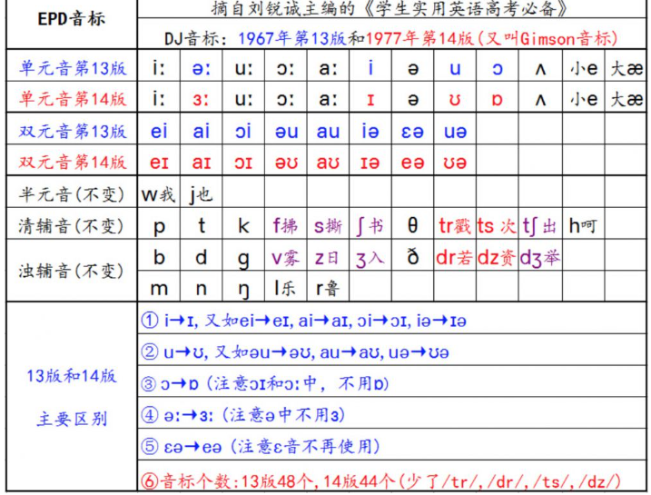
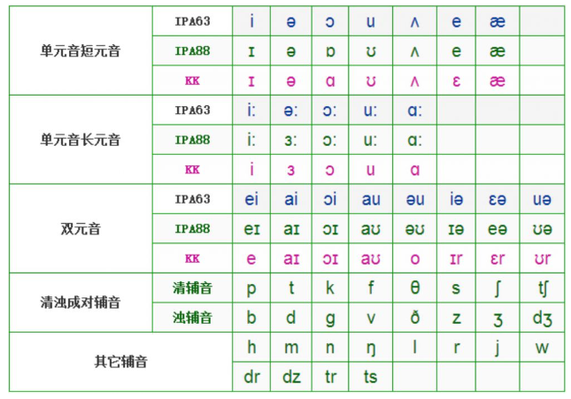
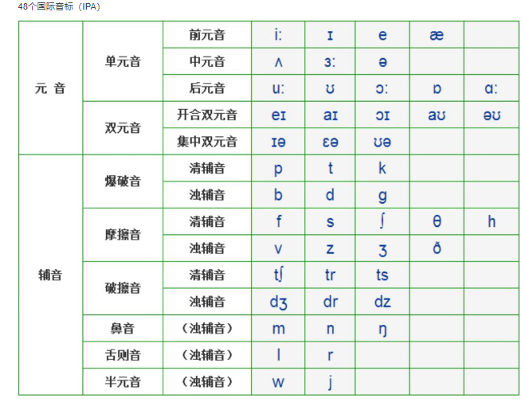
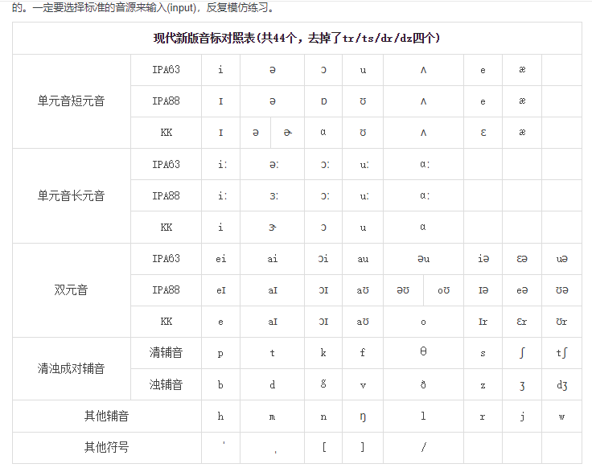
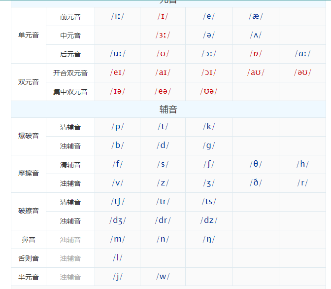
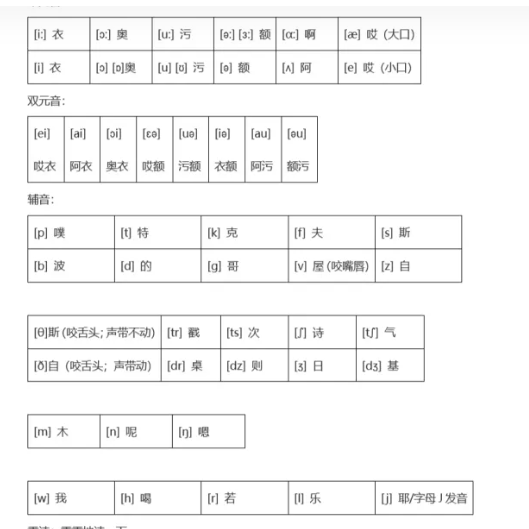

## 发音比较重要的




```
id
音素 v
辅助发音 "乌，雾"
类别 IPA
版本年份： "1967年"
别称："DJ， IPA63"

```


## 音标比价 

```
IPA63 == DJ12 == 1936年 == Daniel Jones
IPA88 == DJ13 == 1988年 == A. C. Gimson
1977年第14版DJ音标共有44个音标，	
KK 音
```




## IPA




## 其他




## 其他



## 历史发展

| 版本     | 发布年份 |
| -------- | -------- |
| IPA 1886 | 1886     |
| IPA 1895 | 1895     |
| IPA 1900 | 1900     |
| IPA 1912 | 1912     |
| IPA 1928 | 1928     |
| IPA 1932 | 1932     |
| IPA 1949 | 1949     |
| IPA 1951 | 1951     |
| IPA 1955 | 1955     |
| IPA 1963 | 1963     |
| IPA 1979 | 1979     |
| IPA 1989 | 1989     |
| IPA 1993 | 1993     |
| IPA 1996 | 1996     |
| IPA 2005 | 2005     |
| IPA 2015 | 2015     |
| IPA 2018 | 2018     |

需要注意的是，虽然IPA音标版本有很多，但是并不是每个版本都得到广泛的应用和认可。常见的版本包括IPA 1949、IPA 1963、IPA 1979、IPA 1993、IPA 2005和IPA 2018。

## ==


