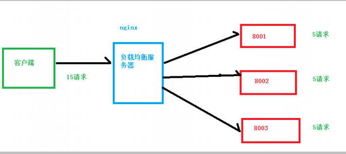
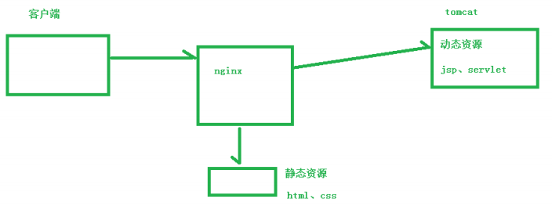

# 知识普及

## 正反向代理

```java
个人理解
    正反向代理就是站在不同立场的产物， 
    a 通过 B 去反问 c
    // 我们一般思考逻辑就是： 客户端发送请求过来， 后端接收处理
    // 简单理解为： 在客户端考虑问题是正向，在服务端考虑是反向
    // 其实你依照服务端有多少个去判断是正反向代理， 其实也是不由自主自己代入了自己是客户端还是服务端
    站在 a 的立场： B 就是代指服务器  // 正向代理： 通常服务端只有一个
    站在 c 的立场： B 就是代指客户端  // 反向代理： 通常服务端有多个
```


## 负载均衡

```java
个人理解
    就是好多请求去请求同一个服务器， 会造成服务器运行压力太大(内存占用过高、线程被占用完了等等)，无法及时处理所有的请求， 负载均衡就是通过一定的规则把过多的请求，分散到不同的服务器上， 减轻服务器的运行压力
```



## 动静分离

```java
其实就是把静态页面、动态代码放在
```




# 配置介绍

## 配置文件

```
默认位置在 config 下，改过后记得重启Nginx服务

配置文件 = 注释行 + 指令(配置项) + 指令块{配置项} 

指令特点：
	1. 配置的继承。在一个区段中嵌套其他区段，那么被嵌套的区段会继承其父区段的配置。在嵌套模块中重新声明指令会覆盖该继承。
	2. 配置块能相互嵌套。在某些情况下不同配置块能够相互嵌套
	3. 指令都有作用域
```


### 指令值

* 单位

  ```
      k或K:千字节
      m或M:兆字节
      ms:Milliseconds(毫秒)
      s:Seconds(秒)
      m:Minutes(分钟)
      h:Hours(小时)
      d:Days(天)
      w:Weeks(星期)
      M:Months(月)
      y:Years(年)
  ```

* 值

  ```
  1. 如果指令值中包含空格、分号或者是大括号等特殊字符，需要使用单引号或双引号将其括起。
  ```

  


## 配置文件结构

```


①、http 全局块
http 全局块配置的指令包括：文件引入、MIME-TYPE 定义、日志自定义、连接超时时间、单链接请求数上限等。

②、server 块
这块和虚拟主机有密切关系，虚拟主机从用户角度看，和一台独立的硬件主机是完全一样的，该技术的产生是为了节省互联网服务器硬件成本。

每个 http 块可以包括多个 server 块，而每个 server 块就相当于一个虚拟主机。而每个 server 块也分为全局 server 块，以及可以同时包含多个 locaton 块。（☆☆☆☆☆）

1、全局 server 块
最常见的配置是本虚拟机主机的监听配置和本虚拟主机的名称或 IP 配置。

2、location 块
一个 server 块可以配置多个 location 块。

这块的主要作用是基于 Nginx 服务器接收到的请求字符串（例如 server_name/uri-string），对虚拟主机名称（也可以是 IP 别名）之外的字符串（例如 前面的 /uri-string）进行匹配，对特定的请求进行处理。地址定向、数据缓存和应答控制等功能，还有许多第三方模块的配置也在这里进行。
```

## 注释

```
字符"#"表示该行是注释行，nginx在读取配置文件时将忽略的文本。
```


## main 模块

```python
 #启用或禁用守护进程模式。
daemon on;

#worker进程运行的用户和组，如果没有提供则使用nginx的master进程的用户和用户组。
user  nobody;   

#定义worker进程数量一般和cpu核数一致。
worker_processes  4;

#错误日志，这里的级别由debug,info,notice,warn,error和crit(debug记录了全部日志，crit仅报告关键错误)
#作用域：main, http, mail, stream, server, location
error_log  logs/error.log error; 

#存放nginx守护进程的pid文件路径。
pid        logs/nginx.pid;

#开启或禁用记录404错误。
log_not_found on; 
...
#除上面指令外还有worker_rlimit_core、worker_rlimit_nofile、worker_cpu_affinity、worker_priority等。
```


## events模块

* 用来配置网络机制。

```python
#默认值on，启用或禁用使用一个接受互斥锁来打开套接字监听。   
accept_mutex:on; 

#指定nginx所使用的网络事件模型，可选值有/dev/poll,epoll,kqueue等，通常不需要显式指定它，默认情况下nginx将使用最有效方法。    
use epoll; 

#定义一个worker进程能够同时连接的数量。
worker_connections 1024; 
```

## configuration模块

* 能够将其他文件包含在nginx配置文件中。在配置文件的任何地方均可插入该指令。
* 注意如果没有指定绝对路径，那么文件路径将和配置文件的目录相关。

```python
include /file/path.conf;
include sites/*.conf;
```

## HTTP 核心

* HTTP 核心模块是Nginx中最大的一个模块，它包含了所有的基本的区段、指令和变量

  ```python
  http {
      # 在http区段中启用gzip压缩
      gzip on;
      server {
          location /downloads/ {
               #在此location区段禁用gzip压缩
              gzip off;
          }
      }
  }
  
  
      http 区段位于配置文件的根部，在这个区段中允许定义HTTP模块的指令和HTTP模块的相关区段。
      server区段用于声明一个站点，该区段只能用在http区段中。
      loation 区段应用于网站特定的URI位置，该区段能够用于server区段中，也能嵌套在其他location中。
  ```

### 属性

```
include       mime.types;
default_type  application/octet-stream;
sendfile        on;
keepalive_timeout  65;
```


### error_page

```java
范围： http,server,location,if
含义：用于定义处理特定 HTTP 错误代码时的错误页面或重定向
语法： error_page <error_code> [=replacement code] [=@block|URI]
<error_code> 
    是要处理的 HTTP 错误代码。
    可以是单个错误代码，也可以是用逗号分隔的多个错误代码，或者使用通配符来匹配一类错误代码。
    
<response> 
    是要返回的 HTTP 响应码，
    可以是数字形式的 HTTP 响应码，也可以是一个内置的 Nginx 响应码，如 400 或 404，
    或者使用 = 前缀精确匹配一个自定义的错误页面。
    
<url> 是要重定向到的 URL 地址，可以是相对路径或绝对路径。  
    
案例
error_page 404 html/404/html;
error_page 500 502 503 504 html/5x.html;
#跳转到命名的location区段。
error_page 404 @notfound; 
#在出现404错误时 ，内部重定向到index.html,并且返回200 OK响应码。
error_page 404 =200/index/html;

返回自定义的错误页面：

bash
Copy code
error_page 404 /errors/not-found.html;
当发生 404 错误时，将返回 /errors/not-found.html 页面。

使用内置的 Nginx 响应码：

javascript
Copy code
error_page 500 = /errors/server-error.html;
当发生 500 错误时，将返回 /errors/server-error.html 页面，并确保只匹配精确的 500 错误。

重定向到外部 URL：

arduino
Copy code
error_page 503 http://example.com/maintenance.html;
当发生 503 错误时，将重定向到 http://example.com/maintenance.html。

处理多个错误码：

bash
Copy code
error_page 404, 500 /errors/error.html;
当发生 404 或 500 错误时，将返回 /errors/error.html 页面。

使用通配符匹配错误码：

javascript
Copy code
error_page 50* /errors/server-error.html;
当发生以 50 开头的任何错误码时，都将返回 /errors/server-error.html 页面。
```


## http-server

* 案例

### listen  

```
 listen [address][:port][其他选项]
 
address：
	指定监听的 IP 地址或域名。
	可以是具体的 IP 地址，例如 192.168.0.1，也可以是域名，例如 example.com。
	如果省略 address，则表示监听所有可用的 IP 地址。
port：
	指定监听的端口号。
	可以是具体的端口号，例如 80，也可以是一个范围，例如 8000-8080。
	如果省略 port，则表示使用默认的 HTTP 端口 80。
	
options：
	可选的附加选项，用于进一步配置监听行为
	ssl 
		选项来启用 SSL/TLS 加密
 	default: 
 	  1. 后续改为  default_server
 	  2. 当客户端请求的域名没有与其他服务器块的server_name指令匹配时，将使用设置为默认服务器的那个服务器块来处理请求。[就是就是匹配不到对应的服务器，就使用 default 修饰的]
 	  
例子
listen 80;  
	表示监听默认的 HTTP 端口 80，对所有可用的 IP 地址生效。
listen 192.168.0.1:8080;
	监听 IP 地址 192.168.0.1 的端口 8080
listen [::]:80;
	表示监听所有 IPv6 地址的端口 80
	
listen example.com:443 ssl;
	表示监听域名 example.com 的端口 443，并启用 SSL/TLS 加密。
listen example.com:443 default_server;
	表示监听域名 example.com 的端口 443。当客户端请求的域名找不到对应的 server 的时候，就是用当前 listen 所在的 server 处理请求
```

### server-name

```
 nginx收到http请求时，根据请求header中Host值与所有server区段比较，第一个与主机名匹配的server块将被选中，否则如果没有server区段与客户端请求的主机名匹配，nginx会选择第一个server区段，匹配监听参数(listen命令),另外具有default选项的listen会被优先选择。注意该指令接受通配符。
 
 
注意：
    1. nginx 根据 server_name 匹配 server, 随后在进行 listen 匹配的
    
案例
单个域名或主机名：
server_name example.com;

多个域名或主机名，使用空格分隔：
server_name example.com www.example.com;

使用通配符（以 * 开头）匹配多个域名或主机名：
server_name *.example.com;

使用正则表达式进行模式匹配：
server_name ~^(www\.)?example\.com$;
在这个示例中，使用了 ~ 符号表示正则表达式匹配，并指定了一个匹配域名的正则模式。


默认服务器配置，使用 _ 作为 server_name 的值：
server_name _;
这表示该 server 块将作为默认服务器处理没有匹配到其他具体 server_name 的请求。


注意：
	1. 当存在多个 server 块时，Nginx 将根据请求中的域名或主机名与 server_name 的配置进行匹配。匹配成功的 server 块将处理请求。如果没有匹配到具体的 server_name，将会使用默认服务器或第一个 server 块来处理请求。
```

### 其他不重要的

```
tcp_nodelay：
	开启或关闭使用TCP_NODELAY套接字选项，仅用于keep-alive连接。它禁用了Nagle 缓冲算法。
tcp_nopush
    开启或禁用TCP_NOPUSH(FreeBSD)或TCP_CORK(Linux)的scoket选项。如果tcp_nopush开启，则nginx将尝试在整个tcp数据包中发送整个http响应头。
sendfile
    指定nginx是否调用sendfile系统函数来输出文件，减少内核空间和用户空间的上下文切换。对于普通应用设为 on，如果用来进行下载等应用磁盘IO重负载应用，可设置为off，以平衡磁盘与网络I/O处理速度，降低系统的负载。

另外还有sendfile_max_chunk、send_lowat等指令
```


## http-location

```
```

### alias

```
location 指定uri路径的别名，它不会改变root的值
是 location 块中用于指定替代文件路径的指令。
它允许您将请求映射到一个不同的文件路径，而不是使用原始请求的路径。
在 Nginx 中实现路径重写或文件的动态映射，以满足特定的需求。

案例理解
当匹配到以 /path/ 开头的请求时，Nginx 将使用 /new/path/ 替代原始请求的路径，然后根据替代的路径来查找对应的文件。
xxx/path/xxx 会被替换成 xxx/new/path/
location /path/ {
    alias /new/path/;
}

注意：
1. 使用 alias 指令时，末尾的斜杠的存在与否很重要。在 alias 的路径配置中，末尾的斜杠（/）表示该路径是一个目录，Nginx 将根据请求的路径在该目录中查找文件。如果省略末尾的斜杠，则表示该路径是一个文件，Nginx 将直接使用该路径作为替代。

2. alias 指令只能用于 location 块中，并且不能与 proxy_pass 指令一起使用。
```


## locaion

```
location [ = | ~ | ~* | ^~] uri {

}

注意：如果 uri 包含正则表达式，则必须要有 ~ 或者 ~* 标识
（1）= ：uri必须与/abcd精确匹配（优先级最高），
		如果匹配成功，就停止继续向下搜索并立即处理该请求。
（2）~：用于表示 uri 包含正则表达式，并且区分大小写。
（3）~*：用于表示 uri 包含正则表达式，并且不区分大小写。
（4）^~：用于不含正则表达式的 uri 前，要求 Nginx 服务器找到标识 uri 和请求
		字符串匹配度最高的 location 后，立即使用此 location 处理请求，
		而不再使用 location块中的正则 uri 和请求字符串做匹配。

    
```

# 配置案例

## 反向代理

* 案例一

  ```python
  server {
      
      # Nginx 监听端口为 9001
  	listen       9001;
  	server_name  192.168.17.129;
  
  	# 访问http://192.168.17.129/edu/直接跳转到 127.0.0.1:8080
  	location ~ /edu/ {
  		proxy_pass  http://127.0.0.1:8080
  	}
  
  	# 访问http://192.168.17.129/vod/直接跳转到 127.0.0.1:8081
  	location ~ /vod/ {
  		proxy_pass  http://127.0.0.1:8081
  	}
      
      # 访问http://192.168.17.129 的所有请求
  	location / {
  		root   html;
  		index  index.html index.htm;
  		proxy_pass  http://127.0.0.1:8080
  	}    
      
  }
  
  ```

  

